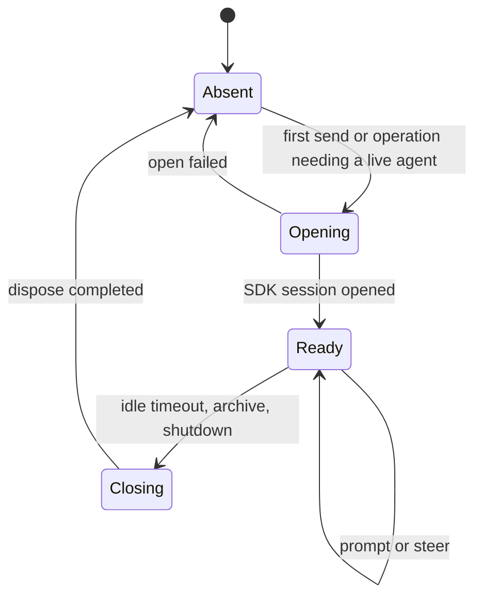
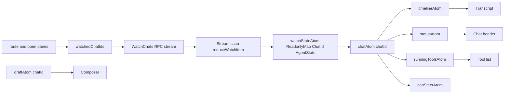
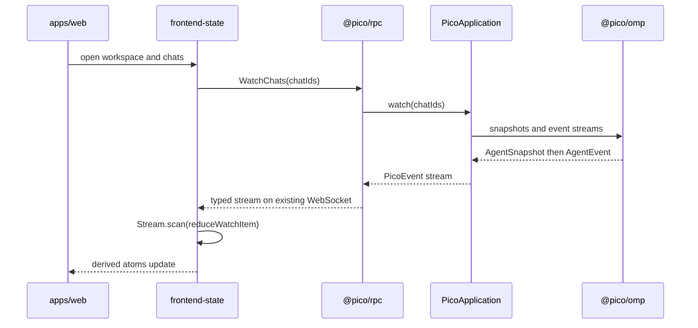

# Pico 设计

## 当前范围

这份文档定义 pico 的整体边界和 MVP 顺序。它不是实现细节清单。具体工作拆在 `TODO.md`。

MVP 包含：

- 原生 Web 客户端。
- 一个薄的 daemon 组装入口。
- Workspace 和 Chat 元数据。
- 普通目录和 Git worktree 两种 Workspace。
- OMP SDK 驱动的多 Chat 会话。
- 一个页面一条 WebSocket 连接。
- 可推导的前端状态。
- 独立的 config、logging、worktree 包。

MVP 不包含：

- Discord 实现。保留 `@pico/discord` 的边界，MVP 完成后再实现。
- 永久 purge。Archive 只隐藏 Chat，不删除 JSONL 或 worktree。
- 第二份消息数据库。OMP JSONL 是 conversation 的唯一持久事实。
- OMP UI mode。

依赖版本固定为：

- `@oh-my-pi/pi-coding-agent@18.0.10`。
- 所有 Effect v4 包使用同一条 `4.0.0-rc.112` release line。
- `@effect/atom-react`、`@effect/platform-bun`、`@effect/sql-sqlite-bun` 和 `@effect/vitest` 也固定为 `4.0.0-rc.112`。

## 整体结构

```mermaid
flowchart TB
  Web[apps/web] --> WebState[@pico/frontend-state]
  Web --> RpcClient[@pico/rpc client]

  Daemon[apps/daemon] --> Config[@pico/config]
  Daemon --> Logging[@pico/logging]
  Daemon --> Persistence[@pico/persistence]
  Daemon --> Worktree[@pico/worktree]
  Daemon --> Omp[@pico/omp]
  Daemon --> Application[@pico/application]
  Daemon --> RpcServer[@pico/rpc server]
  Daemon -. post-MVP .-> Discord[@pico/discord]

  WebState --> Contract[@pico/contract]
  RpcClient --> Contract
  Persistence --> Contract
  Worktree --> Contract
  Omp --> Contract
  Application --> Contract
  RpcServer --> Contract
  Discord --> Contract
```

箭头表示 import。所有实现包都是 sibling。实现包之间不互相 import。`apps/daemon` 和 `apps/web` 是唯一允许组装多个 sibling package 的地方。

## Package 边界

```text
packages/
├── contract/          跨包 vocabulary、Schema、service tag、RPC 定义
├── application/       Workspace 和 Chat 的 use case 与跨 port 排序
├── omp/               OMP 18.0.10 adapter 与内存 SessionPool
├── persistence/       SQLite schema、migration、repository 实现
├── worktree/          Git worktree 创建与本次操作的 rollback
├── rpc/               Effect RPC WebSocket client 和 server transport
├── frontend-state/    Effect Atom state、action、selector
├── config/            pico root、config.toml、secret reference、root lock
├── logging/           Effect logger、console/file sink、rotation、retention
└── discord/           Discordeno adapter，MVP 后实现

apps/
├── daemon/            组装 Layer，启动进程，处理 shutdown
└── web/               组装 browser client，React route 和 component
```

### `@pico/contract`

唯一的跨包 vocabulary。它拥有：

- Branded ID 和 path type。
- Workspace、Chat 和 binding Schema。
- `AgentEvent`、`ChatEvent`、`WorkspaceEvent`、`DaemonEvent` 和 `PicoEvent`。
- Repository、AgentRuntime、Worktree、PicoApplication 和 PicoClient service tag。
- Boundary error。
- Effect RPC request、result 和 stream Schema。

它没有实现，也不 import OMP、SQLite、Git、Discord、React 或 Bun adapter。

### `@pico/application`

实现 `PicoApplication`。它只 import contract。它负责：

- Workspace 和 Chat use case。
- 创建 Chat 时的跨 port 顺序。
- 普通目录和 worktree policy。
- Send、abort、archive 和 watch 的业务规则。
- 失败时按相反顺序 rollback 本次操作创建的资源。

它不知道 OMP、SQL、Git command、WebSocket、Discord、TOML 和日志文件。

### Adapter packages

- `@pico/omp` 是唯一 import OMP SDK 的包。
- `@pico/persistence` 是唯一 import SQLite driver 的包。
- `@pico/worktree` 是唯一运行 Git worktree command 的包。
- `@pico/rpc` 是唯一构造 Effect RPC transport 的包。
- `@pico/discord` 是唯一 import Discordeno 的包。
- `@pico/frontend-state` 是唯一拥有产品级 Atom state 的包。
- `@pico/config` 是唯一读取 TOML、secret 和 pico root lock 的包。
- `@pico/logging` 是唯一构造 logger sink、rotation 和 retention 的包。

Domain adapter 只依赖 `@pico/contract` 和自己的第三方库。`@pico/config` 与 `@pico/logging` 不依赖其他 `@pico/*` package。任何 adapter 都不依赖 sibling adapter。

### Thin daemon

`apps/daemon/src/main.ts` 只做这些事：

```text
main
  acquire pico root and lock       @pico/config
  install logger                   @pico/logging
  build repository layer           @pico/persistence
  build worktree layer             @pico/worktree
  build OMP layer                  @pico/omp
  build application layer          @pico/application
  build RPC server layer           @pico/rpc
  serve web assets
  run the scoped program
```

Daemon 里不放 handler policy、SQL、Git command、OMP event mapping、config parser 或 log rotation。任何需要独立单元测试的 daemon 逻辑都应该移到 package。

## Effect v4 的使用边界

- `@pico/contract` 用 `effect/Schema` 定义 domain、error 和 RPC payload，并用 `Context.Service` 定义跨包 port。
- 每个实现 package 提供 `make`。只有需要部署组合或 resource scope 时才提供 `layer`。
- `@pico/application` 用 `Effect.fn` 定义有语义的 use case，不创建转发 facade。
- `@pico/persistence` 使用 Effect v4 SQL API 和 scoped SQLite layer。
- `@pico/rpc` 使用 Effect v4 RPC、Stream 和 WebSocket protocol。
- `@pico/frontend-state` 使用 `effect/unstable/reactivity` 和 `@effect/atom-react`。
- `@pico/logging` 安装 Effect logger。其他 package 只调用 Effect logging API。
- OMP session、database、socket、logger 和 root lock 的 release 由 Scope finalizer 管理。

Implementation 前先运行 `bun run vendor:effect`，再以 `repos/effect/LLMS.md` 和 vendored v4 source 为准。

## 持久状态

### Workspace

```text
Workspace = {
  id: WorkspaceId
  name: string
  binding: null | { platform: PlatformId, externalId: string }
  defaultCwd: AbsolutePath
  mode:
    | { type: "regular" }
    | { type: "worktree", sourceRef: string, branchPrefix: string }
  createdAt: UnixMilliseconds
}
```

Native Workspace 的 `binding` 是 `null`。不要在数据库保存一个假的 `native` platform。

### Chat

```text
Chat = {
  id: ChatId
  workspaceId: WorkspaceId
  cwd: AbsolutePath
  externalId: string | null
  worktreeBranch: string | null
  createdAt: UnixMilliseconds
  archivedAt: UnixMilliseconds | null
}
```

创建 Chat 时把 `workspace.defaultCwd` 或新 worktree path 写入 `chat.cwd`。以后修改 Workspace 只影响新 Chat。Resume 永远使用 `chat.cwd`。

SQLite 只保存这些元数据。Messages、tool calls 和 agent events 不进入 SQLite。

## OMP session 文件应该放哪里

根 session path 固定为 `<picoRoot>/sessions/<chatId>.jsonl`。完整结构是：

```text
<picoRoot>/sessions/
├── <chatId>.jsonl
└── <chatId>/
    ├── 0.<tool>.log
    ├── <agentId>.jsonl
    ├── <agentId>.md
    ├── <parentId>.<childId>.jsonl
    └── <parentId>.<childId>.md
```

不要使用 `<picoRoot>/sessions/<chatId>/<chatId>.jsonl`。

OMP 18.0.10 用 session 文件去掉 `.jsonl` 后的路径作为 artifact directory：

```text
artifactDir(sessionFile) = sessionFile without ".jsonl"
```

所以两种方案实际会变成：

```diff
 <picoRoot>/sessions/
-└── <chatId>/
-    ├── <chatId>.jsonl
-    └── <chatId>/          OMP 自动生成的 artifact directory，多嵌套一层
+├── <chatId>.jsonl
+└── <chatId>/              OMP 自动生成的 artifact directory
```

OMP CLI 默认使用 `<timestamp>_<ompSessionId>.jsonl`，并在旁边创建同 basename 的 artifact directory。Pico 保留这个 sibling 规则，但用 `chatId` 作为 basename。Pico 通过 `SessionManager.open(explicitPath, ...)` 指定文件路径。

`ChatId` 和 OMP session header ID 是两个 ID。Pico 使用 `ChatId` 做业务 identity。OMP 自己管理 header ID。

OMP-global auth、model registry 和 blob store 仍然属于 OMP root。自定义 session path 不会移动 global blob store。

## OMP SessionPool 是什么

旧文档的 `Live session lifecycle` 指的是 daemon 内存里的 OMP resource cache。它不是 Chat 的产品状态，也不是前端状态。这里改名为 `SessionPool`。

```text
SessionPool = Map<ChatId, SessionSlot>

SessionSlot =
  | Opening { deferred }
  | Ready   { session, unsubscribe, lastUsedAt }
  | Closing { deferred, reason }
```

不保存 `running`、`retrying` 或 `compacting` boolean。OMP `AgentSession` 已经拥有这些事实。Pico 从 `session.isStreaming`、`session.isRetrying`、`session.isCompacting`、`session.state` 和 event stream 推导状态。



SessionPool 负责：

- 同一个 Chat 的并发 open 共用一个 `Deferred`。
- 同一个 Chat 只有一个 JSONL writer。
- 不同 Chat 可以同时运行。
- 空闲且没有 queued work 的 session 才能成为 eviction candidate。
- Eviction 只释放内存。它不 archive Chat，也不删除 JSONL 或 worktree。
- Archive 关闭 runtime session 后只写 `archivedAt`。

Private `AgentRegistry` 仍然是每个 Chat 的必需配置，但它不能完全隔离 OMP 18.0.10 的 process-global lifecycle。MVP 先保留一个 process lifecycle gate。普通 open、prompt 和 steer 使用 shared access。Dispose 使用 exclusive access，而且只能在所有 Chat 都没有 active turn 时开始。Phase 00 必须验证 dispose 后其他 Ready Chat 和已持久化 subagent 仍可恢复。如果验证失败，MVP 暂停 per-chat disposal，只在 daemon shutdown 统一 dispose。

## 运行中发送消息

Pico 只有一个 `SendMessage` use case 和 RPC。客户端不判断应该 prompt 还是 steer。

```text
SendMessage(chatId, content)
  session = SessionPool.getOrOpen(chatId)
  session.sendUserMessage(content)
    idle      -> OMP starts a normal turn
    streaming -> OMP queues a steer message
```

OMP 18.0.10 的 `sendUserMessage` 默认就是这个行为。也可以等价地调用 `prompt(content, { streamingBehavior: "steer" })`。Pico 不实现自己的 prompt queue。

## Event 层级

`@pico/contract` 定义 pico 自己的 event。它们保留 OMP event 的语义层级，但不暴露 OMP type 或 payload。

```text
PicoEvent
├── AgentEvent
│   ├── AgentSnapshotEvent
│   ├── AgentLifecycleEvent
│   │   ├── agent_start
│   │   └── agent_end
│   ├── AgentTurnEvent
│   │   ├── turn_start
│   │   └── turn_end
│   ├── AgentMessageEvent
│   │   ├── message_start
│   │   ├── message_update
│   │   └── message_end
│   ├── AgentToolEvent
│   │   ├── tool_execution_start
│   │   ├── tool_execution_update
│   │   └── tool_execution_end
│   ├── AgentMaintenanceEvent
│   │   ├── auto_retry_start
│   │   ├── auto_retry_end
│   │   ├── auto_compaction_start
│   │   └── auto_compaction_end
│   └── AgentNoticeEvent
├── WorkspaceEvent
├── ChatEvent
└── DaemonEvent
```

类型关系是：

```ts
type AgentEvent =
  | AgentSnapshotEvent
  | AgentLifecycleEvent
  | AgentTurnEvent
  | AgentMessageEvent
  | AgentToolEvent
  | AgentMaintenanceEvent
  | AgentNoticeEvent

type PicoEvent =
  | AgentEvent
  | WorkspaceEvent
  | ChatEvent
  | DaemonEvent
```

每个 `AgentEvent` 都带 `chatId`。每个 leaf event 使用全局唯一的 `type` 字面量。`@pico/omp` 做显式转换：

```text
OMP AgentSessionEvent
  -> sanitize foreign payload
  -> translate to zero or one pico AgentEvent
  -> publish through AgentRuntime
```

未知 OMP event 默认不向外发送。需要 UI、RPC 或 Discord 消费时，再把它加入 contract。

## Snapshot 和 Event

Snapshot 回答“现在是什么状态”。Event 回答“刚刚发生了什么”。

```text
AgentSnapshot = {
  chatId: ChatId
  transcript: readonly AgentMessage[]
  run: null | AgentRun
  retry: null | AgentRetry
  compaction: null | AgentCompaction
}
```

Daemon 不保存第二份 `LiveProjection`。对于 live session，`@pico/omp` 从 `AgentSession.state` 和公开状态 getter 生成 `AgentSnapshot`。对于 cold session，它通过 OMP session loader 读取完成的 transcript，其他 runtime 字段为 `null`。

Watch 建立时先订阅 event，再读取 snapshot，并暂存中间 event。这样 snapshot 和后续 event 之间没有空洞。重连时客户端用新 snapshot 整体替换旧 state。

## 前端 state management

只存无法推导的事实。能推导的 UI state 全部用 Atom 派生。



Agent stream 只有一个 canonical state：

```text
WatchState = ReadonlyMap<ChatId, AgentState>
```

Workspace 和 Chat metadata 由各自的 RPC query atom 持有。不要再复制进一个第三方 entity store。需要组合 metadata 和 agent state 时，用 derived atom 读取两个 source atom。

真正 writable 的本地 state 只有：

- Router 没有管理时的 watched Chat IDs。
- 每个 Chat 的 draft input。
- 触发 RPC action 的 input。

以下 state 都派生，不单独保存：

- `selectedChat`。
- `isRunning`、`isRetrying`、`isCompacting`。
- Timeline rows。
- Partial assistant message。
- Running tool rows。
- `canSteer`。
- Loading 和 failure。它们来自 `AsyncResult`。

```text
status(state)
  if state.compaction != null -> compacting
  if state.retry != null      -> retrying
  if state.run != null        -> running
  otherwise                   -> idle

timeline(state)
  return state.transcript + state.run?.message + state.run?.tools

canSteer(state)
  return state.run != null
```

Effect v4 使用方式：

- 页面根节点有一个 `AtomRegistry` 和 `RegistryProvider`。
- `Atom.family` 按 `ChatId` 产生 draft atom 和窄 selector。
- `Atom.map` 从 canonical state 派生 UI state。
- `Stream.scan` 把 snapshot 和 event reduce 成新的 `WatchState`。
- `AtomRpc.Service` 复用 typed RPC client 和 Layer。
- `useAtomValue` 只读。`useAtom` 只用于真正 writable 的 input。`useAtomSet` 用于 write-only action。

Unary read 使用 `PicoRpc.query`，command 使用 `PicoRpc.mutation`。长连接 `WatchChats` 不直接使用 streaming `query`，因为 Effect v4 rc.112 会把它做成需要显式 pull 的 atom。`@pico/frontend-state` 使用 `PicoRpc.runtime.atom` 消费原始 RPC `Stream`，再用 `Stream.scan` 连续 reduce。

不要为这些 API 再写 pico hook wrapper。

## RPC 和 subscription

每个页面只有一条 WebSocket。Effect RPC 在这条连接上 multiplex query、command 和 stream。



`WatchChats` 只接受需要的 `chatIds`。服务器只发送这些 Chat 的 `AgentEvent` 和相关 `ChatEvent`。Workspace list 和 metadata 使用独立 query 或 workspace watch。MVP 不提供按 leaf event type 过滤，因为缺少 start、update 或 end 中任意一类都会让 reducer 得到非法状态。

## Config、logging 和 worktree

### `@pico/config`

- 接收显式 `picoRoot`，生产默认是 `~/.pico`。
- 构造所有 pico path。
- 获取单进程 root lock。
- 解析一次 `config.toml`。
- 应用 default，拒绝 unknown key 和 invalid value。
- 解析 `<picoRoot>/secrets/*` reference，但不泄露 secret 内容。
- 返回 immutable config value。它不启动服务。

### `@pico/logging`

- 安装 Effect logger。
- 同时输出 console 和 file。
- 每天 rotation。
- 保留 30 天 completed log files。
- 通过 Scope flush 和 close。
- 默认不记录 secret、auth、完整 prompt、完整 response 或 raw OMP payload。

其他 package 使用 Effect logging 和 annotation。它们不 import `@pico/logging`。

### `@pico/worktree`

- 验证并解析 `sourceRef`。
- 创建 `<branchPrefix>/<chatId>`。
- 创建 `<picoRoot>/worktrees/<chatId>`。
- 返回 resolved cwd 和 branch。
- 失败时只 rollback 本次调用创建的资源。
- 不实现永久 purge。

## Chat 创建流程

```text
PicoApplication.createChat
  load Workspace                         ChatRepository
  mint ChatId
  resolve cwd
    regular  -> Workspace.defaultCwd
    worktree -> Worktree.create
  materialize <sessions>/<chatId>.jsonl AgentRuntime
  insert Chat metadata                  ChatRepository
  return Chat
```

如果失败，`@pico/application` 按相反顺序释放本次操作创建的资源。Repository、worktree 和 OMP adapter 不互相调用。

## 明确不做的事情

- 不复制 OMP transcript 到 SQLite。
- 不持久化 PicoEvent。
- 不实现自己的 prompt queue、retry、compaction 或 tool runner。
- 不让 component 直接调用 RPC。
- 不让 frontend-state import RPC implementation。`apps/web` 创建 PicoClient 后注入。
- 不在 daemon 放业务 handler。
- 不做 Discord MVP。
- 不做永久 purge。

## 实现前必须验证的 spike

1. OMP 18.0.10 两个 headless session 共享 auth/model registry，同时使用 private `AgentRegistry`。
2. 一个 Chat 运行时另一个 Chat dispose，不中断前者。失败时保留 process lifecycle gate。
3. `sendUserMessage` 在 idle 时启动 turn，在 streaming 时进入 steer queue。
4. `<chatId>.jsonl` 的 artifact、subagent 和 nested subagent 路径符合本文件的 tree。
5. Effect v4 `4.0.0-rc.112` 的 WebSocket RPC 可以在一条连接上取消并重建 `WatchChats` stream。
6. `AtomRpc`、`Stream.scan`、`Atom.family` 和 `Atom.map` 能形成单一 canonical state，没有 duplicated loading 或 run-state boolean。

这些 spike 通过后再冻结 contract payload。