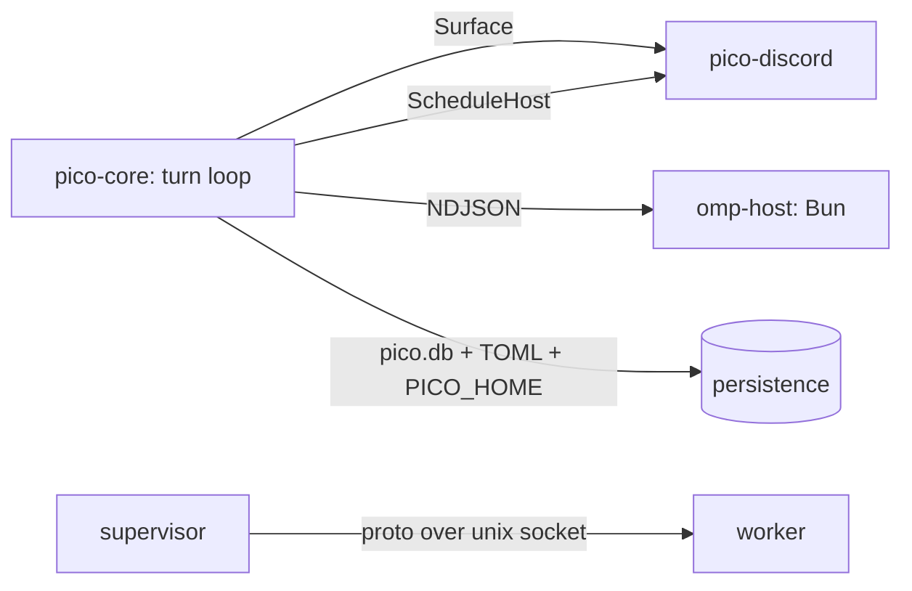

This page is the contributor-facing map of pico: the crates, the five seams that hold them together, and — narrated as a walkthrough, not a diagram to decode — how one Discord message becomes one answer. Read this before touching code across a crate boundary.

## The crates

Six Rust crates plus one non-Rust process:

- `crates/core` (`pico-core`) — the neutral engine: turn loop, seams, persistence, scheduling, worktrees (`crates/core/src/lib.rs:1-19`).
- `crates/discord` (`pico-discord`) — the (currently only) platform adapter, implementing core's seams for Discord.
- `crates/supervisor` — owns and hot-swaps the worker process.
- `crates/worker` — runs the platform adapters.
- `crates/cli` (`pico`) — local CLI launching the omp TUI plus admin subcommands.
- `crates/shared` (`pico-shared`) — paths, the supervisor↔worker wire protocol, config, logging, secrets, signals, process plumbing.
- `omp-host/` — a Bun process running omp's TS SDK (`omp-host/host.ts`), hosting many omp `AgentSession`s that the Rust side talks to over NDJSON.

`discord`/`supervisor`/`worker`/`cli` depend on `core` + `shared`; `core` depends only on `shared` (`Cargo.toml:21-23`) — dependencies point one way, toward the neutral core, never back out to a platform.

## The five seams

Each of these is a place where you can plug in something new without touching the other side:

1. **`Surface` trait** (`crates/core/src/surface.rs:4-42`) — the boundary between the neutral engine and a platform adapter. Associated types `Msg`/`Typing`; methods `post`/`edit`/`ui`/`limits`/`typing`/`set_title`, plus defaulted renderers for activity/thinking/failure lines. `DiscordSurface` (`crates/discord/src/discord.rs:1576-1645`) is the one production implementation; a `FakeSurface` test double in `crates/core/src/engine.rs:748-795` proves the seam is real (the engine's tests run against it with no Discord involved at all).
2. **The omp-host protocol** — `crates/core/src/omp/{client,pool,protocol}.rs` on the Rust side spawn and talk to `omp-host/host.ts` over sessionId-tagged NDJSON. One Bun host process per profile; one omp `AgentSession` per thread within that host.
3. **`ScheduleHost` trait** (`crates/core/src/schedule/mod.rs:111-116`) — the seam letting the neutral scheduler fire a job into a platform. Discord implements it in `crates/discord/src/schedule_host.rs`.
4. **Supervisor↔worker protocol** (`pico_shared::proto`, `crates/shared/src/proto.rs`) — deploy/rollback/status/ready frames over a Unix control socket, letting the supervisor hot-swap the worker binary without dropping connections mid-conversation.
5. **Persistence** — one SQLite `pico.db` (bindings, threads, approvals) plus filesystem-backed schedules and TOML config, all rooted under `PICO_HOME` via `crates/shared/src/paths.rs`.

## One Discord message, end to end

Walk one message through the whole stack:

A user's message lands at the Discord gateway and reaches `route_message` (`crates/discord/src/discord.rs:1005-1360`), which filters out DMs and unconfigured guilds, wraps the raw message together with any reply/forward quotes it carries, then resolves in sequence: which binding owns this channel, which route that binding implies, the thread's marker (creating a thread on the channel's first message if none exists), and — if the binding is worktree-mode — which git worktree backs this thread. That resolved context feeds `session::run_turn`, which hands off to an `OmpPool` session: either an existing omp `AgentSession` in the Bun host for this thread, or a freshly created one.

Inside the Bun host, the omp SDK runs the actual agent loop — reasoning, tool calls, the works — and emits a stream of events back over the NDJSON channel. On the Rust side, `engine::drive_turn` (`crates/core/src/engine.rs:56-298`) consumes that event stream and maps it onto the `Surface`: text becomes `post`/`edit` calls, tool activity becomes rendered activity lines, and so on. `DiscordSurface` turns those into actual Discord messages — silent preamble messages as the turn progresses, and exactly one message that pings the user, the final answer.

That whole path is why the seams matter: everything left of "maps onto the `Surface`" is platform-neutral and testable with `FakeSurface`; everything right of it is Discord-specific and swappable for a future adapter without engine changes.

## Where each seam is documented in depth

- The turn loop itself: .
- The `Surface` seam and how rendering works: .
- The omp-host process and NDJSON protocol: .
- The Discord adapter (routing, threads, slash commands): .
- Persistence — `pico.db`, config, `PICO_HOME`: .
- The scheduler and `ScheduleHost`: .
- Worktrees and thread titles: .
- Supervisor, worker, and deploy: .
- The CLI: .
