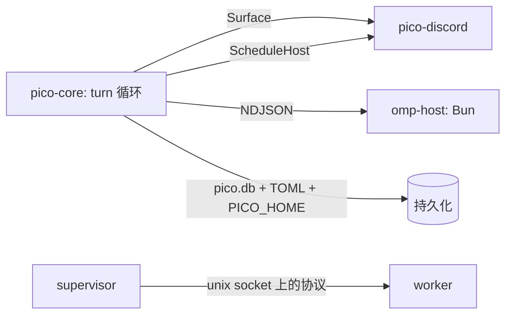

本页是面向贡献者的 pico 地图:各个 crate、把它们维系在一起的五个接缝,以及 —— 以叙述的方式而非一张需要解读的图 —— 一条 Discord 消息是如何变成一条回答的。在跨 crate 边界改动代码之前,先读这一页。

## 各个 crate

六个 Rust crate,外加一个非 Rust 进程:

- `crates/core`(`pico-core`)—— 中立引擎:turn 循环、各个接缝、持久化、调度、worktree(`crates/core/src/lib.rs:1-19`)。
- `crates/discord`(`pico-discord`)—— (目前唯一的)平台适配器,为 Discord 实现 core 的各个接缝。
- `crates/supervisor` —— 持有并热替换 worker 进程。
- `crates/worker` —— 运行各个平台适配器。
- `crates/cli`(`pico`)—— 本地 CLI,启动 omp TUI,外加管理子命令。
- `crates/shared`(`pico-shared`)—— 路径、supervisor↔worker 线协议、配置、日志、密钥、信号、进程相关基础设施。
- `omp-host/` —— 一个运行着 omp TS SDK 的 Bun 进程(`omp-host/host.ts`),托管着许多 omp `AgentSession`,Rust 侧通过 NDJSON 与之通信。

`discord`/`supervisor`/`worker`/`cli` 都依赖 `core` + `shared`;`core` 只依赖 `shared`(`Cargo.toml:21-23`)—— 依赖方向始终指向中立的 core,绝不会反向流向某个平台。

## 五个接缝

以下每一个都是一个可以插入新实现、而不必改动另一侧的位置:

1. **`Surface` trait**(`crates/core/src/surface.rs:4-42`)—— 中立引擎与平台适配器之间的边界。关联类型 `Msg`/`Typing`;方法 `post`/`edit`/`ui`/`limits`/`typing`/`set_title`,外加带默认实现的 activity/thinking/failure 行渲染器。`DiscordSurface`(`crates/discord/src/discord.rs:1576-1645`)是目前唯一的生产实现;`crates/core/src/engine.rs:748-795` 里的 `FakeSurface` 测试替身证明这个接缝是真实存在的(引擎的测试可以完全不涉及 Discord,直接跑在它上面)。
2. **omp-host 协议** —— Rust 侧的 `crates/core/src/omp/{client,pool,protocol}.rs` 生成并通过带 sessionId 标记的 NDJSON 与 `omp-host/host.ts` 通信。每个 profile 一个 Bun host 进程;该 host 内每个线程一个 omp `AgentSession`。
3. **`ScheduleHost` trait**(`crates/core/src/schedule/mod.rs:111-116`)—— 让中立调度器把任务触发到某个平台上的接缝。Discord 在 `crates/discord/src/schedule_host.rs` 中实现它。
4. **supervisor↔worker 协议**(`pico_shared::proto`,`crates/shared/src/proto.rs`)—— 通过 Unix 控制 socket 传递部署/回滚/状态/就绪帧,让 supervisor 能够热替换 worker 二进制文件而不中断对话中的连接。
5. **持久化** —— 一个 SQLite `pico.db`(绑定、线程、审批),外加文件系统存储的 schedule 和 TOML 配置,所有路径都通过 `crates/shared/src/paths.rs` 根植于 `PICO_HOME`。

## 一条 Discord 消息的完整旅程

跟着一条消息走完整个技术栈:

用户的消息到达 Discord 网关,进入 `route_message`(`crates/discord/src/discord.rs:1005-1360`):过滤掉私信和未配置的服务器,把原始消息连同它携带的任何回复/转发引用一起包装起来,然后依次解析 —— 哪个绑定拥有这个频道、该绑定对应的路由、这个线程的标记(如果不存在就在频道的第一条消息上创建线程),以及 —— 如果绑定是 worktree 模式 —— 哪个 git worktree 支撑着这个线程。解析出的上下文被送入 `session::run_turn`,后者交给一个 `OmpPool` session:要么是 Bun host 中这个线程已有的 omp `AgentSession`,要么新建一个。

在 Bun host 内部,omp SDK 运行真正的 agent 循环 —— 推理、工具调用等等 —— 并通过 NDJSON 通道把一串事件发回来。在 Rust 侧,`engine::drive_turn`(`crates/core/src/engine.rs:56-298`)消费这个事件流,并把它映射到 `Surface` 上:文本变成 `post`/`edit` 调用,工具活动变成渲染出的 activity 行,等等。`DiscordSurface` 把这些变成真正的 Discord 消息 —— turn 进行过程中的静默前导消息,以及恰好一条会 @提醒 用户的、作为最终答案的消息。

这整条路径正是各个接缝重要的原因:"映射到 `Surface`"左边的一切都是平台中立的,可以用 `FakeSurface` 测试;右边的一切都是 Discord 特有的,未来可以在不改动引擎的情况下替换成别的适配器。

## 每个接缝的详细文档在哪里

- turn 循环本身:。
- `Surface` 接缝与渲染是如何工作的:。
- omp-host 进程与 NDJSON 协议:。
- Discord 适配器(路由、线程、斜杠命令):。
- 持久化 —— `pico.db`、配置、`PICO_HOME`:。
- 调度器与 `ScheduleHost`:。
- worktree 与线程标题:。
- supervisor、worker 与部署:。
- CLI:。
