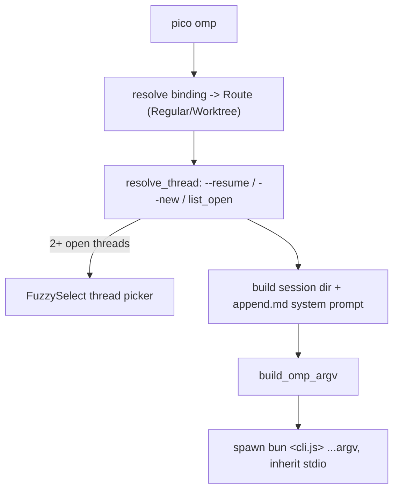

`pico` is the local front door into the exact same worker root, database, and
config that the Discord bot uses. It exists so a developer sitting at a
terminal — not just a Discord user — can open an interactive omp session
against a project, inspect/administer bindings, profiles, and schedules, all
without a separate code path: `pico omp` resolves the same binding/thread
model the Discord adapter resolves, then hands the terminal over to the same
omp TUI that powers Discord turns.

## Command surface

`Cli{command: Command}` with `Command::{Omp, Bind, Schedule, Profile}`
(`crates/cli/src/main.rs:9-24`). `main()` (main.rs:26-37) sets up file-only
logging (`pico_shared::logging::init_file_only`, root `<worker_root>/logs`,
prefix `"cli"` — no stdout logging, because stdout is reserved for the omp
TUI/human output) and dispatches to one of four thin subcommand modules, each
wrapping `pico_core` primitives:

- `pico omp [--new] [--resume THREAD_ID]` — launch an interactive session
  (`crates/cli/src/omp.rs:22-146`).
- `pico bind [--profile] [--worktree BASE [--branch] [--branch-prefix]] |
  --unset | --show` — wraps `pico_core::bindings::{set_regular,set_worktree,
  unset,get}` keyed on `(PLATFORM="cli", channel=cwd)`
  (`crates/cli/src/bind.rs:24-63`).
- `pico profile {create NAME|list}` — validates the name
  (`pico_shared::validate::is_valid_profile`), creates
  `profiles/<name>/` or lists existing profile dirs
  (`crates/cli/src/profile.rs:6-59`).
- `pico schedule {create JSON|list|show|remove|enable|disable|trigger}` — thin
  calls into `pico_core::schedule::*` (`crates/cli/src/schedule.rs:9-62`);
  `create` parses a `CreateInput` JSON blob (mode: `continue`/`fresh`;
  trigger: `oneshot{at}`/`cron{expr,tz}`) and always answers in JSON — this is
  the machine-facing surface an LLM-driven omp extension shells out to when a
  user asks pico, in natural language, to schedule something.

None of these subcommands own domain logic; `crates/cli` itself is just
argv-building, terminal I/O (the thread picker), and JSON parsing wrapped
around `pico_core::{bindings,thread_marker,worktree,db,prompt,config,
schedule}` — the same modules the Discord adapter calls.



## Resolving a thread

`pico omp`'s `launch` (`crates/cli/src/omp.rs:46-146`) first resolves *where*
you are: `bindings::get(db, PLATFORM="cli", channel=cwd)`
(omp.rs:63); if no binding exists yet it auto-creates a `Route::Regular` for
the current directory (omp.rs:65-78) and prints a hint about `pico bind
--worktree` for isolation. `Route` (`crates/cli/src/thread.rs:31-42`) is
either `Regular{profile,cwd}` or `Worktree{profile,base_repo,default_branch,
branch_prefix}`, built from the same `pico_core::bindings::Binding`/
`BindingKind` the Discord adapter reads (`route_from_binding`, thread.rs:
44-61).

Then it resolves a `Thread` via `resolve_thread` (thread.rs:71-94):
`--resume <id>` loads that thread directly; `--new` always mints one; with
neither flag, it lists open threads for this channel
(`thread_marker::list_open`) and picks by count — 0 → create, 1 → resume it
automatically, 2+ → `pick` (thread.rs:96-102), which builds short-ULID labels
(`entry_label`, thread.rs:104-112) and runs `dialoguer::FuzzySelect` inside
`spawn_blocking` (dialoguer is synchronous). Pressing Esc returns `None`,
which `resolve_thread` propagates as `Ok(None)` all the way up to `run`
(omp.rs:38-43) — the CLI just exits, doing nothing, rather than launching a
session. `new_thread`/`resume_thread` (thread.rs:114-200) mint a
`ulid::Ulid` id, materialize a git worktree via `pico_core::worktree::ensure`
for `Route::Worktree`, and persist/load a `ThreadMarker`.

## Assembling the session and launching omp

Once a `Thread` is resolved, `launch` builds the session directory
(`pico_shared::paths::profile_session_dir`), loads the root config for the
timezone, and assembles a `RuntimeContext` (platform, channel, thread label,
profile, cwd, worktree origin, timezone) into an `append.md` system-prompt
file via `pico_core::prompt::{runtime_context_block, assemble_append}`
(omp.rs:89-110) — the same runtime-context mechanism the Discord adapter uses
per turn. If the resolved profile has `browser_enabled`, it starts the
camofox browser daemon (omp.rs:114-117). It checks whether a prior `.jsonl`
session log exists (`thread::newest_jsonl`, omp.rs:119) to decide whether
this is a resume.

Finally `build_omp_argv` (omp.rs:148-178) assembles the omp CLI's argv, and
`launch` execs `bun <argv>` with `Stdio::inherit()` on stdin/stdout/stderr
(omp.rs:135-143) — **the omp TUI takes over the terminal directly**; the
`pico` process just blocks on the child's exit status and propagates its
exit code (omp.rs:38-42, `run`).

## Worked example: `build_omp_argv`

`build_omp_argv` is a pure function, unit-tested at `crates/cli/src/omp.rs:
184-237`. Given a resuming session with a model override and camofox enabled:

```rust
build_omp_argv(
    Path::new("/host/dist/cli.js"),
    Path::new("/work"),
    Path::new("/sessions/t"),
    true, // resume
    Path::new("/sessions/t/append.md"),
    Some("anthropic/claude"),
    Some(Path::new("/host/extensions/camofox.ts")),
)
```

produces the argv (`omp.rs:186-211`):

```
/host/dist/cli.js --cwd /work --session-dir /sessions/t --continue
  --append-system-prompt /sessions/t/append.md
  --model anthropic/claude -e /host/extensions/camofox.ts
```

`--continue` is only present when `resume` is `true` — i.e. when
`thread::newest_jsonl(session_dir)` found an existing log (omp.rs:119). This
is the exact session-interop contract with the omp SDK/TUI's own
`--session-dir`/`--continue` flags: a fresh thread gets a bare
`--session-dir` (first-ever run in that directory), a reopened one adds
`--continue` so the omp TUI resumes the prior conversation instead of
starting blank. Without a model override or camofox, the same call omits
`--continue`, `--model`, and `-e` entirely (`omp.rs:214-237`):

```
/host/dist/cli.js --cwd /work --session-dir /sessions/t
  --append-system-prompt /sessions/t/append.md
```

## Shared state, not a parallel system

`pico bind`, `pico profile`, and `pico schedule` all read/write the exact
same sqlite database and `PICO_HOME` layout that Discord threads use
(`pico_core::bindings`/`thread_marker`/`schedule`/`db` — see
[](carto:persistence)). A binding created with `pico bind` is visible to a
Discord channel bound to the same key, and a schedule created with `pico
schedule create` fires through the identical engine a Discord-created
schedule does (see [](carto:scheduling)). Worktree-routed threads created
from the CLI materialize through the same `pico_core::worktree::ensure` used
by Discord's worktree threads (see [](carto:worktrees)). This is the same
`pico_core::omp::client::{locked_omp_cli, omp_host_dir}` version-locked omp
binary resolution the Discord-side launcher uses (omp.rs:54,56,123) — one
omp install, two front doors.

`pico omp` needs a running or at-least-deployed worker root to make sense of
(`PICO_HOME`/config/db all come from the same layout the supervisor's worker
process manages) — see [](carto:lifecycle) for how that binary and root get
there in the first place.
