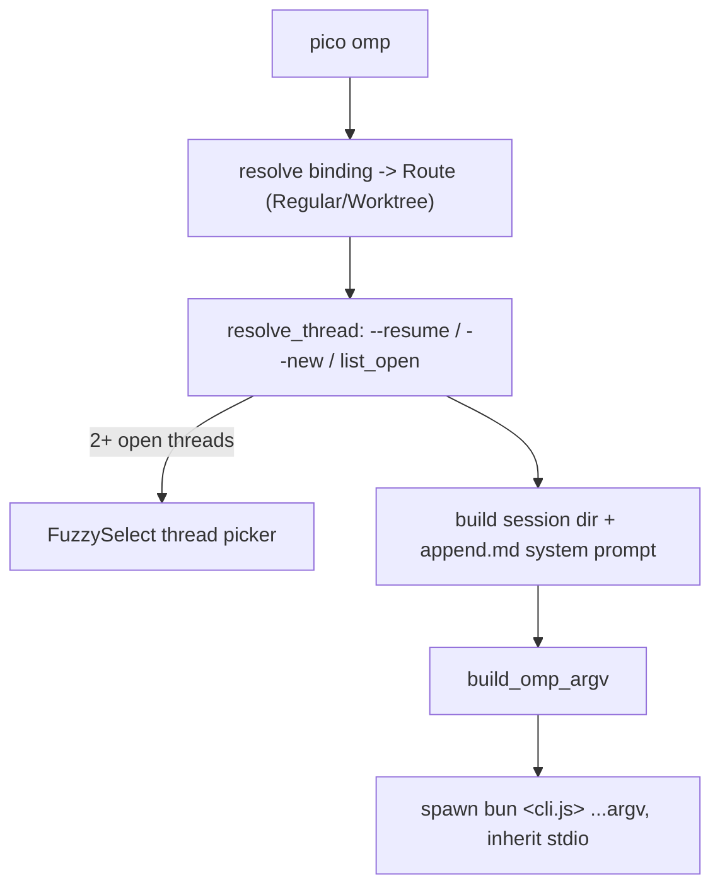

`pico` 是通向 Discord bot 所用的同一个 worker root、数据库和配置的本地入口。
它存在的意义是:让坐在终端前的开发者——而不仅仅是 Discord 用户——也能对某个
项目打开一个交互式 omp 会话、查看/管理 bindings、profile 和 schedule,而且
不需要另一套代码路径:`pico omp` 解析的是与 Discord 适配层完全相同的
binding/thread 模型,然后把终端直接交给驱动 Discord turn 的同一个 omp TUI。

## 命令面

`Cli{command: Command}`,其中 `Command::{Omp, Bind, Schedule, Profile}`
(`crates/cli/src/main.rs:9-24`)。`main()`(main.rs:26-37)设置只写文件的
日志(`pico_shared::logging::init_file_only`,根目录 `<worker_root>/logs`,
前缀 `"cli"`——没有 stdout 日志,因为 stdout 要留给 omp TUI/人类输出),
然后分发到四个薄子命令模块之一,每个都是对 `pico_core` 原语的包装:

- `pico omp [--new] [--resume THREAD_ID]` —— 启动一个交互式会话
  (`crates/cli/src/omp.rs:22-146`)。
- `pico bind [--profile] [--worktree BASE [--branch] [--branch-prefix]] |
  --unset | --show` —— 包装 `pico_core::bindings::{set_regular,set_worktree,
  unset,get}`,以 `(PLATFORM="cli", channel=cwd)` 为键
  (`crates/cli/src/bind.rs:24-63`)。
- `pico profile {create NAME|list}` —— 校验名称
  (`pico_shared::validate::is_valid_profile`),创建
  `profiles/<name>/` 或列出已有的 profile 目录
  (`crates/cli/src/profile.rs:6-59`)。
- `pico schedule {create JSON|list|show|remove|enable|disable|trigger}` ——
  薄薄地调用 `pico_core::schedule::*`(`crates/cli/src/schedule.rs:9-62`);
  `create` 解析一段 `CreateInput` JSON(mode:`continue`/`fresh`;
  trigger:`oneshot{at}`/`cron{expr,tz}`),并且始终以 JSON 作答——这正是
  一个由 LLM 驱动的 omp extension 在用户用自然语言让 pico 安排某个定时
  任务时,会去调用的机器可读接口。

这些子命令都不拥有领域逻辑;`crates/cli` 这个 crate 本身只是 argv 构建、
终端 I/O(线程选择器)和 JSON 解析,包裹在 `pico_core::{bindings,
thread_marker,worktree,db,prompt,config,schedule}` 之上——与 Discord
适配层调用的是同一批模块。



## 解析线程

`pico omp` 的 `launch`(`crates/cli/src/omp.rs:46-146`)首先解析你*在哪里*:
`bindings::get(db, PLATFORM="cli", channel=cwd)`(omp.rs:63);如果还没有
binding,就自动为当前目录创建一个 `Route::Regular`(omp.rs:65-78),并打印
一条关于 `pico bind --worktree` 隔离用法的提示。`Route`
(`crates/cli/src/thread.rs:31-42`)要么是 `Regular{profile,cwd}`,要么是
`Worktree{profile,base_repo,default_branch,branch_prefix}`,都是从与
Discord 适配层读取的同一个 `pico_core::bindings::Binding`/`BindingKind`
构建出来的(`route_from_binding`,thread.rs:44-61)。

接着它通过 `resolve_thread`(thread.rs:71-94)解析一个 `Thread`:
`--resume <id>` 直接加载该线程;`--new` 总是新建一个;两个 flag 都不带时,
它会列出该 channel 下的所有开放线程(`thread_marker::list_open`),按数量
分派——0 个 → 新建,1 个 → 自动恢复它,2 个及以上 → 走 `pick`
(thread.rs:96-102),后者构造短 ULID 标签(`entry_label`,thread.rs:
104-112),并在 `spawn_blocking` 里运行 `dialoguer::FuzzySelect`(因为
dialoguer 是同步的)。按 Esc 会返回 `None`,`resolve_thread` 把它一路
透传为 `Ok(None)`,直到 `run`(omp.rs:38-43)——此时 CLI 直接退出,什么
都不做,而不会启动会话。`new_thread`/`resume_thread`(thread.rs:114-200)
生成一个 `ulid::Ulid` id,对于 `Route::Worktree` 通过
`pico_core::worktree::ensure` 落地一个 git worktree,并持久化/加载一个
`ThreadMarker`。

## 组装会话并启动 omp

一旦 `Thread` 解析完成,`launch` 会构建会话目录
(`pico_shared::paths::profile_session_dir`),加载根配置以获取时区,并通过
`pico_core::prompt::{runtime_context_block, assemble_append}`
(omp.rs:89-110)把一个 `RuntimeContext`(平台、channel、线程标签、profile、
cwd、worktree 来源、时区)组装进一个 `append.md` 系统提示文件——这与
Discord 适配层每个 turn 使用的 runtime-context 机制完全相同。如果解析出的
profile 开启了 `browser_enabled`,就会启动 camofox 浏览器守护进程
(omp.rs:114-117)。它会检查是否已存在之前的 `.jsonl` 会话日志
(`thread::newest_jsonl`,omp.rs:119),据此判断这是否是一次恢复。

最后 `build_omp_argv`(omp.rs:148-178)组装出 omp CLI 的 argv,`launch`
以 `Stdio::inherit()` 在 stdin/stdout/stderr 上 exec `bun <argv>`
(omp.rs:135-143)——**omp TUI 会直接接管终端**;`pico` 进程只是阻塞等待
子进程的退出状态,并透传其退出码(omp.rs:38-42,`run`)。

## 实例演示:`build_omp_argv`

`build_omp_argv` 是一个纯函数,单测位于 `crates/cli/src/omp.rs:184-237`。
给定一个正在恢复的会话、带模型覆盖并启用了 camofox:

```rust
build_omp_argv(
    Path::new("/host/dist/cli.js"),
    Path::new("/work"),
    Path::new("/sessions/t"),
    true, // resume
    Path::new("/sessions/t/append.md"),
    Some("anthropic/claude"),
    Some(Path::new("/host/extensions/camofox.ts")),
)
```

产生的 argv 为(`omp.rs:186-211`):

```
/host/dist/cli.js --cwd /work --session-dir /sessions/t --continue
  --append-system-prompt /sessions/t/append.md
  --model anthropic/claude -e /host/extensions/camofox.ts
```

`--continue` 只有在 `resume` 为 `true` 时才会出现——也就是当
`thread::newest_jsonl(session_dir)` 找到了一份已有日志时(omp.rs:119)。
这正是与 omp SDK/TUI 自身的 `--session-dir`/`--continue` flag 之间精确的
会话互操作契约:全新线程只得到一个裸的 `--session-dir`(该目录下的第一次
运行),重新打开的线程会加上 `--continue`,让 omp TUI 恢复之前的对话,
而不是从空白开始。如果没有模型覆盖也没有 camofox,同一个调用会完全省略
`--continue`、`--model` 和 `-e`(`omp.rs:214-237`):

```
/host/dist/cli.js --cwd /work --session-dir /sessions/t
  --append-system-prompt /sessions/t/append.md
```

## 共享状态,而非并行系统

`pico bind`、`pico profile` 和 `pico schedule` 读写的都是 Discord 线程所用
的同一个 sqlite 数据库和同一套 `PICO_HOME` 布局(`pico_core::bindings`/
`thread_marker`/`schedule`/`db`——参见 [](carto:persistence))。用
`pico bind` 创建的 binding,对绑定到同一个键的 Discord 频道同样可见;用
`pico schedule create` 创建的 schedule,跑的是与 Discord 创建的 schedule
完全相同的引擎(参见 [](carto:scheduling))。从 CLI 创建的走 worktree
路由的线程,通过与 Discord 的 worktree 线程相同的
`pico_core::worktree::ensure` 落地(参见 [](carto:worktrees))。这也是
Discord 端启动器所用的同一个 `pico_core::omp::client::{locked_omp_cli,
omp_host_dir}` 版本锁定的 omp 二进制解析逻辑(omp.rs:54,56,123)——一次
omp 安装,两个入口。

`pico omp` 需要一个正在运行、或至少已被部署过的 worker root 才有意义
(`PICO_HOME`/配置/数据库全都来自 supervisor 管理的那个 worker 进程所用的
同一套布局)——关于这个二进制和 root 最初是如何产生的,参见
[](carto:lifecycle)。
