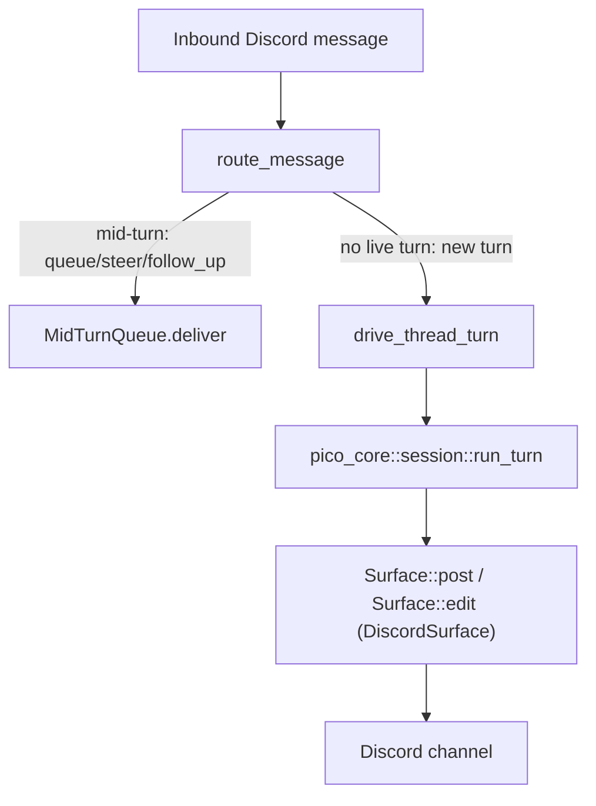

`discord` is the one Discord-specific crate in pico. It owns zero business
logic — bindings, worktrees, sessions, and the turn loop all live in
`pico_core` — its whole job is protocol translation in both directions:
turning inbound Discord messages/interactions into engine turns, and turning
engine output back into Discord messages, edits, and interactive prompts. If
you are trying to understand "how does a Discord message become an LLM turn,
and how does the answer get back to the channel", this is the page.

## Mental model

Five pieces make up the crate:

1. **`DiscordSurface`** — the per-turn struct that implements pico-core's
   neutral  `Surface` trait for Discord: post/edit/ui/typing/limits.
2. **The bot process** (`app.rs` + `framework()` in `discord.rs`) — boots a
   `poise`/`serenity` bot, registers 11 slash commands, and starts the
   scheduler and background-turn launcher as part of setup.
3. **`route_message`** — the inbound pipeline: raw Discord message in, an
   engine  turn (or a queued follow-up) out.
4. **`ui.rs`** — the `Surface::ui` implementation: select menus, confirm
   buttons, modals, and a "just type your answer as a reply" fallback.
5. **`DiscordScheduleHost`** — the  seam implementation:
   fires scheduled jobs into Discord threads, posts raw digests, and renders
   home-channel notice embeds.

## `DiscordSurface`: the `Surface` impl

`DiscordSurface` (`crates/discord/src/discord.rs:1567-1574`) is a per-turn,
per-channel struct — `{ ctx, channel, trigger: Option<MessageId>, author,
pending, cancel }` — built fresh for every turn (`drive_thread_turn`, the
background launcher, title generation, and every scheduler fire path all
construct a new one). It implements pico-core's `Surface` trait at
`crates/discord/src/discord.rs:1576-1645`:

- `type Msg = serenity::MessageId` (`discord.rs:1577`).
- `post(text, opts)` (`discord.rs:1588-1606`) builds a `CreateMessage`; if
  `opts.as_reply` and `trigger: Some(msg_id)` is set, it attaches a
  `MessageReference` (`fail_if_not_exists(false)`, `discord.rs:1590-1595`); if
  `opts.silent`, it sets `MessageFlags::SUPPRESS_NOTIFICATIONS`
  (`discord.rs:1596-1598`). This is the exact point where pico-core's
  "muted preamble vs. pinged final answer" decision (see )
  becomes a wire-level Discord flag — Discord only renders the two booleans,
  it does not decide them.
- `edit(msg, text)` (`discord.rs:1614-1626`) calls `channel.edit_message`, used
  for activity-line updates and streamed partial answers.
- `ui(req)` (`discord.rs:1628-1630`) delegates entirely to `crate::ui::run(...)`
  — none of the interactive-prompt logic lives in `discord.rs` itself.
- `set_title(title)` (`discord.rs:1632-1644`) calls `channel.edit_thread(...)`;
  used only when pico auto-created the thread and needs to name it once a
  title is generated (a non-thread-originated turn).
- `post_reply(text, as_reply, silent)` (`discord.rs:1608-1612`) is a
  Discord-specific override (not the trait default): it splits `text` into
  Discord-sized chunks via `render_reply` (`discord.rs:271-285`), and only the
  *first* chunk gets the caller's `(as_reply, silent)` — every later chunk is
  forced silent, never a reply-ping.

`limits()` (`discord.rs:1584-1586`) returns `DISCORD_LIMITS` — see below.

## The bot process: `app.rs` + `framework()`

`App::build` (`app.rs:16-55`) reads the bot token, opens the sqlite db, runs
`crate::approval::reconcile_pending_aborted(&db)` as startup housekeeping
(`app.rs:19-23` — see the approval note below), then builds the `serenity`
client with `crate::discord::framework(...)`.

`framework(...)` (`discord.rs:33-124`) builds the `poise::Framework`:
registers 11 top-level slash commands (`discord.rs:45-57`) — `/ping`,
`/schedule`, `/cancel`, `/busy`, `/context`, `/shake`, `/compact`,
`/dev-deploy`, `/update`, `/bind`, `/worktree` — wires the message event
handler to `on_event`, and in `.setup()` starts pico-core's scheduler
(`pico_core::schedule::run`, `discord.rs:92-108`) with a fresh
`DiscordScheduleHost`, and installs a `DiscordBackgroundLauncher` on the
shared `OmpPool`. `App::run` (`app.rs:57-103`) races shutdown against
`cancel.cancelled()`, and after gateway reconnect calls the caller-supplied
`on_connected()`, posting a `DeployReport` if one was pending — this is how a
`/update`-triggered restart reports "I'm back" once the new process is live.

## `route_message`: the inbound pipeline

`route_message` (`discord.rs:1005-1360`) is the single most load-bearing
function in the crate — every plain Discord message that isn't a slash
command flows through it, spawned onto a shared `TaskTracker` so the gateway
loop is never blocked. The steps that matter most:

- **Mid-turn answer short-circuit** (`discord.rs:1063-1066`): if this message
  is inside a thread and `crate::ui::deliver_pending_answer(...)` consumes it
  as a typed answer to an in-flight `Select`/`Input`/`Editor` prompt, routing
  stops here — it never reaches turn logic.
- **The queue-vs-new-turn decision** (`discord.rs:1106-1117`): for in-thread
  messages, `mid_turn.deliver(&conversation, &wrapped, None)` is tried first.
  If it returns `Some(mode)`, a turn is *already running* for this
  `ConversationId` and the message was queued/steered/followed-up instead —
  `route_message` reacts with an emoji and returns without starting anything
  new. Only when there is no live turn does the pipeline continue on to build
  a fresh `TurnInputs` and call `drive_thread_turn`.
- **Thread targeting** (`discord.rs:1177-1188`): if the message isn't already
  in a thread, pico forks one via `create_thread_from_message`, with a race
  workaround for Discord's `THREAD_ALREADY_CREATED` error.
- **Thread marker resolution** (`discord.rs:1191-1300`): loads or creates a
  `pico_core::thread_marker` row — rejecting closed threads, re-verifying a
  worktree still exists, or persisting a brand-new marker on first contact.
- Finally `drive_thread_turn` (`discord.rs:1382-1455`) builds context/identity
  and calls `pico_core::session::run_turn` — the seam into .

## `ui.rs`: the interactive UI seam

`crate::ui::run(...)` (`ui.rs:66-120`) is what `DiscordSurface::ui` delegates
to. It matches on the neutral `UiRequest` enum:

- `Select` → a Discord select-menu + cancel button, capped at 25 options.
- `Confirm` → Yes/No buttons.
- `Input` / `Editor` → both open a genuine Discord modal dialog
  (`run_modal`, `ui.rs:363-400`), capped at 4000 chars with a 14-minute
  submit window.
- `Notify` → a silent (`SUPPRESS_NOTIFICATIONS`) message prefixed with
  ℹ️/⚠️/❌.

The interesting piece is **`PendingAnswers`** (`ui.rs:26-27`): a
`Arc<Mutex<HashMap<ChannelId,PendingAnswer>>>` that lets a user answer a
Select/Input/Editor prompt by *typing a plain reply* instead of clicking a
button — `deliver_pending_answer` is what `route_message` checks first
(`discord.rs:1063`), keyed by `(channel, author)` so only the prompting
user's reply in that exact channel resolves it. An `AnswerGuard` RAII drop
guard removes the registration once the UI call returns, so a stale entry
can never outlive its prompt.

## `DiscordScheduleHost`: wiring  into Discord

`schedule_host.rs` implements pico-core's `ScheduleHost` trait
(`crates/core/src/schedule/mod.rs:111-116`): `resolve_cwd`, `fire`,
`post_raw`, `notify_home`. `fire` dispatches to `fire_continue` or
`fire_fresh`, and both end by calling the *same* `drive_thread_turn` that
`route_message` uses — a scheduled job and a live chat message drive a turn
through one shared code path. Notably, `fire_continue` never steers or
interrupts a live turn: if the target thread already has one running, it
queues behind it via `mid_turn.deliver(..., Some(Queue))`
(`schedule_host.rs:117-123`) rather than jumping ahead of the user.
`notify_home` renders `HomeNotice` variants into color-coded Discord embeds,
and is the only consumer of the per-guild `home_channel` config.

## `DISCORD_LIMITS`: the size-limit knob

`consts.rs:1-6` defines `DISCORD_LIMITS: SizeLimits { message_cap: 1900,
activity_line_cap: 20, activity_char_cap: 1800, activity_send_max: 1990 }`.
`DiscordSurface::limits()` (`discord.rs:1584-1586`) hands this to pico-core's
neutral activity batcher — see  — which uses it to decide
how many tool-activity lines fit in one Discord message before rolling over
to a new one. Discord supplies the numbers; it does not own the batching
logic.

## Honest gap: `approval.rs` is built but unwired

`approval.rs` (340 lines) implements a complete approve/deny UX: an
`Outcome` enum, a `Subject` describing what's being approved, a
`parse_approvers` helper, and `pub async fn request(...)` which persists a
pending row, posts an Approve/Deny button message, and races a
`ComponentInteractionCollector` against cancellation. **A repo-wide grep for
`approval::request`, `approval::Subject`, `approval::parse_approvers`, and
`approval::Outcome` finds zero call sites outside the module's own test
code.** The *only* external call into `approval.rs` is
`crate::approval::reconcile_pending_aborted(&db)` at startup
(`app.rs:19-23`), which just flips any `pending` row left over from a killed
process to `aborted` — pure housekeeping, not a live approval flow. In other
words: the approve/deny mechanism exists and compiles, but nothing in the
tool-call or engine path currently triggers it. Don't assume dangerous-tool
gating goes through this seam — as of this writing, it doesn't.

## Where the neutral logic actually lives

Two things worth remembering so you don't misattribute behavior to Discord:
the emoji-per-tool activity-line rendering is a pico-core concept (owned by
's activity batcher) — Discord overrides none of
`tool_activity_line`/`thinking_line`/`failure_line`, it only supplies
`SizeLimits`. And session/turn state itself — bindings, thread markers,
worktree routes — is 's job; Discord just reads and
writes through those seams.
