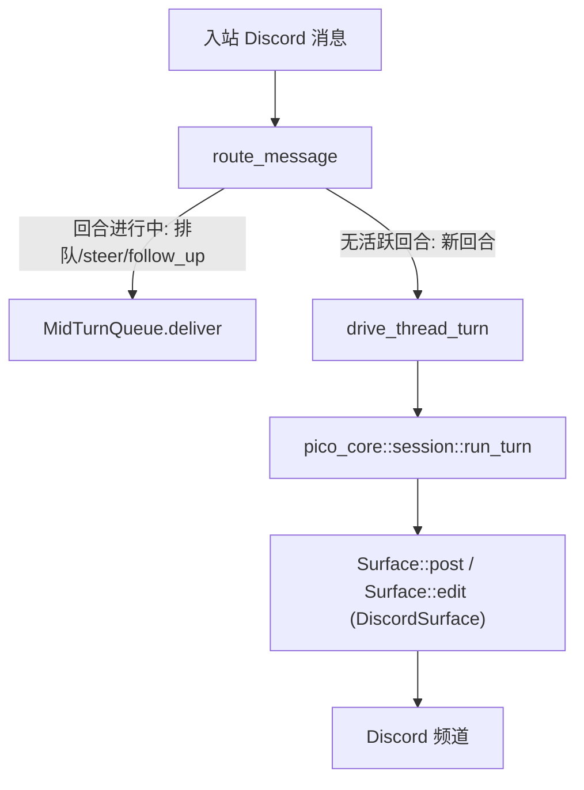

`discord` 是 pico 中唯一一个与 Discord 强绑定的 crate。它不包含任何业务逻辑
——绑定、worktree、会话、回合循环全部住在 `pico_core` 里——它唯一的职责是双向的
协议转换:把 Discord 收到的消息/交互变成引擎回合,再把引擎产出的内容转回
Discord 消息、编辑操作和交互式提示。如果你想搞清楚"一条 Discord 消息是怎么
变成 LLM 回合的,答案又是怎么传回频道的",这一页就是答案。

## 心智模型

这个 crate 由五个部分组成:

1. **`DiscordSurface`**——按回合创建的结构体,为 Discord 实现了 pico-core
    中定义的中立 `Surface` trait:post/edit/ui/typing/limits。
2. **机器人进程**(`app.rs` + `discord.rs` 里的 `framework()`)——启动一个
   `poise`/`serenity` 机器人,注册 11 个斜杠命令,并在启动过程里拉起调度器和
   后台回合启动器。
3. **`route_message`**——入站流水线:一条原始 Discord 消息进来,产出一个
   引擎回合(或者一次排队的后续投递)。
4. **`ui.rs`**——`Surface::ui` 的实现:选择菜单、确认按钮、弹窗输入,以及
   "直接用文字回复来作答"的兜底机制。
5. **`DiscordScheduleHost`**—— 的接入实现:把定时任务
   触发到 Discord 线程里、发布原始摘要消息、渲染主频道通知嵌入卡片。

## `DiscordSurface`:`Surface` 的实现

`DiscordSurface`(`crates/discord/src/discord.rs:1567-1574`)是一个按回合、
按频道创建的结构体——`{ ctx, channel, trigger: Option<MessageId>, author,
pending, cancel }`——每个回合都会重新构造一个(`drive_thread_turn`、后台
启动器、标题生成、以及每一条调度器触发路径都会各自新建一个)。它在
`crates/discord/src/discord.rs:1576-1645` 实现了 pico-core 的 `Surface` trait:

- `type Msg = serenity::MessageId`(`discord.rs:1577`)。
- `post(text, opts)`(`discord.rs:1588-1606`)构造一个 `CreateMessage`;如果
  `opts.as_reply` 且 `trigger: Some(msg_id)` 已设置,就附加一个
  `MessageReference`(`fail_if_not_exists(false)`,`discord.rs:1590-1595`);
  如果 `opts.silent`,就设置 `MessageFlags::SUPPRESS_NOTIFICATIONS`
  (`discord.rs:1596-1598`)。这正是 pico-core "静音前导 vs. 会 ping 的最终
  回答"这一决策(见 )落到 Discord 协议层具体两个布尔位的
  地方——Discord 只负责渲染这两个布尔值,并不负责决定它们。
- `edit(msg, text)`(`discord.rs:1614-1626`)调用 `channel.edit_message`,
  用于活动状态行更新和流式的部分回答。
- `ui(req)`(`discord.rs:1628-1630`)整个委托给 `crate::ui::run(...)`——
  所有交互式提示的逻辑都不在 `discord.rs` 里,而在 ui.rs。
- `set_title(title)`(`discord.rs:1632-1644`)调用
  `channel.edit_thread(...)`;只在 pico 自动创建了线程、需要在标题生成后
  为其命名时使用(即非线程发起的回合)。
- `post_reply(text, as_reply, silent)`(`discord.rs:1608-1612`)是一个
  Discord 专属的覆写(不是 trait 默认实现):它通过 `render_reply`
  (`discord.rs:271-285`)把 `text` 切分成 Discord 大小的分块,只有*第一块*
  会拿到调用方传入的 `(as_reply, silent)`——之后的每一块都被强制设为静音,
  绝不会再次 ping。

`limits()`(`discord.rs:1584-1586`)返回 `DISCORD_LIMITS`——见下文。

## 机器人进程:`app.rs` + `framework()`

`App::build`(`app.rs:16-55`)读取机器人 token,打开 sqlite 数据库,在启动
时执行 `crate::approval::reconcile_pending_aborted(&db)` 作为清理工作
(`app.rs:19-23`——见下方的 approval 说明),然后用
`crate::discord::framework(...)` 构建 `serenity` 客户端。

`framework(...)`(`discord.rs:33-124`)构建 `poise::Framework`:注册 11 个
顶层斜杠命令(`discord.rs:45-57`)——`/ping`、`/schedule`、`/cancel`、
`/busy`、`/context`、`/shake`、`/compact`、`/dev-deploy`、`/update`、
`/bind`、`/worktree`——把消息事件处理器接到 `on_event`,并在 `.setup()`
里启动 pico-core 的调度器(`pico_core::schedule::run`,
`discord.rs:92-108`),配上一个新建的 `DiscordScheduleHost`,同时给共享的
`OmpPool` 装上 `DiscordBackgroundLauncher`。`App::run`(`app.rs:57-103`)
把关闭信号与 `cancel.cancelled()` 做竞速,并在网关重连后调用调用方传入的
`on_connected()`,如果有待发送的 `DeployReport` 就一并发出——这就是
`/update` 触发的重启在新进程上线后"报平安"的方式。

## `route_message`:入站流水线

`route_message`(`discord.rs:1005-1360`)是这个 crate 里承载最多逻辑的
单一函数——每一条不是斜杠命令的普通 Discord 消息都会流经它,并被派发到
共享的 `TaskTracker` 上执行,以确保网关循环永远不被阻塞。其中最关键的
几步是:

- **中途应答的短路分支**(`discord.rs:1063-1066`):如果这条消息位于某个
  线程内,并且 `crate::ui::deliver_pending_answer(...)` 把它当作对某个
  进行中 `Select`/`Input`/`Editor` 提示的文字回答消费掉了,路由就到此
  为止——根本不会进入回合逻辑。
- **排队 vs. 新开回合的决策**(`discord.rs:1106-1117`):对于线程内的消息,
  会先尝试 `mid_turn.deliver(&conversation, &wrapped, None)`。如果它返回
  `Some(mode)`,说明这个 `ConversationId` 已经有一个回合*正在运行*,这条
  消息被排队/steer/follow_up 了——`route_message` 回复一个表情反应后直接
  返回,不会开启任何新东西。只有在没有活跃回合时,流水线才会继续往下
  构建全新的 `TurnInputs` 并调用 `drive_thread_turn`。
- **线程定位**(`discord.rs:1177-1188`):如果消息还不在某个线程里,pico
  会通过 `create_thread_from_message` 派生一个新线程,并对 Discord 的
  `THREAD_ALREADY_CREATED` 竞态错误做了兼容处理。
- **线程标记解析**(`discord.rs:1191-1300`):加载或创建一条
  `pico_core::thread_marker` 记录——拒绝已关闭的线程、重新校验 worktree
  是否仍然存在,或者为首次接触的线程持久化一条全新的标记。
- 最终 `drive_thread_turn`(`discord.rs:1382-1455`)构建上下文/身份信息,
  调用 `pico_core::session::run_turn`——这正是进入
   的接口。

## `ui.rs`:交互式 UI 接口

`crate::ui::run(...)`(`ui.rs:66-120`)就是 `DiscordSurface::ui` 委托的
目标。它对中立的 `UiRequest` 枚举做匹配:

- `Select` → 一个 Discord 选择菜单加取消按钮,最多 25 个选项。
- `Confirm` → 是/否按钮。
- `Input` / `Editor` → 两者都通过一个真正的 Discord 弹窗对话框实现
  (`run_modal`,`ui.rs:363-400`),上限 4000 字符,提交窗口 14 分钟。
- `Notify` → 一条静音消息(`SUPPRESS_NOTIFICATIONS`),前缀为
  ℹ️/⚠️/❌。

其中最值得关注的是 **`PendingAnswers`**(`ui.rs:26-27`):一个
`Arc<Mutex<HashMap<ChannelId,PendingAnswer>>>`,它让用户可以*直接打字回复*
来回答 Select/Input/Editor 提示,而不必点击按钮——`deliver_pending_answer`
正是 `route_message` 最先检查的东西(`discord.rs:1063`),它按
`(channel, author)` 作键,确保只有发起提示的那位用户在同一频道里的回复
才会被消费。`AnswerGuard` 是一个 RAII 释放守卫,在 UI 调用返回后移除该
注册项,这样一条过期的登记就不可能比它对应的提示活得更久。

## `DiscordScheduleHost`:把  接入 Discord

`schedule_host.rs` 实现了 pico-core 的 `ScheduleHost` trait
(`crates/core/src/schedule/mod.rs:111-116`):`resolve_cwd`、`fire`、
`post_raw`、`notify_home`。`fire` 会分发到 `fire_continue` 或
`fire_fresh`,两者最终都调用与 `route_message` 相同的那个
`drive_thread_turn`——一次定时任务触发和一条真实聊天消息,驱动回合走的
是同一条代码路径。值得注意的是,`fire_continue` 从不 steer 或打断一个
正在进行的回合:如果目标线程已经有回合在跑,它会通过
`mid_turn.deliver(..., Some(Queue))`(`schedule_host.rs:117-123`)排在
后面,而不是插到用户前面。`notify_home` 把 `HomeNotice` 的各个变体渲染成
带颜色的 Discord 嵌入卡片,并且是每个 guild 的 `home_channel` 配置项的
唯一使用方。

## `DISCORD_LIMITS`:大小限制旋钮

`consts.rs:1-6` 定义了 `DISCORD_LIMITS: SizeLimits { message_cap: 1900,
activity_line_cap: 20, activity_char_cap: 1800, activity_send_max: 1990 }`。
`DiscordSurface::limits()`(`discord.rs:1584-1586`)把这些数字交给
pico-core 中立的活动批处理器——见 ——由它决定一条
Discord 消息能塞下多少行工具活动状态,超出就滚动到下一条消息。Discord
只提供数字,不拥有批处理逻辑本身。

## 诚实的缺口:`approval.rs` 已经建好但还没接线

`approval.rs`(340 行)实现了一整套完整的批准/拒绝交互:一个 `Outcome`
枚举、一个描述被批准对象的 `Subject`、一个 `parse_approvers` 辅助函数,
以及 `pub async fn request(...)`——它会持久化一条待处理记录、发出一条带
批准/拒绝按钮的消息,并让 `ComponentInteractionCollector` 与取消信号做
竞速。**对全仓库搜索 `approval::request`、`approval::Subject`、
`approval::parse_approvers`、`approval::Outcome`,除了该模块自己的测试
代码之外,找不到任何调用点。** 唯一从外部调用这个模块的地方是启动时的
`crate::approval::reconcile_pending_aborted(&db)`(`app.rs:19-23`),它只是
把进程被杀死后残留的、状态为 `pending` 的记录翻转为 `aborted`——纯粹的
收尾清理,不是一条真正在运行的批准流程。换句话说:批准/拒绝机制已经
存在且能编译通过,但目前没有任何工具调用或引擎路径的代码会触发它。不要
假设危险工具的门禁走的是这条通路——就目前的代码而言,并没有。

## 中立逻辑真正的归属

有两点值得记住,免得把行为错误地归到 Discord 头上:每个工具对应一个
表情符号的活动行渲染,是 pico-core 的概念(由  的
活动批处理器拥有)——Discord 没有覆写
`tool_activity_line`/`thinking_line`/`failure_line` 中的任何一个,只提供
`SizeLimits`。而会话/回合状态本身——绑定、线程标记、worktree 路由——是
 的职责;Discord 只是通过这些接口去读写而已。
