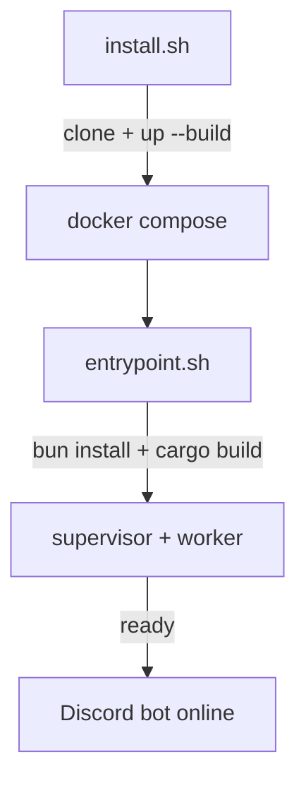

This page gets you from a bare host to a running pico bot, talking to it for the first time by tailing its logs. If you already have pico running, skip to [](carto:usage).

## Goal

End state: a `pico` container running via Docker Compose, built from source, with its supervisor/worker daemons up and the Discord bot online — verified by watching its startup logs.

## Prerequisites

You need three things on the host machine:

- **git** — to clone the repo.
- **Docker** — to build and run the container.
- **Docker Compose v2, `>= 2.24.0`** — the compose file uses the optional `env_file` syntax that requires this version (`install.sh:9-14`).

`install.sh` checks all three before doing anything and fails fast with an actionable message if one is missing or too old (`install.sh:9-14`).

## Steps

### 1. Run the installer

```sh
curl -fsSL https://raw.githubusercontent.com/5u4/pico/main/install.sh | bash
```

(Or clone the repo yourself and run `./install.sh` from inside it — the script is idempotent either way.)

What it actually does (`install.sh:16-26`):

- If `~/.pico/agent` does not exist yet, it clones `https://github.com/5u4/pico.git` there and runs `docker compose up -d --build` — the first run compiles pico *inside* the container, so this step takes a while.
- If `~/.pico/agent` already exists, it just runs `docker compose up -d` — this is the "make sure it's running" fast path for reinstalls/reboots.

### 2. What the container does on boot

Once the image builds, `docker/entrypoint.sh` runs entirely as the unprivileged `pico` user — there is no root phase (`entrypoint.sh:13-16`). In order, it:

1. Sets `PICO_OMP_HOST` and runs `bun install` in `omp-host/`, installing the pinned omp SDK the Bun host needs (`entrypoint.sh:33-36`).
2. Builds `pico-supervisor` and `pico-worker` in release mode into a shared target dir (`entrypoint.sh:69-73`).
3. Installs the `pico` CLI itself via `cargo install` (`entrypoint.sh:79-80`).
4. Starts the supervisor daemon and blocks until it reports ready, at which point the supervisor adopts/boots the current worker — this is the point the Discord bot actually comes online (`entrypoint.sh:82-102`).

### 3. The compose stack

`docker-compose.yml` brings up two services: `pico` (built from `docker/Dockerfile`, runs fully unprivileged as `USER pico`, working directory `/home/pico/.pico/agent`, `docker-compose.yml:2-13`) and `hindsight`, a long-term-memory server the pico container reaches at `http://hindsight:8888` (`docker-compose.yml:64-89`) — pico's own code doesn't know about memory at all; it's wired in via omp config, not pico config. The `pico` service mounts `~/.pico` and `~/.omp` from the host so state survives container rebuilds (`docker-compose.yml:53-56`), and its only elevated privilege is group access to the Docker socket, for self-deploy (`docker-compose.yml:31-32`).

Two optional env vars tame resource-constrained hosts: `PICO_MEM_LIMIT` caps container memory+swap so a runaway Rust build gets OOM-killed instead of freezing the host, and `CARGO_BUILD_JOBS` bounds parallel build jobs (`docker-compose.yml:27-52`).

## Verification

Follow the logs to confirm the bot came up cleanly — the installer prints the exact command to do this (`install.sh:28`):

```sh
cd ~/.pico/agent && docker compose logs -f
```

You're looking for the entrypoint's own progress lines (`[entrypoint] installing omp-host deps…`, `[entrypoint] building pico-supervisor + pico-worker…`, `[entrypoint] starting supervisor daemon…`) ending in the supervisor reporting ready and adopting a worker. If it instead exits with `supervisor never became ready; aborting`, something failed earlier in the log — scroll up.

If you enabled the noVNC port (`127.0.0.1:6080`, published for manual camofox browser login, `docker-compose.yml:37-46`), you can also confirm the container is reachable by opening that address in a browser on the host.



## Next

With the bot online, go to [](carto:usage) to bind a Discord channel and start a conversation. To understand what the supervisor/worker split buys you for zero-downtime updates, see [](carto:lifecycle).
