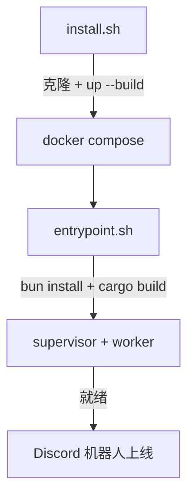

本页带你从一台裸机走到一个运行中的 pico 机器人,并通过跟踪它的日志完成第一次"对话确认"。如果你已经有一个在运行的 pico,直接跳到 [](carto:usage)。

## 目标

最终状态:一个通过 Docker Compose 运行、从源码构建的 `pico` 容器,supervisor/worker 守护进程都已启动,Discord 机器人已上线 —— 通过观察启动日志来验证。

## 前置条件

宿主机上需要三样东西:

- **git** —— 用来克隆仓库。
- **Docker** —— 用来构建并运行容器。
- **Docker Compose v2,`>= 2.24.0`** —— compose 文件用到了需要这个版本的可选 `env_file` 语法(`install.sh:9-14`)。

`install.sh` 在做任何事情之前会先检查这三项,一旦缺失或版本过旧,就会给出可操作的报错并立即退出(`install.sh:9-14`)。

## 步骤

### 1. 运行安装脚本

```sh
curl -fsSL https://raw.githubusercontent.com/5u4/pico/main/install.sh | bash
```

(或者自己克隆仓库,在里面运行 `./install.sh` —— 这个脚本是幂等的,两种方式都可以。)

它实际做的事情(`install.sh:16-26`):

- 如果 `~/.pico/agent` 还不存在,就把 `https://github.com/5u4/pico.git` 克隆到那里,然后运行 `docker compose up -d --build` —— 第一次运行会在容器*内部*编译 pico,所以这一步会花上一段时间。
- 如果 `~/.pico/agent` 已经存在,就只运行 `docker compose up -d` —— 这是给重装/重启场景准备的"确保它在跑"快速路径。

### 2. 容器启动时做了什么

镜像构建完成后,`docker/entrypoint.sh` 完全以非特权用户 `pico` 运行 —— 没有 root 阶段(`entrypoint.sh:13-16`)。它依次:

1. 设置 `PICO_OMP_HOST`,并在 `omp-host/` 里运行 `bun install`,安装 Bun host 需要的固定版本 omp SDK(`entrypoint.sh:33-36`)。
2. 以 release 模式把 `pico-supervisor` 和 `pico-worker` 构建到共享的 target 目录(`entrypoint.sh:69-73`)。
3. 通过 `cargo install` 安装 `pico` CLI 本身(`entrypoint.sh:79-80`)。
4. 启动 supervisor 守护进程,并阻塞直到它报告就绪 —— 届时 supervisor 会接管/启动当前 worker,这也是 Discord 机器人真正上线的时刻(`entrypoint.sh:82-102`)。

### 3. compose 技术栈

`docker-compose.yml` 启动两个服务:`pico`(从 `docker/Dockerfile` 构建,完全以非特权的 `USER pico` 运行,工作目录 `/home/pico/.pico/agent`,`docker-compose.yml:2-13`)和 `hindsight`,一个长期记忆服务,pico 容器通过 `http://hindsight:8888` 访问它(`docker-compose.yml:64-89`)—— pico 自己的代码完全不知道"记忆"这回事;它是通过 omp 的配置接进来的,而不是 pico 的配置。`pico` 服务把宿主机上的 `~/.pico` 和 `~/.omp` 挂载进来,让状态在容器重建后仍然保留(`docker-compose.yml:53-56`),它唯一的特权是加入 Docker socket 所在的用户组,用于自我部署(`docker-compose.yml:31-32`)。

两个可选的环境变量用来照顾资源受限的宿主机:`PICO_MEM_LIMIT` 限制容器的内存+swap,让失控的 Rust 构建被 OOM 杀掉而不是拖死整台宿主机;`CARGO_BUILD_JOBS` 限制并行构建任务数(`docker-compose.yml:27-52`)。

## 验证

跟踪日志,确认机器人干净地启动了 —— 安装脚本会打印出确切的命令(`install.sh:28`):

```sh
cd ~/.pico/agent && docker compose logs -f
```

你要找的是 entrypoint 自身打印的进度行(`[entrypoint] installing omp-host deps…`、`[entrypoint] building pico-supervisor + pico-worker…`、`[entrypoint] starting supervisor daemon…`),最终以 supervisor 报告就绪并接管一个 worker 结束。如果它反而以 `supervisor never became ready; aborting` 退出,说明前面的日志里出了问题 —— 往上翻。

如果你开启了 noVNC 端口(`127.0.0.1:6080`,用于手动 camofox 浏览器登录,`docker-compose.yml:37-46`),也可以在宿主机浏览器里打开这个地址,确认容器可达。



## 接下来

机器人上线后,前往 [](carto:usage) 绑定一个 Discord 频道并开始对话。想理解 supervisor/worker 分离如何实现零停机更新,见 [](carto:lifecycle)。
