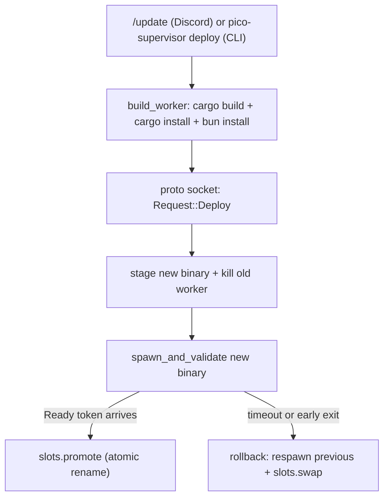

pico ships itself: the running bot updates its own binary from inside a Discord
command, without an operator SSHing in. This page explains the daemon that
makes that safe — `pico-supervisor`, a small process that owns exactly one
`pico-worker` child and knows how to replace it, roll back a bad replacement,
and never end up running zero workers.

## Why a supervisor at all

If `pico-worker` (the process that holds the Discord gateway connection,
runs turns, etc.) redeployed itself, the deploy would kill the very process
serving it. So pico splits into two binaries: a tiny, rarely-changing
`pico-supervisor` daemon that never touches Discord, and `pico-worker`, which
does everything else and gets replaced on every deploy. The supervisor's job
is entirely process lifecycle — stage a new binary, spawn it, wait for it to
prove it's alive, and atomically make it "current."

## Core concepts

- **`Supervisor`** (`crates/supervisor/src/supervisor.rs:39-50`) — the daemon
  state: `worker: AsyncMutex<Option<WorkerProc>>` (the one live child),
  `history` (a `VecDeque<DeployRecord>` capped at `HISTORY_CAP=5`, lines 18,
  502-513), and `deploy_lock: AsyncMutex<()>` that serializes deploy/rollback
  so two `/update`s can't race each other.
- **`Slots`** (`crates/supervisor/src/slots.rs:3-68`) — an A/B symlink pair,
  `current` and `previous`, living under `<supervisor_dir>/slots`, each
  pointing into `<supervisor_dir>/builds/<id>/worker`. `promote(bin)`
  (slots.rs:29-34) shifts current→previous then sets current to the new
  binary; `swap()` (slots.rs:36-46) swaps the two in place — that's what
  rollback uses to fall back to the previous binary without re-staging it.
  Every symlink write goes through a tmp file + `rename` (slots.rs:56-67), so
  a reader never observes a half-written link — "current" is always one
  complete binary or the other, never neither.
- **`stage`** (`crates/supervisor/src/stage.rs:13-21`) — copies the deploy
  source binary into a fresh `builds/<unix-nanos>/worker` path so a deploy
  never touches an in-use binary file. `worker_version` (stage.rs:23-49) runs
  `<bin> --version` under a 5s timeout to get a human-readable version
  string; `build_id` (stage.rs:51-70) SHA-256-hashes the binary and truncates
  to a 12-hex-char id — this is the `build` shown in `pico status`.
- **The ready handshake** (`spawn_and_validate`, supervisor.rs:421-479) — the
  supervisor spawns `<bin> --path <worker_root> --socket <ctrl_sock>
  --ready-token <token>` and races three outcomes with `tokio::select!`: the
  worker dialing back with `Request::Ready{token}` (via a `oneshot` registered
  in `pending_ready`), the child exiting early, or `health_timeout()`
  (default 30s, `crates/supervisor/src/config.rs:8-10,17-19,26-28`) elapsing.
  Only the ready-token branch produces a `WorkerProc`; the other two force-kill
  the child (supervisor.rs:473-477) and the deploy is treated as failed.
- **Deploy history** — each attempt is recorded (`record`, supervisor.rs:
  502-513) as a `DeployRecord{target,build,outcome,at_unix}`
  (`crates/shared/src/proto.rs:53-59`) with `outcome` ∈ `ok|rolled_back|failed`,
  surfaced newest-first through `Response::Status`.

## The deploy flow, end to end

1. **Build** (`crates/core/src/deploy.rs`) — the caller (Discord's `/update`,
   see below) first fast-forwards the checkout (`update_repo`, deploy.rs:
   165-172, `git fetch` + `git reset --hard origin/main`), then calls
   `build_worker` (deploy.rs:29-61) under a process-wide `DEPLOY_BUILD_LOCK`
   (deploy.rs:25,31) so two concurrent builds never race the same
   `--target-dir`. It runs `cargo build --release -p pico-worker` (deploy.rs:
   32-33), then on success chains `install_cli` (`cargo install --path
   crates/cli --force`, deploy.rs:63-100 — a soft failure, only warned) and
   `bun_install_host` (`bun install` in `omp-host/`, deploy.rs:102-130, also a
   soft failure), then `snapshot` (deploy.rs:132-145) copies the freshly
   built `pico-worker` release binary into a timestamped staging directory
   (pruning entries older than an hour first, `prune_staging`, deploy.rs:
   147-163) and returns that path as the binary to deploy.
2. **Deploy** (`Request::Deploy{path,report_to}` → `Supervisor::deploy`,
   supervisor.rs:226-319): takes `deploy_lock`; `stage::stage` copies the
   binary into a build slot; `inspect()` computes version+build
   (supervisor.rs:68-74); the **currently-running worker is killed
   immediately** (supervisor.rs:251-253) — *before* the new binary is proven
   to work. Then `spawn_and_validate` the new binary. On success: install as
   `self.worker`, `slots.promote(bin)`, record `"ok"`. On failure, if a
   previous slot exists, the supervisor re-`spawn_and_validate`s *it* as a
   rollback (supervisor.rs:276-306), recording `"rolled_back"` (or `"failed"`
   and logging "NO WORKER RUNNING" if even the rollback spawn fails).
3. **Ready signaling** — the newly spawned worker, once its own startup
   completes (Discord connected), dials the control socket and sends
   `Request::Ready{token}`; `handle_conn` (supervisor.rs:200-204) routes this
   to `signal_ready` (supervisor.rs:213-224), which matches the token against
   `pending_ready`, fires the `oneshot`, and replies `ReadyAck{report}` —
   handing back any `DeployReport` set at deploy time, over the *worker's own*
   socket connection (not the original CLI/Discord caller's connection).
4. **Rollback** (`Request::Rollback` → `Supervisor::rollback`,
   supervisor.rs:321-367) is the same mechanism manually triggered: read
   `previous_target()`, kill current, spawn+validate the previous binary,
   `slots.swap()` on success.

## Trade-off: this is not zero-downtime

The old worker is torn down (`supervisor.rs:251-253`) *before* the new one is
validated. If the new binary fails its ready handshake, there is a real gap —
from the kill until either the rollback binary comes up or the deploy is
declared failed — where **no worker is running** and Discord is disconnected.
The design accepts this in exchange for simplicity: at most one worker
process exists at any instant, so there's never a "two workers both connected
to Discord" state to reason about. `kill_worker` (supervisor.rs:481-500)
SIGTERMs first and only force-kills after `health_timeout()`.

## How a deploy gets started

Two entry points share the exact same `Request::Deploy` shape
(`pico_shared::proto::Request`, `crates/shared/src/proto.rs:8-20`):
- **CLI**: `pico-supervisor deploy|status|stop|rollback` (`crates/supervisor/
  src/main.rs:16-19`) via `crates/supervisor/src/client.rs:9-84`, which opens a
  fresh `UnixStream`, writes one `Request`, and reads one `Response` with a
  generous timeout (`health_timeout_secs*4+10`, min 180s).
- **Discord**: the `/update` command (`crates/discord/src/discord.rs:589-610`)
  calls `update_repo` then `build_and_deploy` (discord.rs:625-666), which
  calls `pico_core::deploy::build_worker` then
  `pico_core::deploy::request_deploy` (`crates/core/src/deploy.rs:6-23`) —
  the same socket, same JSON frame. The Discord channel id that issued
  `/update` is threaded through as `report_to` so that once the *new* worker
  reports ready, its `on_connected` hook (`crates/discord/src/app.rs:83-97`)
  posts the `DeployReport` text back into that channel
  (`post_deploy_report`, `discord.rs:612-623`) — the worker announces its own
  deploy outcome, not the supervisor.

## The wire protocol

Everything above rides one protocol:
`pico_shared::proto::{Request,Response,ReadyAck,DeployReport,StatusReport,
DeployRecord}` (`crates/shared/src/proto.rs:8-59`) — newline-delimited JSON
frames (`read_frame`/`write_frame`, proto.rs:61-83) over a Unix domain socket
at `<supervisor_dir>/pico.sock`. `Request` is tagged by `cmd`
(`deploy|rollback|status|stop|ready`); `Response` by `status`
(`ok|status|error`). It is the *only* shape shared between the supervisor
daemon, the worker daemon, and every CLI/Discord caller — transport- and
domain-agnostic by design, so any future caller reuses it unchanged.

## Related

-  — the `pico-supervisor` CLI subcommands and the `pico`
  binary that shares this worker root.
-  — the `/update` slash command and
  `post_deploy_report` delivery path.
