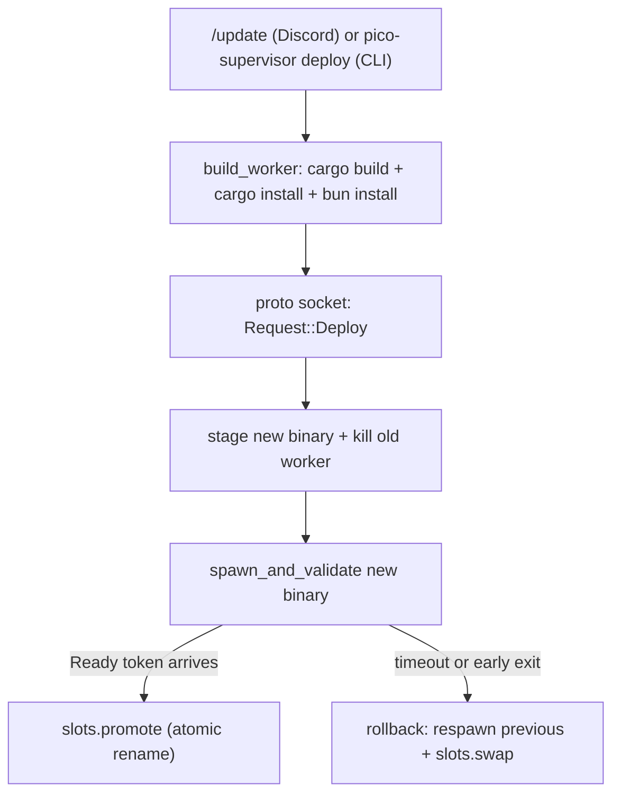

pico 会自己更新自己:运行中的 bot 可以从 Discord 命令内部更新自己的二进制文件,
不需要运维人员登录服务器手动操作。本页说明让这件事安全发生的守护进程——
`pico-supervisor`,一个只管一个 `pico-worker` 子进程的小进程,知道如何替换它、
在新版本失败时回滚,并且永远不会落到"零个 worker 在跑"的境地。

## 为什么需要 supervisor

如果 `pico-worker`(持有 Discord 网关连接、执行 turn 等的进程)自己重新部署自己,
这次部署会杀掉正在服务这次部署请求的那个进程本身。所以 pico 拆成两个二进制:
一个几乎不变、从不接触 Discord 的 `pico-supervisor` 守护进程,和一个 `pico-worker`,
后者做剩下的所有事,并且在每次部署时被替换。supervisor 的职责纯粹是进程生命周期——
暂存新二进制、启动它、等待它证明自己活着,然后原子化地把它设为"current"。

## 核心概念

- **`Supervisor`**(`crates/supervisor/src/supervisor.rs:39-50`)——守护进程状态:
  `worker: AsyncMutex<Option<WorkerProc>>`(唯一一个存活的子进程)、`history`
  (一个 `VecDeque<DeployRecord>`,上限 `HISTORY_CAP=5`,第 18 行、502-513 行),
  以及 `deploy_lock: AsyncMutex<()>`,用来串行化 deploy/rollback,防止两次
  `/update` 互相竞争。
- **`Slots`**(`crates/supervisor/src/slots.rs:3-68`)——一对 A/B 符号链接,
  `current` 和 `previous`,位于 `<supervisor_dir>/slots` 下,各自指向
  `<supervisor_dir>/builds/<id>/worker`。`promote(bin)`(slots.rs:29-34)
  先把 current 移到 previous,再把 current 设为新二进制;`swap()`
  (slots.rs:36-46)原地交换两者——rollback 就是用这个方法回退到之前的
  二进制,而不需要重新暂存。每次符号链接写入都经过临时文件 + `rename`
  (slots.rs:56-67),因此读者永远不会看到一个写了一半的链接——"current"
  始终是完整的某一个二进制,不会是"两者都不是"。
- **`stage`**(`crates/supervisor/src/stage.rs:13-21`)——把部署来源的二进制
  复制到一个全新的 `builds/<unix-nanos>/worker` 路径,确保一次部署永远不会
  碰到正在使用中的二进制文件。`worker_version`(stage.rs:23-49)在 5 秒
  超时下运行 `<bin> --version` 拿到人类可读的版本字符串;`build_id`
  (stage.rs:51-70)对二进制做 SHA-256 哈希并截断成 12 个十六进制字符的
  id——这就是 `pico status` 里显示的 `build`。
- **ready 握手**(`spawn_and_validate`,supervisor.rs:421-479)——supervisor
  启动 `<bin> --path <worker_root> --socket <ctrl_sock> --ready-token
  <token>`,用 `tokio::select!` 竞速三种结果:worker 回拨发来
  `Request::Ready{token}`(通过注册在 `pending_ready` 里的 `oneshot`)、
  子进程提前退出,或者 `health_timeout()`(默认 30 秒,
  `crates/supervisor/src/config.rs:8-10,17-19,26-28`)超时。只有 ready-token
  这条分支会产生一个 `WorkerProc`;另外两条分支会强制杀掉子进程
  (supervisor.rs:473-477),此次部署被视为失败。
- **部署历史**——每次尝试都会被记录(`record`,supervisor.rs:502-513)为
  一条 `DeployRecord{target,build,outcome,at_unix}`
  (`crates/shared/src/proto.rs:53-59`),`outcome` 取值
  `ok|rolled_back|failed`,通过 `Response::Status` 按最新在前的顺序暴露出来。

## 完整的部署流程

1. **构建**(`crates/core/src/deploy.rs`)——发起方(Discord 的 `/update`,
   见下文)首先 fast-forward 检出的代码(`update_repo`,deploy.rs:165-172,
   即 `git fetch` 加 `git reset --hard origin/main`),然后调用
   `build_worker`(deploy.rs:29-61),它由一个进程级的 `DEPLOY_BUILD_LOCK`
   (deploy.rs:25,31)保护,以确保两次并发构建不会争抢同一个
   `--target-dir`。它先运行 `cargo build --release -p pico-worker`
   (deploy.rs:32-33),成功后依次串联 `install_cli`(`cargo install --path
   crates/cli --force`,deploy.rs:63-100——这是一次软失败,只会记警告)和
   `bun_install_host`(在 `omp-host/` 里跑 `bun install`,deploy.rs:102-130,
   同样是软失败),再由 `snapshot`(deploy.rs:132-145)把刚构建出的
   `pico-worker` release 二进制复制进一个带时间戳的暂存目录(先清理超过
   一小时的旧条目,`prune_staging`,deploy.rs:147-163),把这个路径作为
   要部署的二进制返回。
2. **部署**(`Request::Deploy{path,report_to}` → `Supervisor::deploy`,
   supervisor.rs:226-319):获取 `deploy_lock`;`stage::stage` 把二进制复制
   到一个 build slot;`inspect()` 计算 version+build(supervisor.rs:68-74);
   **当前正在跑的 worker 会被立即杀掉**(supervisor.rs:251-253)——这发生在
   新二进制被证明可用之前。然后 `spawn_and_validate` 新二进制。成功时:
   设为 `self.worker`、`slots.promote(bin)`、记录 `"ok"`。失败时,如果存在
   previous slot,supervisor 会把*它*重新 `spawn_and_validate` 作为回滚
   (supervisor.rs:276-306),记录 `"rolled_back"`(如果连回滚的 spawn 也
   失败,则记录 `"failed"` 并打印 "NO WORKER RUNNING" 日志)。
3. **ready 信号**——新启动的 worker,一旦自己的启动流程完成(Discord 已连接),
   会拨通控制 socket 并发送 `Request::Ready{token}`;`handle_conn`
   (supervisor.rs:200-204)把这个帧路由到 `signal_ready`(supervisor.rs:
   213-224),后者用 token 去匹配 `pending_ready`,触发 `oneshot`,并回复
   `ReadyAck{report}`——把部署时设置的 `DeployReport` 带回去,走的是
   *worker 自己*的 socket 连接(而不是最初发起部署的 CLI/Discord 调用方
   的连接)。
4. **回滚**(`Request::Rollback` → `Supervisor::rollback`,supervisor.rs:
   321-367)是同一套机制的手动触发版本:读取 `previous_target()`、杀掉
   当前 worker、spawn+validate 之前的二进制,成功后 `slots.swap()`。

## 权衡:这不是零停机

旧 worker 会在新 worker 被验证*之前*就被拆除(`supervisor.rs:251-253`)。
如果新二进制没能通过 ready 握手,这中间确实存在一个真实的空档——从
被杀到回滚二进制启动成功或部署被判定失败之间——在这段时间里**没有
worker 在运行**,Discord 是断开的。这个设计接受了这个代价,换来的是简单性:
任何时刻最多只存在一个 worker 进程,永远不需要处理"两个 worker 同时连着
Discord"的状态。`kill_worker`(supervisor.rs:481-500)先发 SIGTERM,只有
在 `health_timeout()` 之后才强制杀。

## 部署是如何触发的

两个入口共享完全相同的 `Request::Deploy` 结构(`pico_shared::proto::
Request`,`crates/shared/src/proto.rs:8-20`):
- **CLI**:`pico-supervisor deploy|status|stop|rollback`(`crates/supervisor/
  src/main.rs:16-19`),通过 `crates/supervisor/src/client.rs:9-84`——打开
  一个全新的 `UnixStream`,写一个 `Request`,用一个宽松的超时
  (`health_timeout_secs*4+10`,最小 180 秒)读一个 `Response`。
- **Discord**:`/update` 命令(`crates/discord/src/discord.rs:589-610`)
  调用 `update_repo`,再调用 `build_and_deploy`(discord.rs:625-666),
  后者调用 `pico_core::deploy::build_worker`,再调用
  `pico_core::deploy::request_deploy`(`crates/core/src/deploy.rs:6-23`)——
  同一个 socket,同一种 JSON 帧。发起 `/update` 的 Discord 频道 id 会作为
  `report_to` 一路传下去,这样一旦*新* worker 报告 ready,它的
  `on_connected` 钩子(`crates/discord/src/app.rs:83-97`)会把
  `DeployReport` 的文本回发到该频道(`post_deploy_report`,`discord.rs:
  612-623`)——是 worker 自己汇报部署结果,而不是 supervisor。

## 协议

上面这一切都跑在同一套协议上:`pico_shared::proto::{Request,Response,
ReadyAck,DeployReport,StatusReport,DeployRecord}`(`crates/shared/src/
proto.rs:8-59`)——以换行分隔的 JSON 帧(`read_frame`/`write_frame`,
proto.rs:61-83)跑在 `<supervisor_dir>/pico.sock` 这个 Unix domain socket
上。`Request` 用 `cmd` 打标签(`deploy|rollback|status|stop|ready`);
`Response` 用 `status` 打标签(`ok|status|error`)。这是 supervisor 守护
进程、worker 守护进程和每一个 CLI/Discord 调用方之间*唯一*共享的形状——
按设计与传输层和领域逻辑无关,所以未来任何新的调用方都能原样复用它。

## 相关

-  —— `pico-supervisor` 的 CLI 子命令,以及共享这个
  worker root 的 `pico` 二进制。
-  —— `/update` 斜杠命令和
  `post_deploy_report` 的投递路径。
