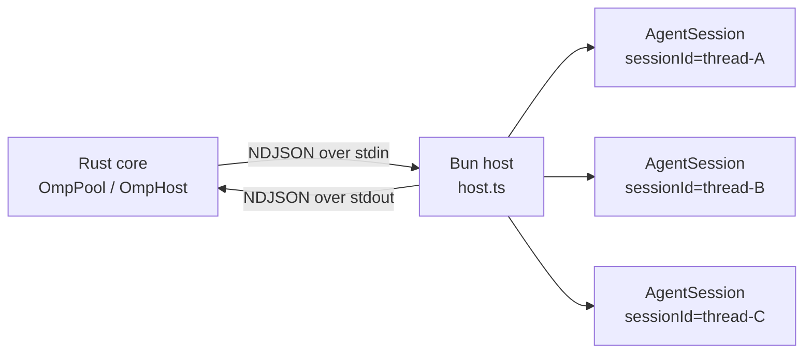

pico doesn't reimplement an agent loop — it embeds one. The omp host is the layer that makes that possible without paying a process-per-conversation cost: **one long-lived Bun/TypeScript process per profile** loads omp's TS SDK (`@oh-my-pi/pi-coding-agent`) once and multiplexes every Discord thread's `AgentSession` inside it, tagged by a `sessionId`. Rust never runs omp logic — it spawns and owns that process and talks to it over stdin/stdout as newline-delimited JSON (NDJSON). This replaced an earlier design that forked a separate `omp --mode rpc` child per thread; multiplexing collapses that into one process that can be reused, resumed, and cheaply queried for things like session titles.

## Mental model

Five pieces make up the seam:

1. **Wire vocabulary** — a typed `Command` enum Rust sends and an `Inbound` enum Rust receives, both tagged JSON (`crates/core/src/omp/protocol.rs:40-109`, `protocol.rs:408-459`).
2. **`OmpHost`** — the Rust-side handle to one child process: owns its stdin, a `Pending` map of in-flight requests, and a `Sessions` map of per-session event channels (`crates/core/src/omp/client.rs:65-76`).
3. **`OmpPool`** — keyed by *profile* (one `OmpHost` per profile) and separately by *Discord thread* (one `ThreadHandle` each), with a per-thread turn lock for exclusivity (`crates/core/src/omp/pool.rs:102-111`, `55-61`).
4. **`prompt.rs`** — builds what actually crosses the wire as text: the durable system-prompt file and the per-message wrapper.
5. **`host.ts`** — the TS process itself: a session registry, the omp SDK calls that open/resume sessions, and three per-session extension factories.

## The wire protocol

`Command<'a>` is the outbound vocabulary Rust dispatches — `OpenSession`, `CloseSession`, `Prompt`, `Steer`, `FollowUp`, `Abort`, `NewSession`, `SetModel`, `SetSessionName`, `Completion`, `Context`, `Compact`, `Shake` — serialized with `#[serde(tag = "type")]` in snake_case (`protocol.rs:40-109`). `Inbound` is what comes back — `Ready`, `Response`, `AgentStart`, `AgentEnd`, `TurnEnd`, `MessageUpdate`, `ToolExecutionStart/Update/End`, `ExtensionUiRequest`, `Error`, `MessageStart`, `MessageEnd`, plus a catch-all `#[serde(other)] Unknown` (`protocol.rs:408-459`). A `RequestId` is a ULID that correlates a request to its eventual `Response` frame (`protocol.rs:7-13`).

`OmpHost::spawn` (`client.rs:135-187`) launches `bun run <PICO_HOME>/agent/omp-host/host.ts` (or `$PICO_OMP_BIN` if set, `client.rs:115-132`), wires piped stdin/stdout/stderr, and starts a `read_loop` plus a stderr drain task. It then blocks on a oneshot channel for the host's `{"type":"ready"}` frame under a 60-second `READY_TIMEOUT` (`client.rs:26`, `162-172`) — the TS side only emits that frame once `initHost()` has provisioned Settings/AuthStorage/ModelRegistry (`host.ts:680-681`). `read_loop` (`client.rs:524-646`) decodes every stdout line as an `Inbound` frame: `Response` frames resolve against the `Pending` map (`client.rs:578-591`); everything else routes through `route()` to the matching session's mpsc channel (`client.rs:478-485`, `593-620`). `OmpSessionHandle` is a cheap `Clone` (`Arc<OmpHost>` + `session_id`, `client.rs:72-76`) — the capability object the turn engine calls `.prompt`/`.steer`/`.follow_up`/`.abort`/`.compact` on.

## Spawn and open: one host per profile

No `OmpHost` is spawned eagerly. `discord/src/app.rs:26-30` builds one `OmpPool::new` (`pool.rs:120-149`) for the whole adapter, and hosts come up lazily on first use via `OmpPool::host` (`pool.rs:155-178`): it takes/creates a `HostSlot` for the profile, checks `is_alive()`, and if dead or absent calls `profile_host_config` — which appends `PICO_PROFILE_DIR=<root>/profiles/<profile>` to the base env (`pool.rs:360-369`) — before `OmpHost::spawn`.

Opening a specific Discord thread goes through `OmpPool::get_or_spawn` (`pool.rs:180-207`), which double-checks the thread map (fast path, then again under a lock to dedupe concurrent opens) and calls `host.open_session(...)` (`client.rs:193-229`). That dispatches `Command::OpenSession` carrying cwd, session dir, `continue_from_file`, the append-system-prompt *path*, model, and identity — and registers the event channel in `Sessions` **before** dispatch, so no early event is lost. On the TS side, `openSession()` (`host.ts:446-469`) calls `constructSession()` (`host.ts:401-444`): it opens or creates a `SessionManager` — resume via `SessionManager.open` if `continueFromFile` is set, otherwise `SessionManager.create` (`host.ts:405-407`) — builds this session's extensions via `buildExtensions(identity)`, resolves the append-system-prompt, calls `createAgentSession(...)`, and subscribes: `session.subscribe(event => emit({...event, sessionId}))` (`host.ts:439-442`). That subscription is the *only* channel-crossing point — every SDK event is forwarded verbatim, stamped with `sessionId`.

## Turns: exclusivity and background launches

A turn starts with `run_turn` (`session.rs:54-93`), which calls `handle.begin_turn()` — this acquires the thread's `turn_lock` (an owned `Mutex<()>`) and installs a fresh renderer channel, producing a `TurnToken` that is the sole proof of exclusivity for that omp session (`pool.rs:64-77`). `engine::drive_turn` (`engine.rs:56`, see ) then calls `client.prompt(...)`, dispatching `Command::Prompt`. TS `case "prompt"` (`host.ts:548-556`) replies success/fail *synchronously* — checking `session.isStreaming` to reject if busy (`host.ts:549-553`) — then fires `deliverPrompt()` asynchronously (resizing any images first, `host.ts:168-171`). Assistant output never rides the RPC response; it arrives later, purely through the subscribed event pump.

Not every turn has a live caller waiting. `forward_or_launch` (`pool.rs:305-354`) is the pump every `ThreadHandle`'s events flow through (installed by `spawn_pump`, `pool.rs:209-227`): if no renderer is registered and the event is `OmpEvent::AgentStart` (`starts_background_turn`, `pool.rs:356-358`), it grabs `turn_lock` itself and calls `BackgroundTurnLauncher::launch` — a trait (`pool.rs:30-38`) set once via `OmpPool::set_background_launcher` (`pool.rs:151-153`) — to spin up a fresh turn-driving task. This is how an omp-side autonomous trigger (e.g. a schedule fire, see ) gets a driver without `pool.rs` knowing anything about `engine::drive_turn`.

## Two prompt surfaces

`prompt.rs` builds text for two very different slots, both orthogonal to the wire format itself:

- **The durable one**: `assemble_append` (`prompt.rs:7-35`) concatenates the persona (`persona.md`, `prompt.rs:5`), surface rules, an optional per-profile `identity.md`, and the current `runtime_context_block` (`prompt.rs:48-71` — platform/channel/thread/profile/cwd/worktree note/timezone), then writes it atomically via tmp-file-plus-rename to `<session_dir>/append.md` (`prompt.rs:29-34`). `build_session` (`session.rs:100-140`, see ) calls this on *every* turn and every resume, so the append content is refreshed each time even though the underlying omp session persists across turns.
- **The per-message one**: `wrap_discord_message` (`prompt.rs:95-135`) wraps a redaction-scrubbed Discord message in a `<discord-message user_id=".." name=".." sent_at=".."/>` tag plus any quoted `<discord-reply>`/`<discord-forward>` blocks; `wrap_scheduled_job` (`prompt.rs:151-178`) does the analogous wrap for a fired schedule, adding an explicit "no user is present, work autonomously" instruction and an optional `<script-output>` block.

## Capability providers and the profile boundary

`PICO_PROFILE_DIR` is read once, at TS module-load time (`host.ts:104-124`), to register profile-scoped skill/rule capability providers — this happens per host **process** (i.e. per profile), not per session. Per-session capabilities are different: `buildExtensions(identity)` (`host.ts:373-379`) instantiates three `ExtensionFactory`s closed over that session's identity — `secret-guard` always, `schedule` always, and `camofox` only if enabled — for every `AgentSession`. Camofox's own connection info (`CAMOFOX_BASE_URL`/`USER_ID`/`ACCESS_KEY`/`ENABLED`) is different again: it's host-*global* env injected once at `OmpHost::spawn` time via `HostConfig.env` (sourced from the sibling `CamofoxDaemon`, `crates/core/src/omp/camofox.rs:36-44`, `71-78`), not a per-session value — only the logical browser tab is scoped per thread.

## Completion: a session-agnostic RPC

Thread titles don't need a full turn. `title.rs:59` calls `pool.complete(profile, &system, prompt)` (`pool.rs:255-270`), which calls `host.completion(...)` (`client.rs:273-287`, dispatching `Command::Completion`). TS `runCompletion` (`host.ts:345-371`) resolves a smol/default-role model and streams a short (64-token) completion, replying `{type:"response", command:"completion", result:text}`. This bypasses the `Sessions` map entirely — no `sessionId` involved — because it's a host-level operation, not something any particular `AgentSession` owns.

## Tradeoffs

Multiplexing means shared fate: one crashed host takes down every thread on that profile at once. The recovery path leans on the same machinery used for a normal open — `session.rs::resume` (`session.rs:158-167`) finds the newest `.jsonl` via `resumable()`/`latest_session_file` (`session.rs:142-145`, `169-188`) and feeds it back through `build_session` → `pool.get_or_spawn` as `continue_from_file`, so the TS side picks `SessionManager.open` over `.create` and the conversation continues rather than restarting. The other cost is that the NDJSON framing is hand-duplicated on both ends — Rust reuses `pico_shared::proto::write_frame`/`read_frame` (`crates/shared/src/proto.rs:61-83`), while TS reimplements the same line-based framing via `emit()` (`host.ts:177-179`) and `readLines()` (`host.ts:638-653`); the two sides are kept in sync by convention, since Rust and TS can't share a serializer.

## See also

-  — what drives a turn once `OmpSessionHandle` exists and how `OmpEvent`s become Surface calls.
-  — `build_session`, session directories, and how `.jsonl` history is laid out on disk.
-  — how a thread's cwd and worktree metadata end up in the runtime-context block this layer writes into `append.md`.
