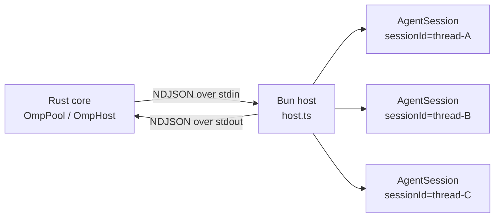

pico 并没有自己重新实现一套 agent 循环——而是把别人的循环嵌进来跑。omp 宿主(omp host)这一层让这件事在成本上可控:**每个 profile 一个长驻的 Bun/TypeScript 进程**,只加载一次 omp 的 TS SDK(`@oh-my-pi/pi-coding-agent`),并在进程内部按 `sessionId` 复用/隔离每个 Discord 线程对应的 `AgentSession`。Rust 侧从不执行 omp 的逻辑——它只负责启动并持有这个进程,通过 stdin/stdout 用换行分隔的 JSON(NDJSON)与之通信。这套设计取代了早期"每个线程 fork 一个 `omp --mode rpc` 子进程"的方案;把多个会话收拢进一个进程,换来了进程复用、断线恢复,以及像获取会话标题这类轻量查询的低成本。

## 心智模型

这层接缝由五个部分组成:

1. **线路词汇表** —— Rust 发送的带类型的 `Command` 枚举,以及 Rust 接收的 `Inbound` 枚举,二者都是打了 tag 的 JSON(`crates/core/src/omp/protocol.rs:40-109`、`protocol.rs:408-459`)。
2. **`OmpHost`** —— Rust 侧对一个子进程的持有者:拥有其 stdin、一个记录在途请求的 `Pending` map,以及一个按会话分发事件的 `Sessions` map(`crates/core/src/omp/client.rs:65-76`)。
3. **`OmpPool`** —— 按 *profile* 分组(每个 profile 一个 `OmpHost`),同时也按 *Discord 线程* 分组(每个线程一个 `ThreadHandle`),并为每个线程配一把回合互斥锁(`crates/core/src/omp/pool.rs:102-111`、`55-61`)。
4. **`prompt.rs`** —— 构建真正跨越这条线路的文本:持久化的系统提示文件,以及每条消息的包装文本。
5. **`host.ts`** —— TS 进程本体:会话注册表、打开/恢复会话所调用的 omp SDK,以及三个按会话安装的扩展工厂。

## 线路协议

`Command<'a>` 是 Rust 派发的出站词汇表——`OpenSession`、`CloseSession`、`Prompt`、`Steer`、`FollowUp`、`Abort`、`NewSession`、`SetModel`、`SetSessionName`、`Completion`、`Context`、`Compact`、`Shake`——用 `#[serde(tag = "type")]` 以 snake_case 序列化(`protocol.rs:40-109`)。`Inbound` 则是回传的内容——`Ready`、`Response`、`AgentStart`、`AgentEnd`、`TurnEnd`、`MessageUpdate`、`ToolExecutionStart/Update/End`、`ExtensionUiRequest`、`Error`、`MessageStart`、`MessageEnd`,再加一个兜底的 `#[serde(other)] Unknown`(`protocol.rs:408-459`)。`RequestId` 是一个 ULID,用来把请求与最终的 `Response` 帧关联起来(`protocol.rs:7-13`)。

`OmpHost::spawn`(`client.rs:135-187`)启动 `bun run <PICO_HOME>/agent/omp-host/host.ts`(若设置了 `$PICO_OMP_BIN` 则用它,`client.rs:115-132`),接好管道化的 stdin/stdout/stderr,启动一个 `read_loop` 和一个 stderr 排空任务。随后它在一个 oneshot 通道上阻塞,等待宿主发出的 `{"type":"ready"}` 帧,超时上限为 60 秒(`READY_TIMEOUT`,`client.rs:26`、`162-172`)——TS 侧只有在 `initHost()` 完成 Settings/AuthStorage/ModelRegistry 的准备工作后才会发出这一帧(`host.ts:680-681`)。`read_loop`(`client.rs:524-646`)把每一行 stdout 解码为一个 `Inbound` 帧:`Response` 帧对照 `Pending` map 解析(`client.rs:578-591`);其余帧通过 `route()` 路由到对应会话的 mpsc 通道(`client.rs:478-485`、`593-620`)。`OmpSessionHandle` 是一个廉价的 `Clone`(`Arc<OmpHost>` + `session_id`,`client.rs:72-76`)——是 turn engine 用来调用 `.prompt`/`.steer`/`.follow_up`/`.abort`/`.compact` 的能力对象。

## 启动与打开会话:每个 profile 一个宿主

没有任何 `OmpHost` 是提前启动的。`discord/src/app.rs:26-30` 为整个适配器构建一个 `OmpPool::new`(`pool.rs:120-149`),宿主进程只在首次用到时才惰性启动,走 `OmpPool::host`(`pool.rs:155-178`):它为该 profile 取出或新建一个 `HostSlot`,检查 `is_alive()`,若已死或不存在,则先调用 `profile_host_config`——它会把 `PICO_PROFILE_DIR=<root>/profiles/<profile>` 追加到基础环境变量中(`pool.rs:360-369`)——再调用 `OmpHost::spawn`。

打开某个具体 Discord 线程走的是 `OmpPool::get_or_spawn`(`pool.rs:180-207`):先做一次快速路径检查线程 map,再在锁内二次检查以去重并发的打开请求,然后调用 `host.open_session(...)`(`client.rs:193-229`)。这会派发 `Command::OpenSession`,携带 cwd、会话目录、`continue_from_file`、系统附加提示的*文件路径*、模型、身份信息——并且在派发之前就把事件通道注册进 `Sessions`,确保不会漏掉任何提前到达的事件。TS 侧,`openSession()`(`host.ts:446-469`)调用 `constructSession()`(`host.ts:401-444`):打开或新建一个 `SessionManager`——若设置了 `continueFromFile` 则用 `SessionManager.open` 恢复,否则用 `SessionManager.create` 新建(`host.ts:405-407`)——为该会话通过 `buildExtensions(identity)` 构建扩展,解析附加系统提示,调用 `createAgentSession(...)`,然后订阅:`session.subscribe(event => emit({...event, sessionId}))`(`host.ts:439-442`)。这个订阅是唯一的跨通道传递点——SDK 产生的每一个事件都会被原样转发,并打上 `sessionId` 戳。

## 回合:互斥性与后台启动

一个回合从 `run_turn`(`session.rs:54-93`)开始,它调用 `handle.begin_turn()`——获取该线程的 `turn_lock`(一个独占的 `Mutex<()>`)并安装一个全新的渲染器通道,生成一个 `TurnToken` 作为该 omp 会话独占权的唯一凭证(`pool.rs:64-77`)。随后 `engine::drive_turn`(`engine.rs:56`,参见 )调用 `client.prompt(...)`,派发 `Command::Prompt`。TS 的 `case "prompt"`(`host.ts:548-556`)会先*同步*回复成功/失败——检查 `session.isStreaming` 判断是否正忙(`host.ts:549-553`)——然后异步触发 `deliverPrompt()`(先对图片做 resize,`host.ts:168-171`)。助手的输出内容从不搭乘 RPC 响应;它只会稍后通过订阅的事件流单独到达。

并非每个回合都有实时调用方在等待。`forward_or_launch`(`pool.rs:305-354`)是每个 `ThreadHandle` 的事件都会流经的泵(由 `spawn_pump` 安装,`pool.rs:209-227`):如果当前没有注册渲染器,且事件是 `OmpEvent::AgentStart`(`starts_background_turn`,`pool.rs:356-358`),它会自己抢下 `turn_lock`,调用 `BackgroundTurnLauncher::launch`——一个 trait(`pool.rs:30-38`),通过 `OmpPool::set_background_launcher` 一次性设置(`pool.rs:151-153`)——来启动一个全新的驱动回合的任务。这就是像调度触发(参见 )这类 omp 侧自主触发事件,在没有人为驱动方的情况下如何获得驱动者的机制。

## 两个提示词构建面

`prompt.rs` 为两个截然不同的位置构建文本,二者都与线路格式本身正交:

- **持久化的一面**:`assemble_append`(`prompt.rs:7-35`)把人设(`persona.md`,`prompt.rs:5`)、平台规则、可选的按 profile 配置的 `identity.md`,以及当前的 `runtime_context_block`(`prompt.rs:48-71`——平台/频道/线程/profile/cwd/worktree 备注/时区)拼接起来,再通过临时文件加改名的方式原子性写入 `<session_dir>/append.md`(`prompt.rs:29-34`)。`build_session`(`session.rs:100-140`,参见 )在*每一个*回合、每一次恢复时都会调用它,所以即便底层 omp 会话是跨回合持久的,附加内容也是每次都刷新的。
- **每条消息的一面**:`wrap_discord_message`(`prompt.rs:95-135`)把经过脱敏的 Discord 消息包进一个 `<discord-message user_id=".." name=".." sent_at=".."/>` 标签,外加任意引用的 `<discord-reply>`/`<discord-forward>` 块;`wrap_scheduled_job`(`prompt.rs:151-178`)对一次调度触发做类似的包装,额外附上一句明确的"当前没有用户在场,请自主工作"的指示,以及一个可选的 `<script-output>` 块。

## 能力提供者与 profile 边界

`PICO_PROFILE_DIR` 只在 TS 模块加载时读取一次(`host.ts:104-124`),用来注册按 profile 划分的技能/规则能力提供者——这发生在每个宿主*进程*(即每个 profile)一次,而不是每个会话一次。按会话划分的能力则不同:`buildExtensions(identity)`(`host.ts:373-379`)会为每一个 `AgentSession` 实例化三个 `ExtensionFactory`,并闭包捕获该会话的身份信息——`secret-guard` 始终启用,`schedule` 始终启用,`camofox` 仅在启用时才有。camofox 自身的连接信息(`CAMOFOX_BASE_URL`/`USER_ID`/`ACCESS_KEY`/`ENABLED`)又是另一回事:它是宿主*全局*的环境变量,在 `OmpHost::spawn` 时通过 `HostConfig.env` 一次性注入(来源于同级的 `CamofoxDaemon`,`crates/core/src/omp/camofox.rs:36-44`、`71-78`),而不是按会话的值——只有逻辑上的浏览器标签页才是按线程划分的。

## Completion:与会话无关的 RPC

线程标题不需要走完整的一个回合。`title.rs:59` 调用 `pool.complete(profile, &system, prompt)`(`pool.rs:255-270`),后者调用 `host.completion(...)`(`client.rs:273-287`,派发 `Command::Completion`)。TS 的 `runCompletion`(`host.ts:345-371`)解析出 smol/default 角色对应的模型,流式生成一段简短(64 token)的补全,回复 `{type:"response", command:"completion", result:text}`。这完全绕开了 `Sessions` map——不涉及任何 `sessionId`——因为这是一个宿主级操作,不属于任何具体的 `AgentSession`。

## 权衡

多路复用意味着命运共享:同一个 profile 上,一个宿主进程崩溃会带倒该 profile 下的每一个线程。恢复路径复用了与正常打开会话相同的机制——`session.rs::resume`(`session.rs:158-167`)通过 `resumable()`/`latest_session_file`(`session.rs:142-145`、`169-188`)找到最新的 `.jsonl`,再把它作为 `continue_from_file` 送回 `build_session` → `pool.get_or_spawn` 这条路径,于是 TS 侧会选择 `SessionManager.open` 而不是 `.create`,对话得以续接而不是重新开始。另一个代价是 NDJSON 的分帧逻辑在两端各写了一份——Rust 侧复用 `pico_shared::proto::write_frame`/`read_frame`(`crates/shared/src/proto.rs:61-83`),而 TS 侧通过 `emit()`(`host.ts:177-179`)和 `readLines()`(`host.ts:638-653`)重新实现了同样的按行分帧逻辑;两端只能靠约定保持一致,因为 Rust 和 TS 没法共享同一个序列化器。

## 另请参阅

-  —— 一旦 `OmpSessionHandle` 就绪,是什么驱动了一个回合,以及 `OmpEvent` 如何映射为 Surface 调用。
-  —— `build_session`、会话目录的组织方式,以及 `.jsonl` 历史记录在磁盘上的布局。
-  —— 线程的 cwd 与 worktree 元数据如何最终写入这一层构建的 `append.md` 中的运行时上下文块。
