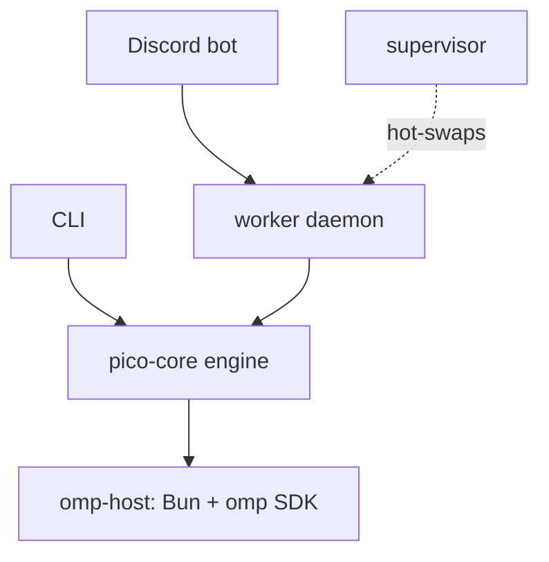

pico is a personal AI assistant you can talk to like a colleague — over Discord, or from a terminal — that keeps a real working directory, real tools, and a real memory of the conversation. It is not a chatbot wrapper: under the hood pico *is* an **omp** (Oh My Pi) agent, running the same harness, persona, and tool set an engineer would use directly, just reachable through two different front doors.

## The core idea: one omp session per conversation

Every Discord thread and every CLI invocation maps to exactly one ongoing **omp session**: a single continuous conversation with its own history, working directory, and state. The persona that drives that session — its identity, tone, and hard rules (e.g. never ask a user to paste a secret; flag any plaintext secret it sees) — is a single shared document, `crates/core/src/persona.md:1-11,13-30`, injected into every session regardless of which front door it came through.

That single-persona, single-session model is the thing to hold onto: pico is one agent wearing two adapters, not two products that happen to share a name.

## The 6-crate + omp-host shape

pico is a Rust workspace (`Cargo.toml:1-8`, edition 2024) of six crates plus a Bun/TypeScript host process:

- **`crates/core`** (`pico-core`) — the platform-neutral engine: the turn loop, the `Surface` rendering seam, the omp-host client, persistence, scheduling, worktrees. See its module list at `crates/core/src/lib.rs:1-19`.
- **`crates/discord`** (`pico-discord`) — the Discord adapter; implements core's `Surface` and `ScheduleHost` seams.
- **`crates/supervisor`** — a daemon that owns and hot-swaps the worker process (so `/update` and `/dev-deploy` don't drop a live conversation).
- **`crates/worker`** — the worker daemon that actually runs the platform adapters (Discord today).
- **`crates/cli`** (`pico`) — the local command-line entry point: launches the omp TUI directly, plus admin subcommands.
- **`crates/shared`** (`pico-shared`) — cross-cutting plumbing: paths, the supervisor↔worker wire protocol, config, logging, secret handling, signals, process management.
- **`omp-host/`** — a long-running Bun process running omp's TypeScript SDK (`omp-host/host.ts`), hosting many live omp `AgentSession`s (one per thread/profile) that the Rust side talks to over NDJSON.

The dependency graph is intentionally acyclic: `discord`/`supervisor`/`worker`/`cli` all depend on `core` + `shared`; `core` depends only on `shared` (`Cargo.toml:21-23`). Nothing platform-specific leaks backward into the engine.

## The shape, at a glance

Two front doors (Discord, CLI) drive the same neutral engine, which in turn drives an omp session in the Bun host. The supervisor sits beside the worker, not in the request path — it manages the worker's lifecycle so deploys don't interrupt live conversations.

## The seams worth knowing by name

Five seams hold this shape together, each with exactly one production implementation today and room for more:

- The **`Surface` trait** (`crates/core/src/surface.rs:4-42`) — how the engine renders to a platform, implemented by `DiscordSurface`.
- The **omp-host NDJSON protocol** — how Rust talks to the Bun-hosted omp SDK, one host per profile.
- The **`ScheduleHost` trait** — how the neutral scheduler fires jobs into a platform.
- The **supervisor↔worker protocol** (`pico_shared::proto`) — deploy/rollback/status over a Unix socket.
- **Persistence** — one SQLite `pico.db` plus filesystem-backed schedules and TOML config, all rooted under `PICO_HOME`.

You don't need to understand all five to use pico. You do need them to extend it — see  for how they fit together.

## Where to go next

- Never run pico before? Start with  — zero to a running bot via `docker compose up`.
- Already running and want to talk to it?  covers binding a channel, threads, slash commands, and mid-turn steering.
- Extending or debugging pico itself?  is the contributor map: the crates, the five seams, and how one Discord message becomes one answer.
