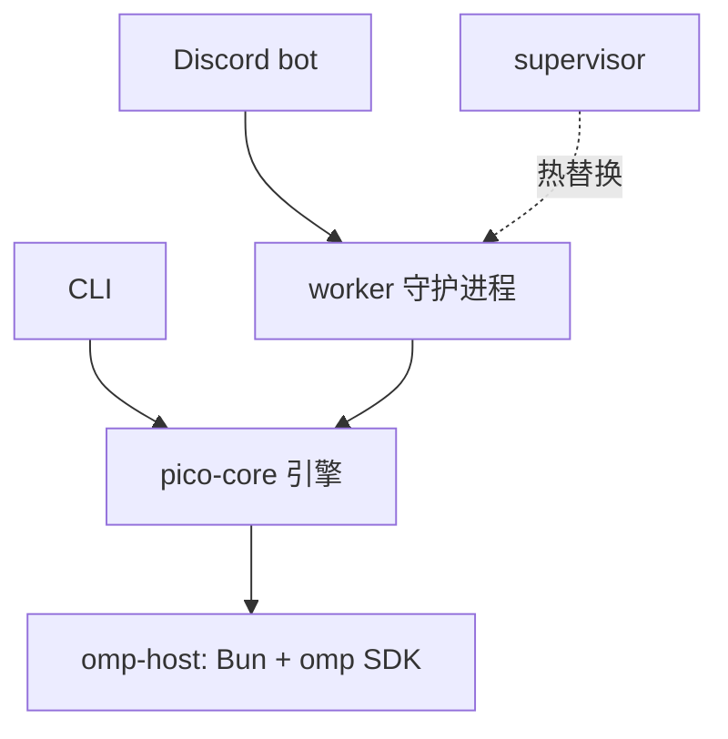

pico 是一个可以像同事一样交流的个人 AI 助手 —— 通过 Discord,或者直接在终端里用命令行。它保留着真实的工作目录、真实的工具集,以及对整段对话的真实记忆。它不是一个套壳聊天机器人:在底层,pico *就是* 一个 **omp**(Oh My Pi)agent —— 运行着与工程师直接使用的同一套 harness、persona 和工具集,只是通过两个不同的入口来访问。

## 核心思路:每段对话对应一个 omp session

每一个 Discord 线程、每一次 CLI 调用,都对应着恰好一个持续进行的 **omp session**:一段拥有自己历史记录、工作目录和状态的连续对话。驱动这个 session 的 persona —— 它的身份、语气,以及硬性规则(例如永远不要求用户粘贴密钥;发现明文密钥要主动提醒)—— 是一份共享文档,`crates/core/src/persona.md:1-11,13-30`,无论从哪个入口进入,都会注入到每一个 session 中。

这个"单一 persona、单一 session"的模型是理解 pico 的关键:pico 是一个套着两层适配器的 agent,而不是两个碰巧同名的产品。

## 6 个 crate + omp-host 的整体结构

pico 是一个 Rust workspace(`Cargo.toml:1-8`,edition 2024),由六个 crate 加一个 Bun/TypeScript host 进程组成:

- **`crates/core`**(`pico-core`)—— 平台无关的引擎:turn 循环、`Surface` 渲染接缝、omp-host 客户端、持久化、调度、worktree。模块列表见 `crates/core/src/lib.rs:1-19`。
- **`crates/discord`**(`pico-discord`)—— Discord 适配器;实现了 core 的 `Surface` 和 `ScheduleHost` 接缝。
- **`crates/supervisor`** —— 一个守护进程,负责持有并热替换 worker 进程(这样 `/update` 和 `/dev-deploy` 就不会打断正在进行的对话)。
- **`crates/worker`** —— 真正运行各平台适配器(目前是 Discord)的 worker 守护进程。
- **`crates/cli`**(`pico`)—— 本地命令行入口:直接启动 omp TUI,外加一些管理子命令。
- **`crates/shared`**(`pico-shared`)—— 横切基础设施:路径、supervisor↔worker 协议、配置、日志、密钥处理、信号、进程管理。
- **`omp-host/`** —— 一个长期运行的 Bun 进程,跑着 omp 的 TypeScript SDK(`omp-host/host.ts`),托管着许多存活的 omp `AgentSession`(每个线程/profile 一个),Rust 侧通过 NDJSON 与之通信。

依赖关系图是刻意做成无环的:`discord`/`supervisor`/`worker`/`cli` 都依赖 `core` + `shared`;`core` 只依赖 `shared`(`Cargo.toml:21-23`)。任何平台相关的东西都不会反向渗入引擎。

## 整体结构一览

两个入口(Discord、CLI)驱动着同一个中立引擎,而这个引擎又驱动着 Bun host 里的一个 omp session。supervisor 位于 worker 旁边,而不在请求路径里 —— 它管理 worker 的生命周期,让部署不会打断正在进行的对话。

## 值得记住名字的几个接缝

有五个接缝把这套结构维系在一起,每个目前都只有一个生产实现,也都留出了扩展空间:

- **`Surface` trait**(`crates/core/src/surface.rs:4-42`)—— 引擎如何向某个平台渲染,由 `DiscordSurface` 实现。
- **omp-host NDJSON 协议** —— Rust 如何与 Bun 托管的 omp SDK 通信,每个 profile 一个 host。
- **`ScheduleHost` trait** —— 中立调度器如何把任务触发到某个平台上。
- **supervisor↔worker 协议**(`pico_shared::proto`)—— 通过 Unix socket 传递部署/回滚/状态。
- **持久化** —— 一个 SQLite `pico.db`,加上文件系统存储的 schedule 和 TOML 配置,所有路径都根植于 `PICO_HOME`。

想要使用 pico,不需要理解全部五个接缝;想要扩展它,才需要 —— 具体如何拼接见 。

## 接下来去哪

- 从未运行过 pico?从  开始 —— 通过 `docker compose up` 从零跑起来。
- 已经在运行,想跟它对话? 讲了如何绑定频道、线程、斜杠命令,以及 turn 进行中的插话方式。
- 想扩展或调试 pico 本身? 是面向贡献者的地图:各个 crate、五个接缝,以及一条 Discord 消息是如何变成一条回答的。
