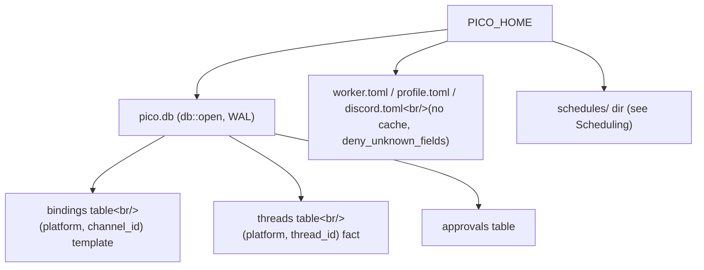

pico's worker process can die and restart at any time (deploy, crash, host reboot). Anything that needs to survive that — which Discord channel maps to which working directory, which thread has a live git worktree, which approval is still pending — lives in one SQLite file, `pico.db`. Everything that does *not* need that durability — model choice, timezone, per-guild defaults — lives in plain TOML files read fresh on every call. This page is the map of that split, and of the one `PICO_HOME` root everything is rooted under.

## Intent

Three durability problems, one file: which `(platform, channel)` maps to a default profile/cwd before any conversation exists (`bindings`), which `(platform, thread_id)` conversation is live and where its worktree is (`threads`), and which human-in-the-loop confirmations are still outstanding (`approvals`). All three are columns in `pico.db`, opened once at boot behind a shared `sqlx::SqlitePool` (`crates/core/src/db.rs:6-24`). Configuration is a deliberately separate concern: `worker.toml` / `discord.toml` / `profile.toml` are decoded strictly (`deny_unknown_fields`, so a typo'd key fails loud instead of being silently ignored) and re-read on every call — no cache to invalidate.

## The core split: channel templates vs thread facts

The single idea worth carrying away from this page: **`bindings` is a template, `threads` is a fact.**

1. **`db::open`** (`crates/core/src/db.rs:6-24`) opens `pico.db` (path from `pico_shared::paths::worker_db`, `crates/shared/src/paths.rs:81-83`) via `SqliteConnectOptions` with WAL journal mode, a 5s busy timeout, foreign keys on, and a 5-connection pool cap, then runs `sqlx::migrate!()` (embedded migrations under `crates/core/migrations/`) **unconditionally on every boot** — sqlx tracks which migrations already applied, so this is a no-op most boots and a schema upgrade on the boot after a deploy.
2. **`bindings` table** — one row per `(platform, channel_id)`: the *default* profile/cwd (or worktree template) for a channel before any thread exists. `Binding { profile, kind: BindingKind::Regular{cwd} | Worktree{base_repo, default_branch, branch_prefix} }` (`crates/core/src/bindings.rs:6-20`). `get`/`set_regular`/`set_worktree`/`unset` (`bindings.rs:66,113,127,156`) all key on `(platform, channel_id)`; the write path is a single `upsert` doing `INSERT ... ON CONFLICT(platform, channel_id) DO UPDATE` (`bindings.rs:167-198`).
3. **`threads` table** — one row per `(platform, thread_id)`: the resolved cwd a *specific* conversation actually ended up with, its optional worktree origin, and a `closed_at` tombstone. `ThreadMarker { profile, cwd, worktree: Option<WorktreeOrigin>, closed_at, channel_id }` (`crates/core/src/thread_marker.rs:6-19`). `load`/`fetch`/`save`/`write`/`tombstone`/`list_open` (`thread_marker.rs:31,55,102,108,144,167`) mirror the bindings pattern. `list_open` (`thread_marker.rs:167-193`) is what powers the CLI's thread picker: `WHERE platform = ? AND channel_id = ? AND closed_at IS NULL` (`thread_marker.rs:195-204`).
4. **`resolve_route`** (`bindings.rs:39-62`) is the shared decision function that bridges the two: given `Option<&Binding>` plus a hard fallback profile/cwd (the guild default), it produces `Route::Regular{profile,cwd}` or `Route::Worktree{profile,base_repo,default_branch,branch_prefix}`. Both the CLI (`crates/cli/src/thread.rs:116`) and Discord's fresh-schedule path (`crates/discord/src/schedule_host.rs:201,215`) branch on this `Route` to decide whether to fork a worktree or just use a cwd directly — see [](carto:worktrees).
5. **`approvals` table** — pending human-approval requests (kind/title/detail/status/resolver), consumed entirely by the `discord` crate (`crates/discord/src/approval.rs:121-137,153-157,169-173`). `core` only owns the migration (0001); no file under `core/src` reads or writes it.

Both `bindings` and `threads` store filesystem paths **portably** — relative to `pico_home()` when possible, via `to_portable`/`from_portable` (`crates/shared/src/paths.rs:136,144`) — so the whole DB survives a `PICO_HOME` move to a new host.



## Mechanism: boot, first message, resume, close

- **Boot**: `pico_discord::app::App::build` calls `pico_core::db::open(root)` exactly once (`crates/discord/src/app.rs:18`); migrations run, and the resulting pool is handed to every subsystem that needs it (schedule host, Discord command handlers, CLI).
- **First message on a channel with no thread yet**: look up `bindings::get(db, "discord", channel_id)` → `resolve_route` against the guild default from `discord.toml` → if the result is `Route::Worktree`, `worktree::ensure(...)` forks a branch and returns a path → `thread_marker::save` persists the *new* thread's `ThreadMarker`, keyed by the freshly-minted **thread_id** (not the channel_id). That's the split in action: the channel's binding is a reusable template; the thread's marker is a one-time fact derived from it.
- **Resuming**: CLI/Discord call `thread_marker::load(db, platform, thread_id)` to get cwd + worktree info before spawning/resuming an omp session. If the row is missing or invalid, callers fall back to re-resolving from `bindings` (`thread_marker.rs:35,42,49` — each logs a `tracing::warn!` on that path).
- **Closing** (`/worktree close`, `crates/discord/src/discord.rs:830-892`): load the marker → `worktree::close_would_lose` (safety check, see [](carto:worktrees)) → `pool.close(thread_id)` (refuses if a turn is in-flight) → `worktree::remove` (deletes the worktree dir + branch) → `thread_marker::tombstone` (sets `closed_at`, the row itself stays — conversation history/profile/cwd are preserved for the record, just marked closed).

## Configuration: the other half

Config is intentionally *not* in the DB — it's small, human-edited, and doesn't need transactional guarantees:

- `config::load` (`crates/core/src/config.rs:50-56`) reads a profile's `profile.toml` → `ProfileConfig{model, browser_enabled}`.
- `config::any_browser_enabled` (`config.rs:58-65`) scans every dir under `root/profiles/` and ORs their `browser.enabled`.
- `config::load_root` (`config.rs:133-169`) reads the root `worker.toml` → `RootConfig{worktrees_dir, timezone, platforms, schedule: ScheduleConfig}`. `ScheduleConfig{grace, script_timeout, cap, timezone, run_history}` (`config.rs:92-99`) defaults to `grace=7200s, script_timeout=60s, cap=60s, run_history=20` (`config.rs:157-161`) — consumed by [](carto:scheduling).
- Discord-specific: `crates/discord/src/config.rs::load` (`config.rs:58-110`) parses `discord.toml`'s `[[guild]]` blocks into `DiscordConfig{guilds: HashMap<snowflake,GuildDefault>, render}`, validating Discord snowflakes (17-20 ASCII digits, `config.rs:120-122`) and profile names.
- **`PICO_HOME`** (`crates/shared/src/paths.rs:9-23`) is the single override knob. Every other path — `worker_root`, `worker_config`, `discord_config`, `profile_dir`, `schedules_dir`, `worker_db`, etc. (`paths.rs:37-113`) — is derived by joining onto it (default `~/.pico`). No crate hardcodes a path relative to `PICO_HOME` directly; they all go through `pico_shared::paths`.

All three surfaces (`config::load`, `config::load_root`, discord's `config.rs::load`) are re-read on demand — there's no in-memory cache to go stale across a config file edit and a bot restart.

## The schema, verbatim

Current shape after migrations 0001-0008 (schedules were added in 0004 and fully dropped in 0007 — see [](carto:scheduling)):

```sql
-- 0001_approvals.sql
CREATE TABLE approvals (
    id TEXT PRIMARY KEY, kind TEXT NOT NULL, title TEXT NOT NULL, detail TEXT NOT NULL,
    status TEXT NOT NULL, created_at TEXT NOT NULL, channel_id TEXT NOT NULL,
    guild_id TEXT, message_id TEXT, requested_by TEXT, resolved_at TEXT, resolver TEXT
);
CREATE INDEX approvals_status ON approvals (status);

-- 0003_bindings_and_threads.sql
CREATE TABLE bindings (
    platform TEXT NOT NULL, channel_id TEXT NOT NULL, profile TEXT NOT NULL, kind TEXT NOT NULL,
    cwd TEXT, base_repo TEXT, default_branch TEXT,
    PRIMARY KEY (platform, channel_id)
);
CREATE TABLE threads (
    platform TEXT NOT NULL, thread_id TEXT NOT NULL, profile TEXT NOT NULL, cwd TEXT NOT NULL,
    base_repo TEXT, default_branch TEXT, closed_at TEXT,
    PRIMARY KEY (platform, thread_id)
);
-- 0005: ALTER TABLE threads ADD COLUMN channel_id TEXT;
-- 0008: ALTER TABLE bindings ADD COLUMN branch_prefix TEXT; ALTER TABLE threads ADD COLUMN branch_prefix TEXT;
```

Final live tables: `approvals` (0001), `bindings` (0003+0008: platform, channel_id, profile, kind, cwd, base_repo, default_branch, branch_prefix), `threads` (0003+0005+0008: platform, thread_id, profile, cwd, base_repo, default_branch, closed_at, channel_id, branch_prefix). There is **no `schedules` table** — that scan of the migration history is a historical dead end, not a hint about where schedule state lives.

## Tradeoffs

- Re-reading TOML on every call trades a few extra syscalls for "never stale after an edit" — no cache-invalidation bugs, at the cost of no in-process fast path for hot config reads.
- Storing paths portably (`to_portable`/`from_portable`) means moving `PICO_HOME` to a new machine doesn't require a DB migration — but it does mean every reader must go through the decode step rather than treating the DB column as a raw path.
- Keeping `threads` rows after tombstoning (rather than deleting them) trades a small amount of disk for a durable audit trail of every conversation a thread ever had, closed or not.

## Where this fits

`bindings::Route`/`resolve_route` (`bindings.rs:26-62`) is the one routing algorithm shared by `crates/cli/src/thread.rs:87-141` and `crates/discord/src/schedule_host.rs:201,215-250`. `thread_marker::ThreadMarker`/`WorktreeOrigin` (`thread_marker.rs:6-19`) is the struct threaded through `worktree::ensure_at`, `title::generate_and_apply`, and `schedule_host::DiscordScheduleHost::resolve_cwd` (`schedule_host.rs:315-336`) — see [](carto:worktrees) for what happens on the other side of that struct, and [](carto:scheduling) for how a scheduled fire resolves its cwd through the same `Route`. The omp session itself, spawned against whatever cwd/profile got resolved here, is covered in [](carto:omp-host).
