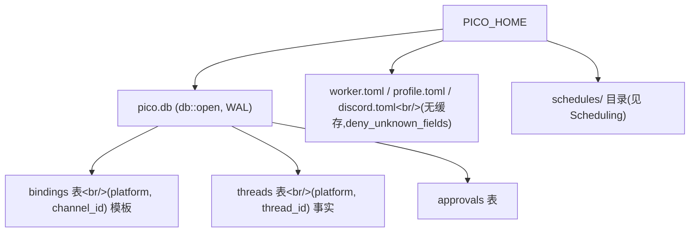

pico 的 worker 进程随时可能重启(部署、崩溃、宿主机重启)。凡是必须跨重启存活的东西——某个 Discord 频道默认映射到哪个工作目录、哪个会话线程有一份实时的 git worktree、哪个人工审批还悬而未决——都放在同一个 SQLite 文件 `pico.db` 里。凡是不需要这种持久性的东西——模型选择、时区、每个 guild 的默认值——都放在每次调用都重新读取的纯 TOML 文件里。本页要讲清楚这个划分,以及万物所根植的那一个 `PICO_HOME` 根目录。

## 目的

三个持久性问题,一个文件:某个 `(platform, channel)` 在任何会话存在之前默认映射到哪个 profile/cwd(`bindings`);某个 `(platform, thread_id)` 会话当前是否存活、它的 worktree 在哪(`threads`);哪些人工确认请求仍未处理(`approvals`)。这三者都是 `pico.db` 里的表,该文件在启动时打开一次,由共享的 `sqlx::SqlitePool` 持有(`crates/core/src/db.rs:6-24`)。配置是刻意分离出去的另一个关切点:`worker.toml` / `discord.toml` / `profile.toml` 都被严格解码(`deny_unknown_fields`,拼错一个字段就会立刻报错而不是被默默忽略),并且每次调用都重新读取——没有缓存需要失效。

## 核心划分:频道模板 vs 线程事实

本页最值得记住的一点:**`bindings` 是模板,`threads` 是事实。**

1. **`db::open`**(`crates/core/src/db.rs:6-24`)通过 `SqliteConnectOptions` 打开 `pico.db`(路径来自 `pico_shared::paths::worker_db`,`crates/shared/src/paths.rs:81-83`),开启 WAL 日志模式、5 秒 busy timeout、外键约束、连接池上限 5,然后**每次启动都无条件**运行 `sqlx::migrate!()`(内嵌迁移脚本位于 `crates/core/migrations/`)——sqlx 自己记录哪些迁移已经应用过,所以大多数启动是空操作,只有部署之后的那次启动才会真正升级 schema。
2. **`bindings` 表**——每个 `(platform, channel_id)` 一行:在任何会话线程存在之前,该频道的*默认*profile/cwd(或 worktree 模板)。`Binding { profile, kind: BindingKind::Regular{cwd} | Worktree{base_repo, default_branch, branch_prefix} }`(`crates/core/src/bindings.rs:6-20`)。`get`/`set_regular`/`set_worktree`/`unset`(`bindings.rs:66,113,127,156`)都以 `(platform, channel_id)` 为键;写入路径是单条 `upsert`,执行 `INSERT ... ON CONFLICT(platform, channel_id) DO UPDATE`(`bindings.rs:167-198`)。
3. **`threads` 表**——每个 `(platform, thread_id)` 一行:某个*具体*会话最终解析到的 cwd、它可选的 worktree 来源,以及一个 `closed_at` 墓碑标记。`ThreadMarker { profile, cwd, worktree: Option<WorktreeOrigin>, closed_at, channel_id }`(`crates/core/src/thread_marker.rs:6-19`)。`load`/`fetch`/`save`/`write`/`tombstone`/`list_open`(`thread_marker.rs:31,55,102,108,144,167`)与 bindings 的模式一致。`list_open`(`thread_marker.rs:167-193`)驱动着 CLI 的线程选择器:`WHERE platform = ? AND channel_id = ? AND closed_at IS NULL`(`thread_marker.rs:195-204`)。
4. **`resolve_route`**(`bindings.rs:39-62`)是连接两者的共享决策函数:给定 `Option<&Binding>` 加上一个硬性兜底的 profile/cwd(guild 默认值),它产出 `Route::Regular{profile,cwd}` 或 `Route::Worktree{profile,base_repo,default_branch,branch_prefix}`。CLI(`crates/cli/src/thread.rs:116`)和 Discord 的 fresh-schedule 路径(`crates/discord/src/schedule_host.rs:201,215`)都依据这个 `Route` 来决定是要 fork 一个 worktree,还是直接用某个 cwd——细节见 [](carto:worktrees)。
5. **`approvals` 表**——待处理的人工审批请求(kind/title/detail/status/resolver),完全由 `discord` crate 消费(`crates/discord/src/approval.rs:121-137,153-157,169-173`)。`core` 只拥有这个迁移(0001);`core/src` 下没有任何文件读写它。

`bindings` 和 `threads` 都以**可移植**方式存储文件系统路径——尽可能相对于 `pico_home()`,通过 `to_portable`/`from_portable`(`crates/shared/src/paths.rs:136,144`)——这样整个数据库在 `PICO_HOME` 迁移到新宿主机时依然有效。



## 机制:启动、首条消息、恢复、关闭

- **启动**:`pico_discord::app::App::build` 调用一次 `pico_core::db::open(root)`(`crates/discord/src/app.rs:18`);迁移执行完毕,得到的连接池被交给每个需要它的子系统(schedule host、Discord 命令处理器、CLI)。
- **频道尚无线程时收到第一条消息**:查询 `bindings::get(db, "discord", channel_id)` → 用 `discord.toml` 里的 guild 默认值调用 `resolve_route` → 如果结果是 `Route::Worktree`,`worktree::ensure(...)` fork 出一个分支并返回路径 → `thread_marker::save` 以新生成的**thread_id**(而不是 channel_id)为键持久化这个新线程的 `ThreadMarker`。这正是该划分的体现:频道的 binding 是可复用的模板;线程的 marker 是由它派生出的一次性事实。
- **恢复**:CLI/Discord 在派生/恢复一个 omp 会话之前调用 `thread_marker::load(db, platform, thread_id)` 获取 cwd 与 worktree 信息。如果该行缺失或无效,调用方会回退到从 `bindings` 重新解析(`thread_marker.rs:35,42,49`——每条路径都会记一条 `tracing::warn!`)。
- **关闭**(`/worktree close`,`crates/discord/src/discord.rs:830-892`):加载 marker → `worktree::close_would_lose`(安全检查,详见 [](carto:worktrees))→ `pool.close(thread_id)`(若有进行中的 turn 则拒绝)→ `worktree::remove`(删除 worktree 目录与分支)→ `thread_marker::tombstone`(设置 `closed_at`,该行本身保留——会话历史/profile/cwd 作为记录被保留,只是标记为已关闭)。

## 配置:另一半

配置刻意*不*放进数据库——它体量小、由人工编辑,不需要事务保证:

- `config::load`(`crates/core/src/config.rs:50-56`)读取某个 profile 的 `profile.toml` → `ProfileConfig{model, browser_enabled}`。
- `config::any_browser_enabled`(`config.rs:58-65`)扫描 `root/profiles/` 下的每个目录并对它们的 `browser.enabled` 做 OR。
- `config::load_root`(`config.rs:133-169`)读取根目录的 `worker.toml` → `RootConfig{worktrees_dir, timezone, platforms, schedule: ScheduleConfig}`。`ScheduleConfig{grace, script_timeout, cap, timezone, run_history}`(`config.rs:92-99`)默认值为 `grace=7200s, script_timeout=60s, cap=60s, run_history=20`(`config.rs:157-161`)——被 [](carto:scheduling) 消费。
- Discord 专属配置:`crates/discord/src/config.rs::load`(`config.rs:58-110`)把 `discord.toml` 的 `[[guild]]` 块解析成 `DiscordConfig{guilds: HashMap<snowflake,GuildDefault>, render}`,并校验 Discord snowflake(17-20 位 ASCII 数字,`config.rs:120-122`)和 profile 名称。
- **`PICO_HOME`**(`crates/shared/src/paths.rs:9-23`)是唯一的覆盖开关。其它所有路径——`worker_root`、`worker_config`、`discord_config`、`profile_dir`、`schedules_dir`、`worker_db` 等等(`paths.rs:37-113`)——都是拼接在它之上得到的(默认 `~/.pico`)。没有任何 crate 直接硬编码相对于 `PICO_HOME` 的路径;它们都要经过 `pico_shared::paths`。

三个配置来源(`config::load`、`config::load_root`、discord 的 `config.rs::load`)都是按需重新读取的——不存在内存缓存,所以修改配置文件和 bot 重启之间不会有缓存陈旧的问题。

## 原样引用的 schema

migrations 0001-0008 之后的当前形态(schedules 表在 0004 中创建,又在 0007 中被完全删除——详见 [](carto:scheduling)):

```sql
-- 0001_approvals.sql
CREATE TABLE approvals (
    id TEXT PRIMARY KEY, kind TEXT NOT NULL, title TEXT NOT NULL, detail TEXT NOT NULL,
    status TEXT NOT NULL, created_at TEXT NOT NULL, channel_id TEXT NOT NULL,
    guild_id TEXT, message_id TEXT, requested_by TEXT, resolved_at TEXT, resolver TEXT
);
CREATE INDEX approvals_status ON approvals (status);

-- 0003_bindings_and_threads.sql
CREATE TABLE bindings (
    platform TEXT NOT NULL, channel_id TEXT NOT NULL, profile TEXT NOT NULL, kind TEXT NOT NULL,
    cwd TEXT, base_repo TEXT, default_branch TEXT,
    PRIMARY KEY (platform, channel_id)
);
CREATE TABLE threads (
    platform TEXT NOT NULL, thread_id TEXT NOT NULL, profile TEXT NOT NULL, cwd TEXT NOT NULL,
    base_repo TEXT, default_branch TEXT, closed_at TEXT,
    PRIMARY KEY (platform, thread_id)
);
-- 0005: ALTER TABLE threads ADD COLUMN channel_id TEXT;
-- 0008: ALTER TABLE bindings ADD COLUMN branch_prefix TEXT; ALTER TABLE threads ADD COLUMN branch_prefix TEXT;
```

最终存活的表:`approvals`(0001)、`bindings`(0003+0008:platform, channel_id, profile, kind, cwd, base_repo, default_branch, branch_prefix)、`threads`(0003+0005+0008:platform, thread_id, profile, cwd, base_repo, default_branch, closed_at, channel_id, branch_prefix)。**不存在 `schedules` 表**——迁移历史里的这个痕迹是一条死胡同,而不是调度状态存放位置的提示。

## 权衡取舍

- 每次调用都重新读取 TOML,用少量额外系统调用换来"编辑之后绝不陈旧"——没有缓存失效的 bug,代价是热路径配置读取没有进程内快速通道。
- 以可移植方式存储路径(`to_portable`/`from_portable`)意味着把 `PICO_HOME` 迁到新机器不需要数据库迁移——但也意味着每个读取者都必须经过解码步骤,而不能把数据库列当作原始路径直接使用。
- 在打上墓碑标记后仍保留 `threads` 行(而不是删除)用少量磁盘空间换来了每个线程曾经历过的所有会话的持久审计轨迹,无论是否已关闭。

## 与其它页面的关系

`bindings::Route`/`resolve_route`(`bindings.rs:26-62`)是 `crates/cli/src/thread.rs:87-141` 与 `crates/discord/src/schedule_host.rs:201,215-250` 共用的唯一路由算法。`thread_marker::ThreadMarker`/`WorktreeOrigin`(`thread_marker.rs:6-19`)是贯穿 `worktree::ensure_at`、`title::generate_and_apply`、`schedule_host::DiscordScheduleHost::resolve_cwd`(`schedule_host.rs:315-336`)的共享结构体——这个结构体另一侧发生的事情见 [](carto:worktrees),定时触发如何通过同一个 `Route` 解析 cwd 见 [](carto:scheduling)。基于这里解析出的 cwd/profile 派生的 omp 会话本身,则在 [](carto:omp-host) 中介绍。
