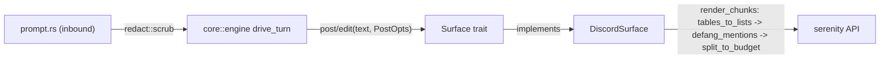

pico supports Discord today and is built to support other platforms later
without rewriting the turn loop. That promise lives entirely in one trait:
`Surface` (`crates/core/src/surface.rs:4-42`). It is the seam between
 — which decides *what* to say and *when* — and a
concrete platform, which decides how a message actually gets posted, edited,
and size-limited. This page is about that seam and the small set of pure text
functions (`render.rs`, `platform_render.rs`, `activity.rs`) that both sides
share so tool-activity lines, message splitting, and mention-safety are
implemented exactly once.

## The mental model

Four pieces make up the rendering layer:

1. **`Surface`** — the async trait a platform implements: `post`, `edit`,
   `ui`, `typing`, `limits`, plus defaulted line renderers a platform may
   override.
2. **`PostOpts`/`SizeLimits`** — the two small value types that carry
   reply/silent intent and the platform's declared message-size budget across
   the seam.
3. **Text primitives** (`render.rs`, `platform_render.rs`) — pure functions:
   splitting a long message into budget-sized chunks, defanging `@mentions`,
   turning Markdown tables into mobile-friendly bullet lists.
4. **`redact.rs`** — the one piece of this layer that runs on the *inbound*
   path, scrubbing secrets out of the prompt before it ever reaches omp.

## The `Surface` trait

`Surface` (surface.rs:4-42) is the sole seam every platform (Discord, a CLI, a
schedule launcher) implements to get streaming replies, live activity lines,
and mid-turn UI for free. Two associated types anchor it (surface.rs:5-6):
`Msg` — an opaque message handle (Discord's is `serenity::MessageId`) — and
`Typing` — an RAII typing-indicator guard. Required async methods:
`post(text, PostOpts) -> Option<Msg>` (surface.rs:12), `edit(&Msg, text) ->
bool` (surface.rs:14), `ui(&UiRequest) -> UiOutcome` (surface.rs:16); sync
methods `typing()` (surface.rs:8) and `limits() -> SizeLimits` (surface.rs:10).
Defaulted methods a platform may override rather than implement from scratch:
`set_title` (surface.rs:18-20, defaults to a no-op), `tool_activity_line`
(surface.rs:22-24, defaults to `crate::activity::tool_activity_line`),
`thinking_line` (surface.rs:26-29), `failure_line` (surface.rs:31-33).

`DiscordSurface` (`crates/discord/src/discord.rs:1576-1645`) is the concrete
implementation: `type Msg = serenity::MessageId`, `type Typing =
serenity::Typing`; `limits()` returns `crate::consts::DISCORD_LIMITS`
(discord.rs:1584-1586); `post`/`edit`/`ui`/`set_title` wrap serenity calls. A
`FakeSurface` test double also implements it (engine.rs:748-795) — proof the
trait is the real contract boundary the engine depends on, not just an
implementation detail of Discord. See  for the full
Discord-side wiring.

## `PostOpts` and `SizeLimits`: what crosses the seam

`PostOpts{as_reply, silent}` (surface.rs:44-71) with consts `PLAIN`/`SILENT`/
`REPLY` (surface.rs:51-62) is how the engine tells a platform whether a
message should thread as a reply and whether it should suppress the
notification — this is exactly the flag 
sets differently for a superseded segment (`silent=true`) versus the true
final answer (`silent=false, as_reply=true`).

`SizeLimits{message_cap, activity_line_cap, activity_char_cap,
activity_send_max}` (surface.rs:66-71) is the platform's declared budget for
splitting and batching. Discord's instance is
`crates/discord/src/consts.rs:1-6`: `message_cap:1900, activity_line_cap:20,
activity_char_cap:1800, activity_send_max:1990`. The engine's `Activity::append`
(engine.rs:543-577) reads `activity_line_cap`/`activity_char_cap` to decide
whether a new tool-activity line still fits the current message or must start
a new one ("rollover", engine.rs:545-553); `ActivityHost::text(send_max)`
(engine.rs:475-481) hard-truncates to `activity_send_max` before sending.

`UiOutcome`/`UiReply`/`ConversationId` (surface.rs:74-104) round out the
contract: `UiOutcome::{Respond{reply,posted}, Notified{posted}, Cancelled}` is
how a platform answers an omp `UiRequest` (dialogs/confirms/selects), and
`ConversationId::new(platform, native)` (surface.rs:91-93) — e.g. `"discord:
123"` — is the cross-cutting key used to register mid-turn queues and cancel
tokens per conversation (see 's registries section).

## Activity-line formatting

`crates/core/src/activity.rs` supplies the default per-tool-name rendering
that `Surface::tool_activity_line` falls back to. `ToolCallStart<'a>`
(activity.rs:9-39) tags a `&ToolCall` by tool name via `From<&ToolCall>`
(activity.rs:41-75), matching strings like `"read"→Read`, `"grep"→Search`,
`"bash"→Bash`, or `name.starts_with("camo_")→Camo`, defaulting to `Unknown`.
`tool_activity_line(tool: &ToolCallStart) -> String` (activity.rs:116-165)
deserializes `Args` from the call's JSON args (activity.rs:118) and formats an
emoji + detail line per variant: Read → `locate("🔍", path)` (activity.rs:121),
Bash → `locate("💻", first_line(command))` (activity.rs:127), Eval →
`"🧪 {language} {first_line(code)…}"` (activity.rs:136-142), Task/Unknown →
`"🛠️ {tool_name}"` (activity.rs:161-163). Detail strings are capped at
`ACTIVITY_DETAIL`=60 chars (activity.rs:113,355) via `render::truncate`.
`thinking_line(content)` (activity.rs:387-394) renders `"🧠
{first_line(content)…60}"`; `failure_line(current, error)` (activity.rs:
396-406) rewrites an existing line's leading emoji to `❌` and appends the
error message, truncated.

## Splitting, defanging, and truncation

Three pure primitives are shared by the engine and every platform's own
render path:

- `render::split_to_budget(text, budget) -> Vec<String>` (render.rs:1-37) —
  the message-splitter: walks lines, tracks code-fence state
  (`is_fence_line`/`fence_info`/`reopen_fence`, render.rs:332-344) so a long
  fenced block splits across chunks that each re-open the same fence, and
  hard-wraps overlong lines (`hard_wrap`, render.rs:368-395) via
  `emit_line`/`projected_len` (render.rs:319-366).
- `platform_render::defang_mentions(text)` (platform_render.rs:1-5)
  neutralizes `<@…>`/`@everyone`/`@here` by inserting a zero-width space,
  applied before every outbound post/edit (engine.rs:476,555,724).
- `platform_render::tables_to_lists(text)` (platform_render.rs:7-43) rewrites
  Markdown pipe-tables into bullet lists for mobile-friendly Discord
  rendering.

The Discord adapter composes all three itself rather than the engine doing it
for every platform: `render_chunks(text, budget)`
(`crates/discord/src/discord.rs:265-268`) runs `tables_to_lists` →
`defang_mentions` → `split_to_budget` in that order, and
`render_reply(text, as_reply, silent)` (discord.rs:271-282) wraps
`render_chunks` with `DISCORD_LIMITS.message_cap` into `(String, PostOpts)`
pairs ready to post. `core` provides the primitives; the platform owns the
actual size constant and composition order. The same primitives are reused by
`schedule_host::post_raw` (`crates/discord/src/schedule_host.rs:345-346`) and
by `ui.rs`/`approval.rs` (`crates/discord/src/ui.rs:511-512,549-550`;
`approval.rs:200-207`) — every Discord-side text emission funnels through
these same core helpers.

## The one inbound exception: `redact.rs`

Everything above shapes *outbound* text. `redact::scrub(input) -> Cow<str>`
(`crates/core/src/redact.rs:27-35`) runs the opposite direction: it applies a
fixed list of regexes (PEM private keys, GitHub PATs, `sk-`/`sk-ant-` API
keys, AWS `AKIA…`, Google `AIza…`, Slack `xox…`, JWTs, `Bearer …`;
redact.rs:5-25) to strip secrets before they enter the omp prompt. It's called
from `crate::prompt` while assembling the wrapped user prompt and quoted
messages (`crates/core/src/prompt.rs:102,117,124,169`) — i.e. it protects the
LLM context and session transcript from leaking credentials, rather than
shaping what a human sees.

## Tradeoffs

Keeping `Surface` narrow (three async methods, two sync) means a new platform
adapter is a small amount of glue code, but it also means every
platform-specific rendering decision — exact size budget, table handling,
composition order of `defang_mentions`/`split_to_budget` — is left to the
platform rather than centralized. `core` deliberately only ships the pure
primitives and a default line-renderer; Discord's `render_chunks`/
`render_reply` (discord.rs:265-282) is where those primitives actually get
assembled into what serenity sends. See  for that
assembly, and  for how `PostOpts` values are chosen in
the first place.
