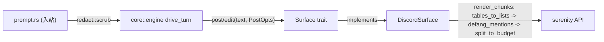

pico 今天支持 Discord，并且从架构上就为将来支持其他平台而不需要重写轮次
循环做好了准备。这个承诺完全建立在一个 trait 之上：`Surface`
(`crates/core/src/surface.rs:4-42`)。它是 （决定
*说什么*、*什么时候说*）与具体平台（决定一条消息实际如何被发出、编辑、
限制大小）之间的接缝。本页讲的就是这条接缝，以及双方共享的一小组纯文本
函数（`render.rs`、`platform_render.rs`、`activity.rs`），它们让工具活动行
格式化、消息拆分、@提及安全化都只需要实现一次。

## 心智模型

渲染层由四部分组成：

1. **`Surface`** —— 平台实现的异步 trait：`post`、`edit`、`ui`、
   `typing`、`limits`，外加一组平台可以覆盖的默认行渲染函数。
2. **`PostOpts`/`SizeLimits`** —— 两个小型值类型，负责在接缝两侧传递
   reply/silent 意图和平台声明的消息大小预算。
3. **文本原语**（`render.rs`、`platform_render.rs`）—— 纯函数：把一段
   长文本拆分成预算大小的分块、给 `@提及` 脱敏、把 Markdown 表格转换成
   移动端友好的列表。
4. **`redact.rs`** —— 本层里唯一运行在*入站*路径上的部分，在 prompt
   到达 omp 之前先清洗掉其中的密钥。

## `Surface` trait

`Surface` (surface.rs:4-42) 是每个平台（Discord、CLI、调度启动器）实现的
唯一接缝，实现它即可免费获得流式回复、实时活动行和 mid-turn UI。两个关联
类型是它的锚点（surface.rs:5-6）：`Msg`——一个不透明的消息句柄（Discord
上是 `serenity::MessageId`）——和 `Typing`——一个 RAII 打字指示器守卫。
必须实现的异步方法：`post(text, PostOpts) -> Option<Msg>` (surface.rs:12)、
`edit(&Msg, text) -> bool` (surface.rs:14)、`ui(&UiRequest) -> UiOutcome`
(surface.rs:16)；同步方法 `typing()` (surface.rs:8) 和
`limits() -> SizeLimits` (surface.rs:10)。可以覆盖而非从零实现的默认
方法：`set_title` (surface.rs:18-20，默认空操作)、`tool_activity_line`
(surface.rs:22-24，默认调用 `crate::activity::tool_activity_line`)、
`thinking_line` (surface.rs:26-29)、`failure_line` (surface.rs:31-33)。

`DiscordSurface` (`crates/discord/src/discord.rs:1576-1645`) 是具体实现：
`type Msg = serenity::MessageId`，`type Typing = serenity::Typing`；
`limits()` 返回 `crate::consts::DISCORD_LIMITS` (discord.rs:1584-1586)；
`post`/`edit`/`ui`/`set_title` 包装了 serenity 的调用。测试替身
`FakeSurface` (engine.rs:748-795) 也实现了这个 trait——证明它是引擎真正
依赖的契约边界，而不只是 Discord 的实现细节。Discord 一侧的完整接线见
。

## `PostOpts` 与 `SizeLimits`：跨越接缝的内容

`PostOpts{as_reply, silent}` (surface.rs:44-71) 及其常量
`PLAIN`/`SILENT`/`REPLY` (surface.rs:51-62) 是引擎告诉平台"这条消息该不该
以回复形式串联、该不该抑制通知"的方式——这正是
 为被取代的文本段
（`silent=true`）与真正的最终答案（`silent=false, as_reply=true`）设置
不同值的那个字段。

`SizeLimits{message_cap, activity_line_cap, activity_char_cap,
activity_send_max}` (surface.rs:66-71) 是平台声明的拆分与批处理预算。
Discord 的实例在 `crates/discord/src/consts.rs:1-6`：`message_cap:1900,
activity_line_cap:20, activity_char_cap:1800, activity_send_max:1990`。
引擎的 `Activity::append` (engine.rs:543-577) 读取
`activity_line_cap`/`activity_char_cap` 来判断一条新的工具活动行是否
还能塞进当前消息，还是必须开启一条新消息（"rollover"，
engine.rs:545-553）；`ActivityHost::text(send_max)` (engine.rs:475-481)
在发送前会硬截断到 `activity_send_max`。

`UiOutcome`/`UiReply`/`ConversationId` (surface.rs:74-104) 补全了这份
契约：`UiOutcome::{Respond{reply,posted}, Notified{posted}, Cancelled}`
是平台应答一个 omp `UiRequest`（对话框/确认/选择）的方式；
`ConversationId::new(platform, native)` (surface.rs:91-93)——比如
`"discord:123"`——是用来按会话注册 mid-turn 队列和取消令牌的跨系统键
（参见  的注册表小节）。

## 活动行格式化

`crates/core/src/activity.rs` 提供了 `Surface::tool_activity_line` 默认
回退所使用的按工具名渲染逻辑。`ToolCallStart<'a>` (activity.rs:9-39)
通过 `From<&ToolCall>` (activity.rs:41-75) 依据工具名字符串给一个
`&ToolCall` 打标签，比如 `"read"→Read`、`"grep"→Search`、`"bash"→Bash`，
或者 `name.starts_with("camo_")→Camo`，默认落到 `Unknown`。
`tool_activity_line(tool: &ToolCallStart) -> String` (activity.rs:116-165)
从调用的 JSON 参数中反序列化出 `Args` (activity.rs:118)，并为每个变体
格式化出一行"表情+细节"：Read → `locate("🔍", path)` (activity.rs:121)，
Bash → `locate("💻", first_line(command))` (activity.rs:127)，Eval →
`"🧪 {language} {first_line(code)…}"` (activity.rs:136-142)，
Task/Unknown → `"🛠️ {tool_name}"` (activity.rs:161-163)。细节字符串
被限制在 `ACTIVITY_DETAIL`=60 个字符 (activity.rs:113,355)，通过
`render::truncate` 实现。`thinking_line(content)` (activity.rs:387-394)
渲染为 `"🧠 {first_line(content)…60}"`；`failure_line(current, error)`
(activity.rs:396-406) 把已有行开头的表情改写为 `❌`，并附加截断后的
错误信息。

## 拆分、脱敏与截断

三个纯原语被引擎和每个平台自己的渲染路径共享：

- `render::split_to_budget(text, budget) -> Vec<String>` (render.rs:1-37)
  ——消息拆分器：逐行遍历，追踪代码围栏状态
  (`is_fence_line`/`fence_info`/`reopen_fence`, render.rs:332-344)，
  使一段很长的围栏代码块被拆分到多个分块时,每块都重新打开同样的围栏
  信息，并通过 `emit_line`/`projected_len` (render.rs:319-366) 对过长的
  行做硬换行 (`hard_wrap`, render.rs:368-395)。
- `platform_render::defang_mentions(text)` (platform_render.rs:1-5)
  通过插入零宽空格来中和 `<@…>`/`@everyone`/`@here`，在每次外发
  post/edit 之前都会应用 (engine.rs:476,555,724)。
- `platform_render::tables_to_lists(text)` (platform_render.rs:7-43)
  把 Markdown 表格重写成列表，以适配移动端上的 Discord 显示。

Discord 适配层自己组合这三者，而不是由引擎替每个平台都做一遍：
`render_chunks(text, budget)` (`crates/discord/src/discord.rs:265-268`)
按顺序执行 `tables_to_lists` → `defang_mentions` → `split_to_budget`，
`render_reply(text, as_reply, silent)` (discord.rs:271-282) 用
`DISCORD_LIMITS.message_cap` 包装 `render_chunks`，输出可直接发送的
`(String, PostOpts)` 对。`core` 提供原语；平台拥有实际的大小常量和
组合顺序。同样的原语也被
`schedule_host::post_raw` (`crates/discord/src/schedule_host.rs:345-346`)
和 `ui.rs`/`approval.rs`
(`crates/discord/src/ui.rs:511-512,549-550`；`approval.rs:200-207`)
复用——每一处 Discord 侧的文本发送都会经过这些同样的 core 辅助函数。

## 唯一的入站例外：`redact.rs`

以上内容都在处理*出站*文本。`redact::scrub(input) -> Cow<str>`
(`crates/core/src/redact.rs:27-35`) 走的是相反方向：它在 prompt 进入
omp 之前，应用一组固定的正则（PEM 私钥、GitHub PAT、`sk-`/`sk-ant-`
API key、AWS `AKIA…`、Google `AIza…`、Slack `xox…`、JWT、`Bearer …`；
redact.rs:5-25）来清洗密钥。它在 `crate::prompt` 组装被包装的用户
prompt 和被引用消息时被调用
(`crates/core/src/prompt.rs:102,117,124,169`)——也就是说，它保护的是
LLM 上下文和会话记录不泄露凭据，而不是塑造人类看到的内容。

## 取舍

让 `Surface` 保持精简（三个异步方法、两个同步方法）意味着接入一个新平台
只需要少量胶水代码，但也意味着每一个平台特有的渲染决策——具体的大小
预算、表格处理方式、`defang_mentions`/`split_to_budget` 的组合顺序——都
留给了平台自己去做，而不是集中管理。`core` 刻意只提供纯原语和一个默认的
行渲染器；Discord 的 `render_chunks`/`render_reply` (discord.rs:265-282)
才是这些原语真正被组装成 serenity 可发送内容的地方。这部分组装的细节见
；`PostOpts` 的值最初是如何被决定的，见
。
