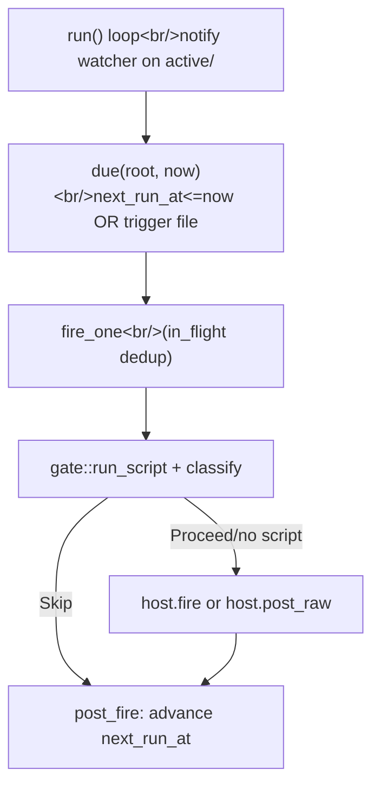

pico can fire jobs on a timer — a oneshot reminder, a cron digest — that either resume an existing conversation or spin up a fresh one, optionally gated by a shell script that can suppress a noisy run. The critical thing to know before reading any code here: **this is not a SQL table**. Migration 0004 created a `schedules` table and migration 0007 dropped it again; the engine that actually runs today stores every schedule as a folder on disk. If you go looking for a `schedules` row in `pico.db`, you will not find one — see  for what *is* in that database.

## Intent

Run `Trigger::Oneshot{at}` ("remind me at 3pm") and `Trigger::Cron{expr, tz}` ("every morning at 9") jobs (`crates/core/src/schedule/mod.rs:67-70`) that either resume the origin thread (`Mode::Continue`) or create a brand-new thread each fire (`Mode::Fresh`, `mod.rs:53-57`), optionally gated by a script that can skip a run entirely or inject extra context into the prompt. The whole thing has to survive worker restarts and degrade gracefully — a schedule that keeps failing should disable itself and tell someone, not retry forever silently.

## Core concepts

1. **On-disk layout** (`crates/shared/src/paths.rs:93-119`): `root/schedules/{active,disabled,triggered}/<id>/`. The three lifecycle states *are* the three top-level directories — transitioning state means `fs::rename`-ing the whole directory (`crates/core/src/schedule/mod.rs:457-464,535-546`), not updating a status column. Each schedule directory holds `schedule.toml` (the immutable definition), `state.json` (mutable runtime data: `next_run_at`, `last_run_at`, `consecutive_failures`, `run_count`), optional `script.sh`/`prompt.md`, a `trigger` marker file (set by a manual `/schedule trigger`), and a `runs/<STAMP>/{stdout,stderr,meta.json}` history directory. `root/schedules/.heartbeat` is a liveness stamp for the whole scheduler loop.
2. **Types** (`schedule/mod.rs:33-109`): `Trigger::Oneshot{at} | Cron{expr, tz}`; `Mode::Continue` vs `Mode::Fresh`; `State::Active | Disabled | Triggered` — `Triggered` means a oneshot already fired and is done (a terminal state, not "currently running").
3. **`ScheduleHost` trait** (`mod.rs:111-116`) is the seam to the platform layer: `resolve_cwd(sched)`, `fire(sched, wrapped_prompt)`, `post_raw(sched, text)`, `notify_home(sched, notice)`. Discord is the only implementer today, `DiscordScheduleHost` (`crates/discord/src/schedule_host.rs:28-38,314-336+`). `fire` returns `FireOutcome::{Delivered, TargetGone, Transient}` (`mod.rs:89-93`), which drives the retry/disable logic below.
4. **The script gate** (`crates/core/src/schedule/gate.rs`): `run_script` (`gate.rs:31-109`) runs `bash -lc <script.sh>` with a timeout, capturing stdout/stderr (capped at 256KiB, `gate.rs:29,111-129`). `classify(stdout, stderr_tail)` (`gate.rs:131-147`) then decides: empty stdout → `Gate::Skip`; JSON on stdout where **both fields are optional** (`GateJson`: `skip` defaults `false`, `context` defaults `None`, `gate.rs:19-25`) → `Gate::Skip` (if `skip:true`) or `Gate::Proceed{context}` (a missing or blank `context` becomes `None`); non-JSON stdout, nonzero exit, or timeout → `Gate::Failure{reason, stderr_tail}` (stderr tail capped at 600 chars, `gate.rs:27,149-159`). This is the mechanism behind a zero-token "quiet day" skip for a script-only digest.
5. **Missed-run + 3-strike auto-disable**: `missed_gate` (`mod.rs:1102-1120`) classifies a late-firing schedule as `Fire` / `SkipStale` (a cron tick so late a newer occurrence already superseded it) / `MissedOneshot` (a oneshot so late past `cfg.grace` it's abandoned — fires `HomeNotice::Missed`, `mod.rs:864-869`). `record_transient` (`mod.rs:1073-1093`) bumps `consecutive_failures` via `record_failure` (`mod.rs:639-648`); once that hits `MAX_CONSECUTIVE_FAILURES = 3` (`mod.rs:749`), the schedule directory moves to `disabled/` via `disable` (`mod.rs:661-668`) and `host.notify_home(..., HomeNotice::Disabled(DisableReason::ConsecutiveFailures(n)))` posts a notice embed to the home channel.

## Mental model: the run loop

`run<H: ScheduleHost>` (`mod.rs:753-825`) is the loop itself: it sets up a filesystem `notify` watcher on `schedules/active/` (wakes the loop on any file change, `mod.rs:762-775`) as an optimization over pure polling. Each tick calls `due(root, now)` (`mod.rs:582-589`: scans `Active` state, keeps schedules whose `next_run_at <= now` OR that have a `trigger` marker file present), spawns each due schedule's `fire_one` on a `TaskTracker` guarded by an `in_flight: HashSet<String>` (per-id de-dup so a slow-firing schedule isn't double-fired, `mod.rs:790-800`), then sleeps until `sleep_target` (`mod.rs:1122-1128` — the min of `cfg.cap` and the next-active schedule's `next_run_at`) or a watcher wakeup or cancellation.

Inside `fire_one` (`mod.rs:849-955`): check the manual trigger marker first (`consume_trigger_marker`, `mod.rs:1014-1027`, deletes the `trigger` file and skips grace/staleness checks entirely) → else run `missed_gate` → read `schedule.toml`+`script.sh`+`prompt.md` via `read_definition` (`mod.rs:567-580`) → `host.resolve_cwd` (Discord: `Mode::Continue` loads the origin thread's live cwd from `thread_marker`; `Mode::Fresh` resolves the target channel's `bindings` route via the same `resolve_route` covered in , `schedule_host.rs:315-336`) → run the gate script → dispatch via `host.fire`/`host.post_raw` → `post_fire` (`mod.rs:1029-1050`) decides `advance_or_finish` (bump `next_run_at` for cron, or move to `Triggered` for a oneshot) vs `advance_or_count` (cron with a `max_runs` cap, `mod.rs:1052-1064`) vs leaving the schedule as-is for a manual trigger.

`fire_and_classify` (`mod.rs:957-988`) wraps the prompt via `prompt::wrap_scheduled_job(name, trigger_desc, fired_at, prompt_body, context)` (`crates/core/src/prompt.rs:151+`) before calling `host.fire`. If `def.prompt` is `None` but the gate script produced real `context` text, it calls `host.post_raw` instead (`mod.rs:975-982`) — that's the script-only digest path with no LLM turn at all.

## Discord's implementation

`DiscordScheduleHost::fire_continue`/`fire_fresh` (`schedule_host.rs:105-182, 184-287`) are the two concrete `ScheduleHost::fire` strategies. `fire_continue` re-enters the existing thread via `mid_turn.deliver(...)` (queued behind any live turn — see  for how that queue works) and calls `drive_thread_turn`. `fire_fresh` creates a brand-new Discord thread, resolves/creates its worktree (see ), persists a `ThreadMarker`, and also calls `drive_thread_turn` — which ultimately spawns/resumes the omp session that produces the reply, see . `schedule::run` is spawned once at Discord app setup (`crates/discord/src/discord.rs:92-104`), reading `RootConfig::schedule()` for `ScheduleConfig` (grace/script_timeout/cap/run_history) from `worker.toml` — see  for that config surface.

## Tradeoffs

- Filesystem-backed state means `ls`/`cat` on a schedule directory is a full debugging tool with no query language needed — at the cost of no atomic multi-row transactions (state transitions are directory renames, which are atomic on the same filesystem but don't compose across schedules).
- The `notify` watcher is an optimization, not the source of truth: the loop still polls on a timer, so a missed filesystem event never causes a schedule to be silently skipped.
- The script gate's JSON-on-stdout protocol keeps `script.sh` dead simple (any script that isn't JSON just gets treated as failure-or-skip) at the cost of scripts needing to know the tiny `{"skip":bool,"context":string}` contract to unlock the "proceed with extra context" path.
- The 3-strike auto-disable trades availability (a broken schedule stops trying after 3 failures) for safety (nobody wants a broken schedule retrying forever and burning tokens or spamming a channel) — the home-channel notice is what makes that tradeoff visible to a human instead of silent.

## Load-bearing files

- `crates/core/src/schedule/mod.rs` — types, fs-backed CRUD (`create/list/get/remove/set_state/trigger`), the `run` loop, `fire_one`/`fire_and_classify`, missed/failure/disable state machine.
- `crates/core/src/schedule/gate.rs` — script execution + stdout-JSON gate classification.
- `crates/discord/src/schedule_host.rs` — the only `ScheduleHost` implementation.
- `crates/shared/src/paths.rs` — `schedules_dir`/`schedule_state_dir`/`schedule_dir`/`find_schedule_dir` layout contract.
- `crates/core/migrations/0004,0006,0007_*.sql` — the historical evidence of the sqlite→filesystem move (0004 created `schedules`, 0006 dropped its script/prompt columns as a transitional step, 0007 dropped the whole table).
