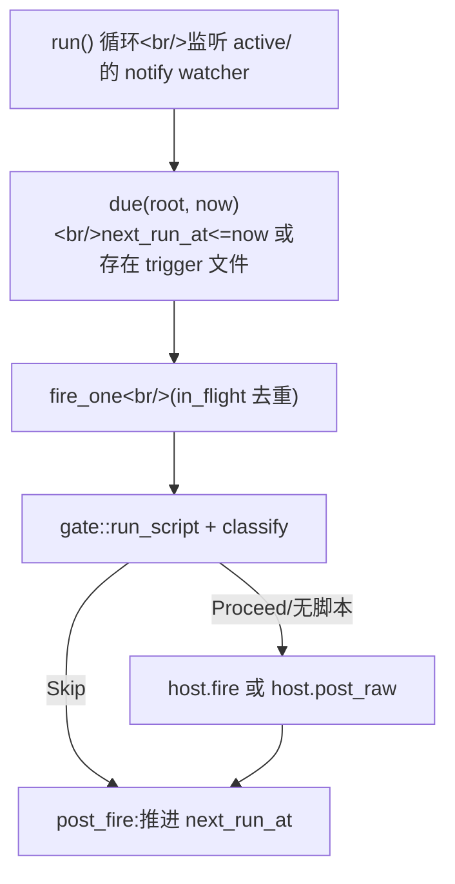

pico 可以按时间触发任务——一次性提醒、每日 cron 摘要——这些任务要么恢复已有会话,要么开一个全新会话,并且可以由一个 shell 脚本来决定是否要抑制某次噪声较大的运行。在阅读这里的任何代码之前,必须先知道的关键点是:**这不是一张 SQL 表**。迁移 0004 创建过一张 `schedules` 表,迁移 0007 又把它删掉了;如今实际运行的引擎把每个 schedule 都存成磁盘上的一个文件夹。如果你想在 `pico.db` 里找一行 `schedules` 记录,你什么也找不到——那个数据库里到底有什么,见 。

## 目的

运行 `Trigger::Oneshot{at}`("下午 3 点提醒我")和 `Trigger::Cron{expr, tz}`("每天早上 9 点")两类任务(`crates/core/src/schedule/mod.rs:67-70`),它们要么恢复源线程(`Mode::Continue`),要么每次触发都新建一个线程(`Mode::Fresh`,`mod.rs:53-57`),并且可以由一个脚本来决定是完全跳过这次运行,还是往 prompt 里注入额外上下文。整套机制必须能扛住 worker 重启,并且要优雅降级——一个持续失败的 schedule 应该自己停下来并通知人,而不是无声地无限重试。

## 核心概念

1. **磁盘布局**(`crates/shared/src/paths.rs:93-119`):`root/schedules/{active,disabled,triggered}/<id>/`。三种生命周期状态*就是*三个顶层目录——状态迁移意味着把整个目录 `fs::rename` 一下(`crates/core/src/schedule/mod.rs:457-464,535-546`),而不是更新某个状态列。每个 schedule 目录下有 `schedule.toml`(不可变定义)、`state.json`(可变运行时数据:`next_run_at`、`last_run_at`、`consecutive_failures`、`run_count`)、可选的 `script.sh`/`prompt.md`、一个 `trigger` 标记文件(由手动 `/schedule trigger` 设置),以及一个 `runs/<STAMP>/{stdout,stderr,meta.json}` 历史目录。`root/schedules/.heartbeat` 是整个调度循环的存活时间戳。
2. **类型**(`schedule/mod.rs:33-109`):`Trigger::Oneshot{at} | Cron{expr, tz}`;`Mode::Continue` vs `Mode::Fresh`;`State::Active | Disabled | Triggered`——`Triggered` 表示一个 oneshot 已经触发完成(是一个终结状态,不代表"正在运行")。
3. **`ScheduleHost` trait**(`mod.rs:111-116`)是通往平台层的接缝:`resolve_cwd(sched)`、`fire(sched, wrapped_prompt)`、`post_raw(sched, text)`、`notify_home(sched, notice)`。目前唯一的实现是 Discord 的 `DiscordScheduleHost`(`crates/discord/src/schedule_host.rs:28-38,314-336+`)。`fire` 返回 `FireOutcome::{Delivered, TargetGone, Transient}`(`mod.rs:89-93`),驱动下面的重试/禁用逻辑。
4. **脚本闸门**(`crates/core/src/schedule/gate.rs`):`run_script`(`gate.rs:31-109`)带超时地运行 `bash -lc <script.sh>`,捕获 stdout/stderr(上限 256KiB,`gate.rs:29,111-129`)。随后 `classify(stdout, stderr_tail)`(`gate.rs:131-147`)做出判定:stdout 为空 → `Gate::Skip`;stdout 是 JSON `{"skip":bool,"context":string}` → 若 `skip:true` 则 `Gate::Skip`,否则 `Gate::Proceed{context}`;stdout 非 JSON、退出码非零、或超时 → `Gate::Failure{reason, stderr_tail}`(stderr 尾部上限 600 字符,`gate.rs:27,149-159`)。这正是纯脚本摘要在"平静的一天"实现零 token 跳过的机制。
5. **误点检测 + 三振自动禁用**:`missed_gate`(`mod.rs:1102-1120`)把一次迟到的触发归类为 `Fire` / `SkipStale`(一次 cron tick 迟到太久,以至于更新的一次触发已经取代了它)/ `MissedOneshot`(一个 oneshot 迟到超过 `cfg.grace`,被判定放弃——触发 `HomeNotice::Missed`,`mod.rs:864-869`)。`record_transient`(`mod.rs:1073-1093`)通过 `record_failure`(`mod.rs:639-648`)累加 `consecutive_failures`;一旦达到 `MAX_CONSECUTIVE_FAILURES = 3`(`mod.rs:749`),该 schedule 目录就通过 `disable`(`mod.rs:661-668`)移到 `disabled/`,并由 `host.notify_home(..., HomeNotice::Disabled(DisableReason::ConsecutiveFailures(n)))` 向主频道发一条通知卡片。

## 心智模型:运行循环

`run<H: ScheduleHost>`(`mod.rs:753-825`)就是这个循环本身:它在 `schedules/active/` 上设置一个文件系统 `notify` watcher(任何文件变动都会唤醒循环,`mod.rs:762-775`),作为对纯轮询的优化。每个 tick 调用 `due(root, now)`(`mod.rs:582-589`:扫描 `Active` 状态,保留那些 `next_run_at <= now` 或存在 `trigger` 标记文件的 schedule),把每个到期 schedule 的 `fire_one` 派发到一个由 `in_flight: HashSet<String>` 守护的 `TaskTracker` 上(按 id 去重,避免一个触发缓慢的 schedule 被重复触发,`mod.rs:790-800`),然后休眠到 `sleep_target`(`mod.rs:1122-1128`——`cfg.cap` 与下一个活跃 schedule 的 `next_run_at` 两者取最小值)、或被 watcher 唤醒、或被取消。

在 `fire_one`(`mod.rs:849-955`)内部:先检查手动触发标记(`consume_trigger_marker`,`mod.rs:1014-1027`,删除 `trigger` 文件并完全跳过宽限期/过期检查)→ 否则运行 `missed_gate` → 通过 `read_definition`(`mod.rs:567-580`)读取 `schedule.toml`+`script.sh`+`prompt.md` → `host.resolve_cwd`(Discord 中:`Mode::Continue` 从 `thread_marker` 加载源线程的实时 cwd;`Mode::Fresh` 通过与  中相同的 `resolve_route` 解析目标频道的 `bindings` 路由,`schedule_host.rs:315-336`)→ 运行脚本闸门 → 通过 `host.fire`/`host.post_raw` 派发 → `post_fire`(`mod.rs:1029-1050`)决定 `advance_or_finish`(cron 推进 `next_run_at`,或 oneshot 移到 `Triggered`)、还是 `advance_or_count`(带 `max_runs` 上限的 cron,`mod.rs:1052-1064`)、还是对手动触发保持 schedule 原状不变。

`fire_and_classify`(`mod.rs:957-988`)在调用 `host.fire` 之前,通过 `prompt::wrap_scheduled_job(name, trigger_desc, fired_at, prompt_body, context)`(`crates/core/src/prompt.rs:151+`)包装 prompt。如果 `def.prompt` 是 `None`,但脚本闸门产出了真实的 `context` 文本,则改为调用 `host.post_raw`(`mod.rs:975-982`)——这就是完全没有 LLM turn 的纯脚本摘要路径。

## Discord 侧的实现

`DiscordScheduleHost::fire_continue`/`fire_fresh`(`schedule_host.rs:105-182, 184-287`)是 `ScheduleHost::fire` 的两种具体策略。`fire_continue` 通过 `mid_turn.deliver(...)` 重新进入已有线程(排在任何进行中 turn 之后——这个队列的工作方式见 ),并调用 `drive_thread_turn`。`fire_fresh` 新建一个 Discord 线程,解析/创建它的 worktree(见 ),持久化一个 `ThreadMarker`,同样调用 `drive_thread_turn`——它最终会派生/恢复产出回复的 omp 会话,见 。`schedule::run` 在 Discord app 启动时被派生一次(`crates/discord/src/discord.rs:92-104`),从 `worker.toml` 读取 `RootConfig::schedule()` 得到 `ScheduleConfig`(grace/script_timeout/cap/run_history)——该配置来源见 。

## 权衡取舍

- 以文件系统承载状态,意味着对一个 schedule 目录 `ls`/`cat` 就是一套完整的调试工具,不需要查询语言——代价是没有跨行的原子多行事务(状态迁移是目录重命名,在同一文件系统上是原子的,但跨 schedule 不可组合)。
- `notify` watcher 只是一种优化,不是真相来源:循环本身仍然按计时器轮询,所以一次被漏掉的文件系统事件永远不会导致某个 schedule 被静默跳过。
- 脚本闸门"stdout 上的 JSON"协议让 `script.sh` 保持极简(任何非 JSON 输出的脚本都被当作失败或跳过处理),代价是脚本需要了解这个很小的 `{"skip":bool,"context":string}` 契约才能解锁"带额外上下文继续执行"的路径。
- 三振自动禁用用可用性(一个坏掉的 schedule 在 3 次失败后停止尝试)换取安全性(没人希望一个坏掉的 schedule 无限重试、白白消耗 token 或刷屏某个频道)——主频道通知正是让这种权衡对人可见,而不是悄无声息发生的机制。

## 相关文件

- `crates/core/src/schedule/mod.rs` —— 类型定义、文件系统 CRUD(`create/list/get/remove/set_state/trigger`)、`run` 循环、`fire_one`/`fire_and_classify`、误点/失败/禁用状态机。
- `crates/core/src/schedule/gate.rs` —— 脚本执行 + stdout-JSON 闸门分类。
- `crates/discord/src/schedule_host.rs` —— 唯一的 `ScheduleHost` 实现。
- `crates/shared/src/paths.rs` —— `schedules_dir`/`schedule_state_dir`/`schedule_dir`/`find_schedule_dir` 布局契约。
- `crates/core/migrations/0004,0006,0007_*.sql` —— sqlite→文件系统迁移的历史证据(0004 创建了 `schedules`,0006 作为过渡步骤删掉了它的 script/prompt 列,0007 删掉了整张表)。
