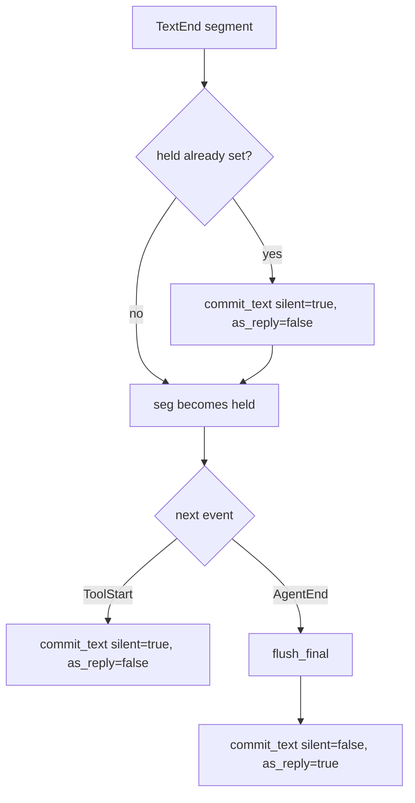

Every reply pico sends, every live "🔍 reading foo.rs" status line, every `/cancel`
that actually stops something — all of it is decided in one function:
`drive_turn` (`crates/core/src/engine.rs:56-298`). It is the single place that
turns a raw stream of omp session events into user-visible messages, so that a
platform adapter (Discord today) never has to reason about streaming, batching,
or "is this the final answer or just a preamble" itself. Understanding this
page means understanding why pico only ever pings you once per turn, why tool
calls collapse into a handful of live-edited status lines instead of spamming
the channel, and why `/cancel` sometimes silently does nothing.

## The mental model

Five things make up the engine:

1. **The loop itself** — `drive_turn` (engine.rs:56-298) consumes a
   `TurnRequest`/`TurnRuntime` pair (engine.rs:44-54) and drains an
   `UnboundedReceiver<OmpEvent>` until the turn ends, returning
   `TurnOutcome::{Live,Dead}` (engine.rs:31-34).
2. **A four-branch `tokio::select!`** (engine.rs:88-289) that races
   cancellation, abort, mid-turn messages, and the next omp event against
   tiered idle timeouts.
3. **The held/supersede/flush_final text state machine** — decides which of
   possibly several text segments in a turn is the one that pings the user.
4. **Activity/subagent batching** — turns a burst of tool-call events into a
   small number of throttled, edited status messages instead of one message
   per event.
5. **Two per-conversation registries** (`mid_turn.rs`, `cancel.rs`) — the only
   way anything outside the loop (a new Discord message, a `/cancel` command)
   can reach into an in-flight turn.

## Context: who calls `drive_turn`

Two call sites, both landing in the same function:

- The normal path: `session::run_turn` (`crates/core/src/session.rs:54-93`)
  builds or resumes an omp session, opens a per-turn event channel via
  `handle.begin_turn()` (session.rs:63), builds the `TurnRequest`/`TurnRuntime`
  (session.rs:65-77), and calls `engine::drive_turn(...)` at session.rs:78.
- The background path: pico's schedule launcher has no live Discord
  interaction context, only a channel id, so it calls `engine::drive_turn`
  directly at `crates/discord/src/discord.rs:1699-1700` instead of going
  through `run_turn`.

Inside `drive_turn`, `TurnKind::Active{prompt, images}` sends the prompt via
`client.prompt(...)` (engine.rs:66); `TurnKind::Background` skips that send
(used for schedule-fired turns that shouldn't inject a new user message). Every
call also registers a mid-turn sink (`rt.mid_turn.register`, engine.rs:69) and
a cancel token (`rt.cancels.register`, engine.rs:70) — see the registries
section below.

## The select loop: four branches, three timeout tiers

The main `loop` (engine.rs:88-289) is a `tokio::select!` with four branches,
each racing against an idle timeout that gets tighter or looser depending on
turn state (`SETTLE_GRACE`=1s once settling, `TOOL_STALL_TIMEOUT`=1h while
`tools_running>0`, else `STALL_TIMEOUT`=15min; engine.rs:24-27,89-95):

- `req.cancel.cancelled()` (engine.rs:97-103) — worker-level shutdown: flush
  activity, flush subagents, `flush_final`, tell the user to resend, return
  `Live`.
- `interrupt.cancelled()` guarded by `!aborted` (engine.rs:104-110) — the
  `/cancel` path: calls `client.abort()` and loops without ending the turn,
  waiting for the abort's resulting events.
- `rx.recv()` (engine.rs:111-124) — a mid-turn message arrived: dispatched by
  `StreamingBehavior` to `client.follow_up`/`client.steer`, or pushed to a
  `deferred` queue if the mode is `Queue`.
- `tokio::time::timeout(idle_wait, events.recv())` (engine.rs:125-145) — the
  omp event itself. On timeout while `settling`, it tries
  `forward_next_pending` to keep going; otherwise it breaks. A hard timeout
  while not settling flushes everything and returns `TurnOutcome::Dead` (the
  session is considered wedged and gets reset).

Event dispatch (engine.rs:153-288) is keyed on `OmpEvent`
(`crates/core/src/omp/protocol.rs:146-158`). The two branches that matter most
for what you see in Discord: `AgentEnd` (engine.rs:244-255) is where the *true*
final answer is flushed via `flush_final`, `answer_delivered` is set `true`,
and `forward_next_pending` either resumes a deferred mid-turn message or sets
`settling=true` to wait for a natural end; `CustomMessage{custom_type}`
(engine.rs:264-273) special-cases an `"autolearn-nudge"` background capture
turn by setting `suppress_text` so its output never surfaces at all (see
`aborted_capture_turn`, engine.rs:346-348). After the loop exits
(engine.rs:290-297) there's a final flush of activity, subagents, and
`flush_final`; if nothing was ever committed, `empty_turn_notice` (engine.rs:
300-324) synthesizes an explanatory message from omp's `AssistantStop` reason.

## The text state machine

This is the part that decides *which* message actually notifies you. The
contract: only the last text segment in a turn pings as a reply; every earlier
segment is posted silently as a superseded preamble.

- `commit_text(surface, activity, text, as_reply, silent)` (engine.rs:402-416)
  is the only function that actually posts: no-op on blank text, else flushes
  pending activity lines, calls `surface.post_reply(text, as_reply, silent)`,
  and seals the activity host (engine.rs:412-414) so the next tool-activity
  line starts a fresh message instead of appending after text just posted.
- `hold_segment(surface, activity, held, title_seed, title_locked, seg)`
  (engine.rs:418-438) is called every time a text segment completes
  (`TextEnd`, engine.rs:159-172). No-op on blank `seg`. If something is
  already `held` from an earlier segment, it gets committed right now via
  `commit_text(..., as_reply=false, silent=true)` (engine.rs:430-431) —
  superseded, posted quietly. Unless `title_locked` (== `answer_delivered`),
  the new segment becomes the thread-title seed (engine.rs:433-435), so the
  title tracks the latest not-yet-final segment until an answer has actually
  landed. Then `seg` becomes the new `held` value.
- `ToolStart` (engine.rs:179-198) also force-commits any currently-held
  segment silently (engine.rs:188) — once a tool call starts, whatever text
  preceded it is disqualified from ever being "the final answer" and gets
  posted quietly right away.
- `flush_final(surface, activity, reply, held, title_seed, title_locked)`
  (engine.rs:440-457) folds any still-buffered `reply` into `held` via
  `hold_segment`, then commits whatever ends up `held` as the true final
  answer: `commit_text(..., as_reply=true, silent=false)` (engine.rs:453-454)
  — the *only* call site in the whole engine with `silent=false` and
  `as_reply=true`. Every other post in a turn is silent.

This is directly verified by the test
`intermediate_segments_are_silent_and_only_final_pings`
(engine.rs:797-814): it posts `"first"` then `"second"` via `hold_segment`,
then calls `flush_final`, and asserts `posts[0]` ("first") is
non-reply+silent while `posts[1]` ("second") is `as_reply && !silent`, with
`title_seed == Some("second")`.

## Tool activity batching

Tool calls don't get one message each. `Activity<S>`/`ActivityHost<M>`
(engine.rs:459-604) batch regular tool-call lines: `Activity::append`
(engine.rs:543-577) decides whether a new line starts a fresh message
("rollover" — sealed, no host yet, or the projected size would exceed the
platform's `SizeLimits`, engine.rs:545-553) or appends to the last host and
edits it in place; `Activity::flush` (engine.rs:585-603) only calls
`surface.edit` for hosts whose rendered text actually changed, throttled by
`ACTIVITY_THROTTLE`=1s (engine.rs:579-583,27). `task` tool calls (subagent
spawns) bypass this and go through `SubagentFeed<S>`/`SubagentBatch<M>`
(engine.rs:606-721) instead — one editable message per subagent-spawning tool
call, throttled by `SUBAGENT_THROTTLE`=2s (engine.rs:28,664). Both paths defer
to  for how a line is actually formatted and size-budgeted.

## Reaching into a running turn

Two per-`ConversationId` registries are how anything *outside* the loop talks
to a `drive_turn` in flight, each registered once per turn (engine.rs:69-70)
and torn down via an RAII guard when the turn ends:

- **`MidTurnQueue`** (`crates/core/src/mid_turn.rs:14-53`) — an
  `mpsc::UnboundedSender` per conversation. `register` (mid_turn.rs:36-52)
  returns a receiver plus a `SinkGuard` whose `Drop` (mid_turn.rs:60-64)
  unregisters the conversation, which is what makes `is_active`/`deliver`
  (mid_turn.rs:32-34,19-30) reflect "a turn is currently running here." A new
  Discord message that arrives mid-turn is routed through `deliver` from the
  Discord adapter.
- **`CancelRegistry`** (`crates/core/src/cancel.rs:20-57`) — a
  `(CancellationToken, streaming: AtomicBool)` per conversation. The
  `streaming` flag is flipped `false` while `handle_ui` awaits a Discord
  dialog/confirm interaction (engine.rs:216,218), so `request()`
  (cancel.rs:25-32) — the `/cancel` command's entry point — only fires
  `token.cancel()` if `streaming` is currently `true`. In other words,
  **cancellation is silently rejected while the turn is paused on a modal**,
  verified by `request_is_rejected_while_paused_on_a_dialog`
  (cancel.rs:94-104). `CancelGuard::drop` (cancel.rs:64-67) unregisters on
  turn end, matching `SinkGuard`.

## Tradeoffs

The engine buys platform-neutrality (one loop, many adapters — see
 for the concrete Discord implementation and
 for the `OmpSessionHandle`/`OmpEvent` side it drives) at the
cost of real state-machine complexity: three interacting timeout tiers, a
held/supersede buffer that must survive `ToolStart`/`TurnEnd`/`AgentEnd` in any
order, and two side-channel registries that must stay in lockstep with the
loop's own lifetime. The payoff is that a platform adapter never has to decide
"is this the reply" or "should this ping" itself — it just implements
's `Surface` trait and gets the contract for free.

## Worked example

A turn where the model streams two text segments and one tool call before
finishing:

1. Model streams `"Let me check that file."` → `TextEnd` → `hold_segment`:
   nothing was held, so it becomes `held`; title seed becomes `"Let me check
   that file."` (engine.rs:433-435).
2. `ToolStart` for a `read` call arrives (engine.rs:179-198) → the held
   segment is force-committed via `commit_text(..., as_reply=false,
   silent=true)` — it posts as a quiet, non-reply message and is no longer
   eligible to be the final answer.
3. Model streams `"The function returns early on error."` → `TextEnd` →
   `hold_segment` again: nothing is currently held (it was just committed), so
   this becomes the new `held` segment.
4. `AgentEnd` arrives → `flush_final` commits the held segment via
   `commit_text(..., as_reply=true, silent=false)` — this is the one message
   that pings you and threads as a reply.

Net effect: one quiet status update, then exactly one notifying reply — the
same shape the unit test at engine.rs:797-814 asserts directly.
