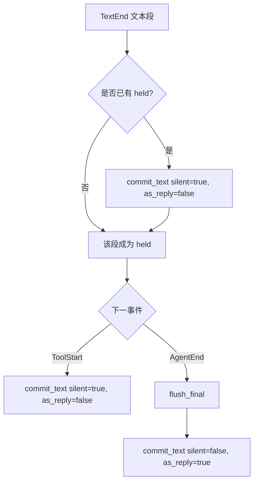

pico 发送的每一条回复、每一行实时的"🔍 正在读取 foo.rs"状态提示、每一次真正生效的
`/cancel`——全部由同一个函数决定：`drive_turn`
(`crates/core/src/engine.rs:56-298`)。它是把 omp 会话事件流转换成用户可见消息的
唯一场所，因此平台适配层（目前是 Discord）完全不需要自己处理流式输出、批量合并，
或者判断"这段文字是最终答案还是只是过程性输出"。理解这一页,就理解了为什么 pico
每个轮次只会 ping 你一次、为什么一堆工具调用会合并成寥寥几行实时编辑的状态提示而
不是刷屏、以及为什么 `/cancel` 有时候看起来什么都没做。

## 心智模型

引擎由五个部分组成：

1. **循环本身** —— `drive_turn` (engine.rs:56-298) 消费一对
   `TurnRequest`/`TurnRuntime` (engine.rs:44-54)，不断从
   `UnboundedReceiver<OmpEvent>` 中取事件直到轮次结束，返回
   `TurnOutcome::{Live,Dead}` (engine.rs:31-34)。
2. **四分支的 `tokio::select!`** (engine.rs:88-289)，在取消、中断、mid-turn
   消息、下一个 omp 事件之间竞速，并配有分级的空闲超时。
3. **held/supersede/flush_final 文本状态机** —— 决定一个轮次里可能出现的多段
   文本中,到底哪一段才是真正 ping 用户的那条。
4. **活动/子代理批处理** —— 把一连串工具调用事件合并成少量、限流的状态消息，
   而不是每个事件发一条消息。
5. **两个按会话（conversation）划分的注册表**（`mid_turn.rs`、`cancel.rs`）——
   循环之外的任何东西（一条新的 Discord 消息、一条 `/cancel` 命令）想要触达一个
   正在进行中的轮次,唯一的途径。

## 背景：谁调用 `drive_turn`

有两个调用点，都落到同一个函数：

- 常规路径：`session::run_turn` (`crates/core/src/session.rs:54-93`) 构建或
  恢复一个 omp 会话，通过 `handle.begin_turn()` (session.rs:63) 打开一个
  每轮次的事件通道，构造 `TurnRequest`/`TurnRuntime` (session.rs:65-77)，然后
  在 session.rs:78 调用 `engine::drive_turn(...)`。
- 后台路径：pico 的调度启动器没有实时的 Discord 交互上下文，只有一个频道
  id，所以它不经过 `run_turn`，而是直接在
  `crates/discord/src/discord.rs:1699-1700` 调用 `engine::drive_turn`。

在 `drive_turn` 内部，`TurnKind::Active{prompt, images}` 会通过
`client.prompt(...)` (engine.rs:66) 发送 prompt；`TurnKind::Background`
则跳过这一步（用于调度触发、不应注入新用户消息的轮次）。每次调用还会注册一个
mid-turn sink（`rt.mid_turn.register`, engine.rs:69）和一个取消令牌
（`rt.cancels.register`, engine.rs:70）——详见下文的注册表小节。

## select 循环：四个分支，三级超时

主 `loop` (engine.rs:88-289) 是一个带四个分支的 `tokio::select!`，每个分支都
与一个随轮次状态收紧或放宽的空闲超时竞速（`SETTLE_GRACE`=1s 一旦进入
settling；`TOOL_STALL_TIMEOUT`=1 小时，当 `tools_running>0` 时；否则
`STALL_TIMEOUT`=15 分钟；engine.rs:24-27,89-95）：

- `req.cancel.cancelled()` (engine.rs:97-103) —— worker 级别的关闭：刷新活动
  状态、刷新子代理状态（`settle_failed=false`）、`flush_final`、告知用户重发，
  返回 `Live`。
- `interrupt.cancelled()`，以 `!aborted` 为前提 (engine.rs:104-110) ——
  `/cancel` 路径：调用 `client.abort()` 并继续循环（不会结束轮次，而是等待
  abort 产生的后续事件）。
- `rx.recv()` (engine.rs:111-124) —— 收到一条 mid-turn 消息：按
  `StreamingBehavior` 分派给 `client.follow_up`/`client.steer`，或者在模式为
  `Queue` 时压入 `deferred` 队列。
- `tokio::time::timeout(idle_wait, events.recv())` (engine.rs:125-145) ——
  omp 事件本身。在 `settling` 状态下超时会尝试 `forward_next_pending` 继续
  推进；否则跳出循环。非 settling 状态下的硬超时会刷新所有状态并返回
  `TurnOutcome::Dead`（该会话被视为卡死并会被重置）。

事件分派 (engine.rs:153-288) 以 `OmpEvent`
(`crates/core/src/omp/protocol.rs:146-158`) 为键。对 Discord 上你能看到的内容
影响最大的两个分支：`AgentEnd` (engine.rs:244-255) 是真正刷新最终答案的地方
——调用 `flush_final`，设置 `answer_delivered=true`，然后 `forward_next_pending`
要么恢复一条被推迟的 mid-turn 消息，要么设置 `settling=true` 等待自然结束；
`CustomMessage{custom_type}` (engine.rs:264-273) 对 `"autolearn-nudge"`
后台捕获轮次做了特殊处理，设置 `suppress_text` 使其输出完全不会被展示出来
（参见 `aborted_capture_turn`, engine.rs:346-348）。循环退出后
(engine.rs:290-297) 会做一次最终刷新（活动、子代理、`flush_final`）；如果这个
轮次里从未提交过任何内容，`empty_turn_notice` (engine.rs:300-324) 会根据 omp
的 `AssistantStop` 原因合成一条解释性消息。

## 文本状态机

这是决定"到底哪条消息才真正通知你"的部分。契约是：一个轮次里只有最后一段
文本会作为 reply 去 ping 用户；更早的每一段都作为被取代的前导内容静默发出。

- `commit_text(surface, activity, text, as_reply, silent)`
  (engine.rs:402-416) 是唯一真正发消息的函数：文本为空则不做任何事；否则先
  刷新待发的活动行，再调用 `surface.post_reply(text, as_reply, silent)`，
  并 `activity.seal()` (engine.rs:412-414)，使下一条活动行会开启一条新消息，
  而不是追加在刚发出的文本后面。
- `hold_segment(surface, activity, held, title_seed, title_locked, seg)`
  (engine.rs:418-438) 在每次一段文本完成时被调用（`TextEnd`,
  engine.rs:159-172）。`seg` 为空则不做任何事。如果已经有来自更早文本段的
  `held` 值，它会立刻通过 `commit_text(..., as_reply=false, silent=true)`
  (engine.rs:430-431) 被提交——被取代，静默发出。除非 `title_locked`
  （等价于 `answer_delivered`），否则新的这段会成为线程标题的种子
  (engine.rs:433-435)，也就是说标题会一直追踪最新的、尚未成为最终答案的
  文本段,直到真正有答案落地为止。然后 `seg` 成为新的 `held` 值。
- `ToolStart` (engine.rs:179-198) 同样会强制静默提交当前 `held` 的文本段
  (engine.rs:188)——一旦某个工具调用开始，此前的文本就永远失去成为"最终
  答案"的资格，会立刻被静默发出。
- `flush_final(surface, activity, reply, held, title_seed, title_locked)`
  (engine.rs:440-457) 先通过 `hold_segment` 把仍缓冲着的 `reply` 折叠进
  `held`，然后把最终得到的 `held` 值作为真正的最终答案提交：
  `commit_text(..., as_reply=true, silent=false)` (engine.rs:453-454)——
  这是整个引擎里唯一一处 `silent=false` 且 `as_reply=true` 的调用点。轮次里
  其余所有消息都是 silent 的。

这一点由测试
`intermediate_segments_are_silent_and_only_final_pings`
(engine.rs:797-814) 直接验证：它先后通过 `hold_segment` 提交 `"first"`
和 `"second"`，再调用 `flush_final`，断言 `posts[0]`（"first"）是
非-reply 且 silent 的，而 `posts[1]`（"second"）是 `as_reply && !silent`
的，且 `title_seed == Some("second")`。

## 工具活动批处理

工具调用不会一个对应一条消息。`Activity<S>`/`ActivityHost<M>`
(engine.rs:459-604) 会批量处理常规的工具调用行：`Activity::append`
(engine.rs:543-577) 判断一条新行是应该开启一条新消息（"rollover"——已
sealed、还没有 host，或者预计大小会超出平台的 `SizeLimits`，
engine.rs:545-553），还是应该追加到最后一个 host 并原地编辑；
`Activity::flush` (engine.rs:585-603) 只会对渲染文本确实发生变化的 host
调用 `surface.edit`，并以 `ACTIVITY_THROTTLE`=1s 限流
(engine.rs:579-583,27)。`task` 工具调用（子代理生成）会绕过这条路径，
改走 `SubagentFeed<S>`/`SubagentBatch<M>` (engine.rs:606-721)——每个
生成子代理的工具调用对应一条可编辑消息，以 `SUBAGENT_THROTTLE`=2s 限流
(engine.rs:28,664)。这两条路径的具体行格式与大小预算，参见
。

## 触达一个正在进行中的轮次

有两个按 `ConversationId` 划分的注册表，是循环*之外*的任何东西与一个正在
进行中的 `drive_turn`通信的方式，每个轮次注册一次（engine.rs:69-70），
并在轮次结束时通过 RAII guard 注销：

- **`MidTurnQueue`** (`crates/core/src/mid_turn.rs:14-53`) —— 每个会话
  一个 `mpsc::UnboundedSender`。`register` (mid_turn.rs:36-52) 返回一个
  接收端和一个 `SinkGuard`，其 `Drop` (mid_turn.rs:60-64) 会注销该会话，
  这正是 `is_active`/`deliver` (mid_turn.rs:32-34,19-30) 能反映"这里当前
  有一个轮次正在运行"的原因。轮次进行中新到达的 Discord 消息就是通过
  Discord 适配层调用 `deliver` 路由进来的。
- **`CancelRegistry`** (`crates/core/src/cancel.rs:20-57`) —— 每个会话
  一个 `(CancellationToken, streaming: AtomicBool)`。当 `handle_ui` 正在
  等待一个 Discord 对话框/确认交互时，`streaming` 标志会被置为 `false`
  (engine.rs:216,218)，因此 `request()` (cancel.rs:25-32)——即 `/cancel`
  命令的入口——只有在 `streaming` 当前为 `true` 时才会真正调用
  `token.cancel()`。换句话说，**当轮次正暂停在一个弹窗上时，取消请求会被
  静默拒绝**，这一点由 `request_is_rejected_while_paused_on_a_dialog`
  (cancel.rs:94-104) 验证。`CancelGuard::drop` (cancel.rs:64-67) 会在
  轮次结束时注销，与 `SinkGuard` 对应。

## 取舍

引擎用真实的状态机复杂度换来了平台无关性（一个循环，多个适配层——具体的
Discord 实现见 ，引擎驱动的
`OmpSessionHandle`/`OmpEvent` 一侧见 ）：三级互相影响的
超时、一个必须在 `ToolStart`/`TurnEnd`/`AgentEnd` 以任意顺序到来时都能存活
的 held/supersede 缓冲区，以及两个必须与循环自身生命周期保持同步的旁路
注册表。换来的好处是：平台适配层完全不需要自己判断"这是不是回复"、
"这条该不该 ping"——只需实现  的 `Surface` trait，
就能免费获得这套契约。

## 实例演练

一个轮次里模型先流式输出两段文本、中间夹一次工具调用、最后结束：

1. 模型流式输出 `"Let me check that file."` → `TextEnd` → `hold_segment`：
   当前没有已 held 的内容，于是这段成为 `held`；标题种子变为
   `"Let me check that file."` (engine.rs:433-435)。
2. 一个 `read` 调用的 `ToolStart` 到来 (engine.rs:179-198) → 被 held 的文本
   段通过 `commit_text(..., as_reply=false, silent=true)` 被强制提交——
   以静默、非回复消息的形式发出，且不再有资格成为最终答案。
3. 模型流式输出 `"The function returns early on error."` → `TextEnd` →
   再次 `hold_segment`：此刻没有任何内容处于 held 状态（刚刚被提交过），
   于是这段成为新的 `held` 值。
4. `AgentEnd` 到来 → `flush_final` 通过
   `commit_text(..., as_reply=true, silent=false)` 提交被 held 的文本段
   ——这就是那条会 ping 你、并以 reply 形式串联的消息。

最终效果：一条静默的状态更新，随后恰好一条会通知你的回复——这正是
engine.rs:797-814 处的单元测试直接断言的形状。
