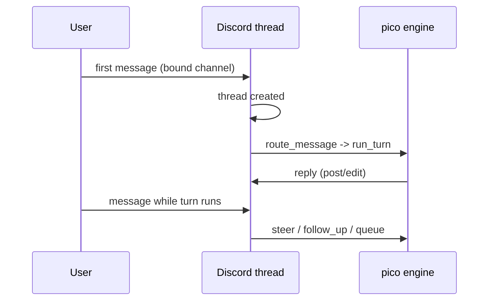

This page is the day-to-day guide to talking to pico once it's running in a Discord server: binding a channel, starting a thread, steering it mid-turn, and using the slash commands. If pico isn't running yet, start at .

## Goal

By the end of this page you can bind a channel, hold an ongoing threaded conversation, interrupt or redirect it while it's working, and know what each slash command does.

## Prerequisites

- pico running and invited to a Discord server ().
- A **bound channel** — until a channel is bound, pico has no working directory there and won't respond. Binding attaches either a plain working directory or a git base-repo (which forks a private worktree per thread) to that channel.

## Steps

### 1. Bind a channel

An admin runs `/bind set` (or `/bind worktree` for the git-base-repo, per-thread-fork mode) in the channel; `/bind show` confirms the current binding and `/bind unset` clears it (`crates/discord/src/discord.rs:668-806`). Binding also selects a **profile** (default `default`) — an overlay of skills/rules/model/browser toggle; pico runs one omp host process per profile.

### 2. Send a message — a thread gets forked

Send any message in a bound channel. `route_message` (`crates/discord/src/discord.rs:1005-1360`) picks it up: it ignores DMs and unconfigured guilds, wraps the message (plus any reply/forward quotes it's attached to), resolves binding → route → thread marker → worktree, and drives one engine turn. The very first message in that channel is what causes the bot to create a Discord thread (`crates/discord/src/discord.rs:1177-1188`); the thread is later given an LLM-generated title once there's enough conversation to summarize (`crates/discord/src/discord.rs:1338-1355`).

From then on, that thread *is* the conversation — one continuous omp session with its own history and (if worktree-bound) its own git worktree.

### 3. Keep talking — and what Discord rendering looks like

Everything you send inside that thread continues the same session. Image attachments arrive as native content with positional `[Image #N]` markers pico can refer back to. Because Discord only renders Discord markdown (no LaTeX, tables, or mermaid), the LLM's system prompt is told about these constraints up front so it doesn't try to send content Discord can't display; long replies are auto-split across multiple messages (`crates/discord/src/discord_surface.md:1-37`).

### 4. Mid-turn: steer, follow-up, queue, or cancel

If you send a new message while pico is still working on a previous one, it is **not** treated as a second turn — it's delivered mid-turn through the `MidTurnQueue` (`crates/discord/src/discord.rs:1106-1117`) as one of:

- **steer** — redirect the current turn immediately.
- **follow_up** — attach additional instructions for the current turn to pick up.
- **queue** — hold the message to run as the next turn once this one finishes.

You choose which with `/busy steer|follow_up|queue` (`crates/discord/src/discord.rs:232-263`). If you just want the current turn to stop outright, `/cancel` cancels the running turn (`crates/discord/src/discord.rs:216`).

### 5. The slash commands

| Command | Line | What it does |
|---|---|---|
| `/ping` | `discord.rs:147` | Liveness check. |
| `/schedule` | `discord.rs:153` | Manage scheduled jobs for this thread/channel (see ). |
| `/cancel` | `discord.rs:216` | Cancel the turn currently running in this thread. |
| `/busy steer\|follow_up\|queue` | `discord.rs:232-263` | Choose how a new message is handled while a turn is running. |
| `/context` | `discord.rs:376` | Inspect the current session's context. |
| `/shake` | `discord.rs:409` | Force a context refresh/reset action on the session. |
| `/compact` | `discord.rs:464` | Compact the session's conversation history. |
| `/dev-deploy` | `discord.rs:572` | Trigger a development deploy for this worker. |
| `/update` | `discord.rs:588` | Pull and deploy the latest pico build. |
| `/bind set\|worktree\|unset\|show` | `discord.rs:668-806` | Manage the channel's binding (plain dir, or git worktree-forking). |
| `/worktree close` | `discord.rs:823-900` | Close out this thread's forked worktree. |

## Verification

You know it worked when: the bot creates a thread on your first message in a bound channel, replies inside it, and a second message sent while it's still replying prompts a steer/follow-up/queue choice instead of starting a duplicate reply.

## Next

- The Discord side of this flow (thread creation, message wrapping, the `Surface` implementation) is detailed in .
- Worktree-bound channels and thread titles are covered in .
- `/schedule` and recurring jobs are covered in .
