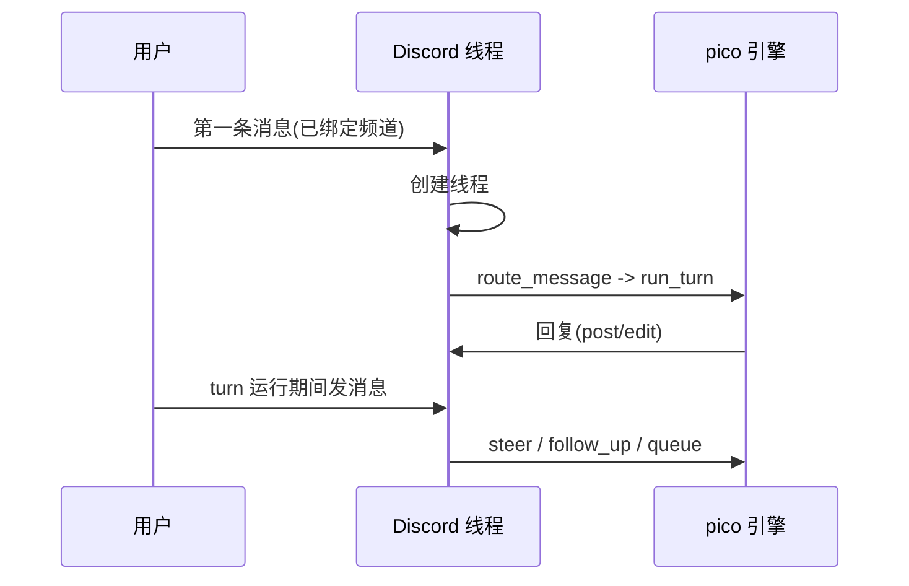

本页是 pico 在 Discord 服务器中跑起来之后的日常使用指南:绑定频道、开启线程、在 turn 进行中插话,以及各个斜杠命令的用法。如果 pico 还没跑起来,先看 。

## 目标

读完本页后,你可以绑定一个频道,进行一段持续的线程对话,在它工作时打断或重新引导它,并了解每个斜杠命令的作用。

## 前置条件

- pico 已经在运行,并已被邀请进某个 Discord 服务器()。
- 一个**已绑定的频道** —— 在频道被绑定之前,pico 在那里没有工作目录,也不会回应。绑定会给该频道关联一个普通工作目录,或者一个 git 基础仓库(每个线程会从中 fork 出一份私有 worktree)。

## 步骤

### 1. 绑定一个频道

管理员在频道里运行 `/bind set`(或者用 `/bind worktree` 开启"每线程 fork 一个 git 基础仓库"模式);`/bind show` 确认当前绑定,`/bind unset` 清除绑定(`crates/discord/src/discord.rs:668-806`)。绑定同时会选择一个 **profile**(默认是 `default`)—— 一套 skills/rules/model/浏览器开关的叠加配置;pico 每个 profile 运行一个 omp host 进程。

### 2. 发一条消息 —— 一个线程被 fork 出来

在已绑定的频道里发任意一条消息。`route_message`(`crates/discord/src/discord.rs:1005-1360`)会接手它:忽略私信和未配置的服务器,包装这条消息(以及它附带的任何回复/转发引用),依次解析 绑定 → 路由 → 线程标记 → worktree,然后驱动一次引擎 turn。该频道里的第一条消息会导致机器人创建一个 Discord 线程(`crates/discord/src/discord.rs:1177-1188`);等对话积累到足够总结时,线程会被赋予一个由 LLM 生成的标题(`crates/discord/src/discord.rs:1338-1355`)。

从此以后,这个线程*就是*这段对话 —— 一个持续的 omp session,有自己的历史记录,如果是 worktree 绑定的话还有自己的 git worktree。

### 3. 继续对话 —— Discord 渲染是什么样的

你在这个线程里发的每一条消息都延续同一个 session。图片附件会作为原生内容到达,并带有位置标记 `[Image #N]`,pico 可以在回复中引用它们。由于 Discord 只能渲染 Discord 风格的 markdown(没有 LaTeX、表格或 mermaid),LLM 的系统提示词会提前告知这些限制,以免它尝试发送 Discord 无法展示的内容;过长的回复会被自动拆分成多条消息(`crates/discord/src/discord_surface.md:1-37`)。

### 4. Turn 进行中:插话、追加、排队,或取消

如果你在 pico 还在处理上一条消息时又发了一条新消息,它**不会**被当作第二个 turn —— 而是通过 `MidTurnQueue`(`crates/discord/src/discord.rs:1106-1117`)以下面三种方式之一在 turn 进行中被送达:

- **steer(插话)** —— 立刻重新引导当前 turn。
- **follow_up(追加)** —— 为当前 turn 附加额外指令,供它随后采纳。
- **queue(排队)** —— 把这条消息留到当前 turn 结束后,作为下一个 turn 运行。

用 `/busy steer|follow_up|queue` 来选择具体方式(`crates/discord/src/discord.rs:232-263`)。如果你只是想让当前 turn 直接停下,`/cancel` 会取消正在运行的 turn(`crates/discord/src/discord.rs:216`)。

### 5. 斜杠命令一览

| 命令 | 行号 | 作用 |
|---|---|---|
| `/ping` | `discord.rs:147` | 存活检测。 |
| `/schedule` | `discord.rs:153` | 管理这个线程/频道的定时任务(见 )。 |
| `/cancel` | `discord.rs:216` | 取消当前线程里正在运行的 turn。 |
| `/busy steer\|follow_up\|queue` | `discord.rs:232-263` | 选择 turn 运行期间新消息的处理方式。 |
| `/context` | `discord.rs:376` | 查看当前 session 的上下文。 |
| `/shake` | `discord.rs:409` | 对 session 强制执行一次上下文刷新/重置动作。 |
| `/compact` | `discord.rs:464` | 压缩 session 的对话历史。 |
| `/dev-deploy` | `discord.rs:572` | 为这个 worker 触发一次开发部署。 |
| `/update` | `discord.rs:588` | 拉取并部署最新的 pico 构建。 |
| `/bind set\|worktree\|unset\|show` | `discord.rs:668-806` | 管理频道的绑定(普通目录,或 git worktree fork)。 |
| `/worktree close` | `discord.rs:823-900` | 关闭这个线程 fork 出来的 worktree。 |

## 验证

以下现象说明一切正常:在已绑定频道发第一条消息时机器人创建了线程,并在其中回复;在它还在回复时再发一条消息,会触发 steer/follow-up/queue 的选择,而不是开始一条重复的回复。

## 接下来

- 这一整套流程在 Discord 侧的实现(线程创建、消息包装、`Surface` 实现)详见 。
- worktree 绑定的频道和线程标题见 。
- `/schedule` 和周期性任务见 。
