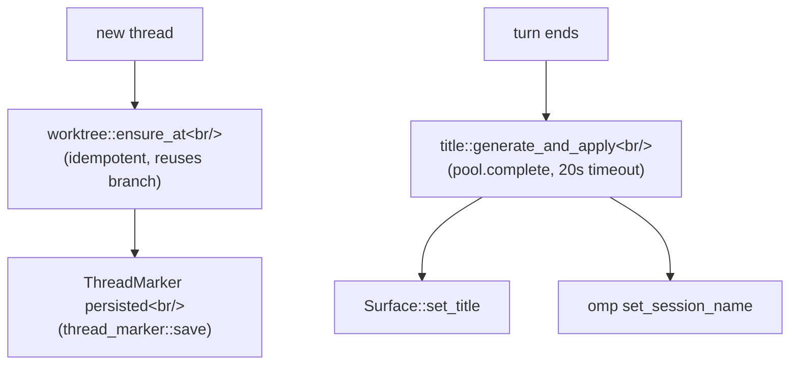

Every code-editing conversation pico has needs its own isolated git checkout — two threads working on the same repo at once must not clobber each other's uncommitted changes. And every thread needs a human-readable label so a Discord sidebar full of threads is navigable instead of a wall of "Thread 1, Thread 2". Both concerns are handled by small, single-purpose modules that plug into the same `ThreadMarker` machinery covered in : `worktree.rs` forks and tears down the checkout, `title.rs` names it.

## Intent

(a) Fork an isolated git worktree per conversation so pico can edit code without touching the main checkout or another thread's in-progress edits, with a safety gate that stops a user from silently discarding uncommitted work when closing a thread. (b) Generate a short, human-readable thread title from a cheap one-shot LLM completion right after the first exchange, so a long-running Discord bot doesn't leave every thread named after its opening message.

## Core concepts

1. **Worktree fork** (`crates/core/src/worktree.rs`): the branch name is always `format!("{branch_prefix}/{thread_id}")` (`worktree.rs:17-19`, default prefix `"pico"` from `bindings.rs:24`); the path is `worktrees_dir/<safe(platform)>/<safe(channel_id)>/<thread_id>` (`worktree.rs:34-39`; both `platform` and `channel_id` go through `safe_component`, which maps path separators/colons to `_`, `worktree.rs:21-32`). `ensure_at` (`worktree.rs:55-119`) is **idempotent** — it checks whether `.git` already exists first (`worktree.rs:63-65`) — prunes stale worktree entries, best-effort fetches `origin` only if `default_branch` starts with `"origin/"` (warns and continues on failure, `worktree.rs:81-85`), then either `git worktree add <path> <existing-branch>` or `git worktree add <path> -b <branch> <default_branch>` (`worktree.rs:87-116`). Because it reuses the branch across restarts, resuming a thread after a worker restart lands back on the exact same branch instead of forking a new one.
2. **Loss-of-work safety gate**: `close_would_lose`/`LossSummary` (`worktree.rs:140-166,168-197`) runs `git status --porcelain` for uncommitted changes and `git rev-list --count <branch> --not --remotes HEAD` for unpushed/unmerged commits. `needs_confirmation()` (`worktree.rs:146-148`) is true if the tree is dirty OR the unmerged count is `>0` or unknown. This surfaces as a confirm dialog in `crates/discord/src/discord.rs:851-866` **before** `/worktree close` actually calls `worktree::remove` — the gate exists specifically so a user can't lose uncommitted work with one careless click.
3. **`validate_base_repo`** (`worktree.rs:121-138`) is the pre-flight check when a user runs `pico bind --worktree <repo>`: confirms it's actually a git repo, and — if `default_branch` starts with `origin/` — that an `origin` remote exists. This prevents a broken binding from being silently stored and only failing later when a thread tries to fork from it.
4. **Title generation** (`crates/core/src/title.rs`): `generate_and_apply` (`title.rs:18-41`) calls `generate` (`title.rs:43-69`), which builds a system prompt embedding the user's `<request>` and the assistant's `<reply>` — both sanitized of `<`/`>` and capped at `TITLE_INPUT_CAP=500` chars (`title.rs:14,71-76`) — then calls `pool.complete(profile, system, prompt)` under a `TITLE_TIMEOUT=20s` (`title.rs:10,59`), racing it in a `tokio::select!` against a `CancellationToken` so a slow completion can't hang the caller. `sanitize_title` (`title.rs:78-86`) strips wrapping quotes, collapses whitespace, caps at 100 chars, and rejects anything under 2 chars as garbage.
5. **Dual title store**: on success, `generate_and_apply` calls `surface.set_title(&title)` — the platform-neutral `Surface` trait method (see ) — **and** separately, best-effort, syncs the omp session's own name via `OmpSessionHandle::client().set_session_name` (`crates/core/src/omp/client.rs`, invoked `title.rs:35`). These are two independent stores kept in sync by this one call site, not one write that fans out.
6. **`OmpPool::complete`** (`crates/core/src/omp/pool.rs:255-270`) is the underlying one-shot LLM completion primitive title generation depends on: it spawns/reuses an omp host process for the given profile and calls `host.completion(system, prompt)` (`crates/core/src/omp/client.rs:273-287`), which round-trips a `Command::Completion{id, system, prompt}` RPC frame to the Bun omp-host (see ) and returns `resp.result`. Model selection isn't a concept in this Rust layer at all — it's whatever the profile's omp session/host was already configured with.
7. **`ThreadMarker` is the shared glue, not a separate concept**: `title.rs` and `worktree.rs` are pure logic modules with no DB/filesystem-marker coupling of their own — they take `thread_id`/`branch_prefix`/`base_repo`/`default_branch` as plain arguments. It's the platform code (`discord.rs`, `schedule_host.rs`) that loads a `ThreadMarker` (see ) first and passes its fields down.

## Mental model

## Worked example: closing a worktree-bound thread

The concrete sequence behind `/worktree close` (`crates/discord/src/discord.rs:830-892`):

1. Load the thread's `ThreadMarker` to get its cwd/worktree origin.
2. `worktree::close_would_lose(base_repo, worktree, thread_id, branch_prefix)` (`worktree.rs:168-197`) derives the branch internally from `(branch_prefix, thread_id)`, then runs `git status --porcelain` and `git rev-list --count <branch> --not --remotes HEAD`.
3. If dirty or unmerged commits exist, Discord shows a confirmation prompt instead of deleting anything — the user must explicitly confirm losing that work.
4. On confirm: `pool.close(thread_id)` (fails if a turn is currently in-flight on that thread, so a close can't race a running turn), then `worktree::remove` deletes the worktree directory and its branch.
5. `thread_marker::tombstone` sets `closed_at` on the DB row but keeps it — the conversation's history, profile, and cwd remain on record even though the working directory is gone.

This is the same "safety gate before a destructive filesystem/git operation" pattern in miniature: cheap read-only `git` checks first, destructive action only after explicit confirmation.

## Tradeoffs

- Reusing the branch across restarts (rather than always forking fresh) means a resumed thread picks up exactly where its uncommitted work left off — at the cost of `ensure_at` needing idempotency checks (`.git` exists? worktree entry stale?) on every call instead of a simple "always create".
- The loss-of-work gate is a heuristic (dirty tree OR unmerged count) rather than a guarantee — an unmerged count of "unknown" (e.g. `git rev-list` itself fails) is treated as "needs confirmation" rather than "assume safe", trading a few unnecessary confirm prompts for never silently discarding work.
- Title generation is fire-and-forget with a hard 20s timeout rather than blocking the turn — a slow or failed completion just means the thread keeps its default name, never blocks the conversation.
- The dual title store (`Surface::set_title` + omp `set_session_name`) means two independent systems can, in principle, drift if one write succeeds and the other fails silently — accepted because both are cosmetic (display name), not load-bearing state.

## Load-bearing files

- `crates/core/src/worktree.rs` — git worktree fork/close/loss-check; the only place in the codebase that shells out to `git`.
- `crates/core/src/title.rs` — LLM-based title generation + dual title-store sync.
- `crates/core/src/omp/pool.rs` (lines 255-270) / `crates/core/src/omp/client.rs` (lines 273-287) — the `complete`/`completion` one-shot LLM primitive `title.rs` depends on.
- `crates/shared/src/validate.rs` — branch/branch-prefix/profile-name validation shared by `bindings.rs`, `thread_marker.rs`, and worktree naming.

`worktree::run_git`/`ensure_at`/`remove` are called from three places — CLI (`crates/cli/src/thread.rs`), live Discord threads (`crates/discord/src/discord.rs`), and Discord's scheduled fresh/continue firing (`crates/discord/src/schedule_host.rs`, see ) — one implementation, three callers, all serialized through the same `CREATE_LOCK`/`GIT_TIMEOUT` guards (`worktree.rs:11,13,15`) so concurrent forks/removes on the same repo don't race.
