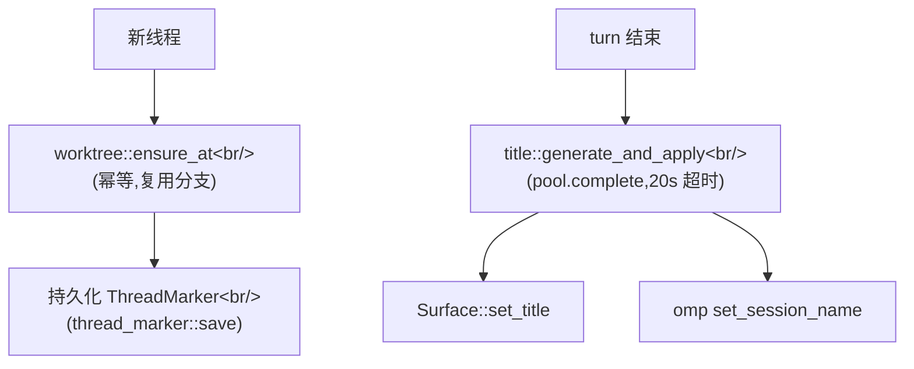

pico 每一个涉及改代码的会话都需要一份独立隔离的 git 检出——两个线程同时操作同一个仓库,绝不能相互践踏对方尚未提交的改动。同时每个线程都需要一个人类可读的标签,这样 Discord 侧边栏里一堆线程才能被导航,而不是一堵"Thread 1, Thread 2"的墙。这两件事都由体量小、职责单一的模块负责,并且都插入到  中讲过的同一套 `ThreadMarker` 机制里:`worktree.rs` 负责 fork 和拆除检出目录,`title.rs` 负责命名。

## 目的

(a) 为每个会话 fork 一个隔离的 git worktree,让 pico 能编辑代码而不影响主检出目录或另一个线程正在进行的改动,并配一道安全闸门,防止用户在关闭线程时悄无声息地丢弃未提交的工作。(b) 在第一轮问答之后,用一次低成本的一次性 LLM 补全生成一个简短、人类可读的线程标题,这样一个长期运行的 Discord bot 就不会让每个线程都以它的第一条消息命名。

## 核心概念

1. **Worktree fork**(`crates/core/src/worktree.rs`):分支名永远是 `format!("{branch_prefix}/{thread_id}")`(`worktree.rs:17-19`,默认前缀 `"pico"` 来自 `bindings.rs:24`);路径是 `worktrees_dir/<safe(platform)>/<safe(channel_id)>/<thread_id>`(`worktree.rs:34-39`;`platform` 和 `channel_id` 都会经过 `safe_component`,它把路径分隔符/冒号映射成 `_`,`worktree.rs:21-32`)。`ensure_at`(`worktree.rs:55-119`)是**幂等的**——它首先检查 `.git` 是否已经存在(`worktree.rs:63-65`)——清理陈旧的 worktree 条目,只有在 `default_branch` 以 `"origin/"` 开头时才尽力去 fetch `origin`(失败时警告并继续,`worktree.rs:81-85`),然后执行 `git worktree add <path> <existing-branch>` 或 `git worktree add <path> -b <branch> <default_branch>`(`worktree.rs:87-116`)。因为它在重启之间复用分支,一个线程在 worker 重启后恢复时,会落回到完全同一条分支上,而不是重新 fork 一条新的。
2. **防止丢失工作的安全闸门**:`close_would_lose`/`LossSummary`(`worktree.rs:140-166,168-197`)运行 `git status --porcelain` 检查未提交改动,以及 `git rev-list --count <branch> --not --remotes HEAD` 检查未推送/未合并的提交。`needs_confirmation()`(`worktree.rs:146-148`)在工作树脏、或未合并数量 `>0`、或未知时为真。这在 `crates/discord/src/discord.rs:851-866` 中呈现为一个确认对话框,发生在 `/worktree close` 真正调用 `worktree::remove` **之前**——这道闸门存在的唯一目的,就是不让用户一次不小心的点击丢掉未提交的工作。
3. **`validate_base_repo`**(`worktree.rs:121-138`)是用户运行 `pico bind --worktree <repo>` 时的预检查:确认它确实是一个 git 仓库,并且——如果 `default_branch` 以 `origin/` 开头——确认 `origin` remote 确实存在。这可以防止一个损坏的 binding 被悄悄存下来,却要等到某个线程尝试从它 fork 时才暴露失败。
4. **标题生成**(`crates/core/src/title.rs`):`generate_and_apply`(`title.rs:18-41`)调用 `generate`(`title.rs:43-69`),后者构造一个内嵌用户 `<request>` 和助手 `<reply>` 的系统提示——两者都经过 `<`/`>` 清理,并被截断到 `TITLE_INPUT_CAP=500` 字符(`title.rs:14,71-76`)——然后在 `TITLE_TIMEOUT=20s`(`title.rs:10,59`)之下调用 `pool.complete(profile, system, prompt)`,并放进 `tokio::select!` 中与一个 `CancellationToken` 竞速,防止一次缓慢的补全把调用方挂住。`sanitize_title`(`title.rs:78-86`)去掉包裹的引号、折叠空白、截断到 100 字符,并把不足 2 个字符的结果当作垃圾拒绝掉。
5. **双重标题存储**:成功后,`generate_and_apply` 调用 `surface.set_title(&title)`——平台中立的 `Surface` trait 方法(见 )——**并且**另外尽力同步 omp 会话自身的名字,通过 `OmpSessionHandle::client().set_session_name`(`crates/core/src/omp/client.rs`,在 `title.rs:35` 调用)。这是由这一处调用点保持同步的两个独立存储,而不是一次写入自动扇出到两处。
6. **`OmpPool::complete`**(`crates/core/src/omp/pool.rs:255-270`)是标题生成所依赖的底层一次性 LLM 补全原语:它为给定 profile 派生/复用一个 omp host 进程,并调用 `host.completion(system, prompt)`(`crates/core/src/omp/client.rs:273-287`),后者把一个 `Command::Completion{id, system, prompt}` RPC 帧往返发送给 Bun omp-host(见 ),并返回 `resp.result`。模型选择在这层 Rust 代码里根本不是一个概念——用的就是该 profile 的 omp 会话/host 本来配置的那个模型。
7. **`ThreadMarker` 是共享的粘合剂,而不是一个独立概念**:`title.rs` 和 `worktree.rs` 都是纯逻辑模块,自身没有任何数据库/文件系统 marker 耦合——它们把 `thread_id`/`branch_prefix`/`base_repo`/`default_branch` 当作普通参数接收。是平台层代码(`discord.rs`、`schedule_host.rs`)先加载好一个 `ThreadMarker`(见 ),再把它的字段传下去。

## 心智模型

## 实例:关闭一个绑定了 worktree 的线程

`/worktree close`(`crates/discord/src/discord.rs:830-892`)背后的具体流程:

1. 加载该线程的 `ThreadMarker`,取得它的 cwd/worktree 来源。
2. `worktree::close_would_lose(base_repo, worktree, thread_id, branch_prefix)`(`worktree.rs:168-197`)在内部由 `(branch_prefix, thread_id)` 派生出分支名,然后运行 `git status --porcelain` 和 `git rev-list --count <branch> --not --remotes HEAD`。
3. 如果存在脏改动或未合并的提交,Discord 会弹出确认提示,而不是直接删除任何东西——用户必须明确确认愿意丢失那部分工作。
4. 确认之后:`pool.close(thread_id)`(如果该线程当前有 turn 正在进行则失败,这样关闭操作就不会与一次正在运行的 turn 竞争),然后 `worktree::remove` 删除 worktree 目录及其分支。
5. `thread_marker::tombstone` 在数据库那一行上设置 `closed_at`,但保留这一行——即便工作目录已经消失,该会话的历史、profile、cwd 依然留有记录。

这正是同一种"破坏性文件系统/git 操作前先设安全闸门"模式的缩影:先做廉价的只读 `git` 检查,只有在明确确认之后才执行破坏性动作。

## 权衡取舍

- 在重启之间复用分支(而不是每次都重新 fork)意味着一个恢复的线程能从未提交工作中断的地方精确接续——代价是 `ensure_at` 每次调用都需要做幂等性检查(`.git` 是否存在?worktree 条目是否陈旧?),而不是简单地"总是创建"。
- 防止丢失工作的闸门是一种启发式(脏树 OR 未合并数量),而不是一个保证——未合并数量为"未知"(比如 `git rev-list` 本身失败)会被当作"需要确认"而不是"假定安全",用少数不必要的确认提示换取绝不悄悄丢弃工作。
- 标题生成是即发即忘(fire-and-forget),带一个硬性的 20 秒超时,而不是阻塞 turn 本身——一次缓慢或失败的补全只会让线程保留默认名字,绝不会阻塞对话。
- 双重标题存储(`Surface::set_title` + omp 的 `set_session_name`)意味着理论上这两个独立系统可能出现漂移,如果一次写入成功而另一次静默失败——之所以可以接受,是因为两者都只是装饰性的显示名称,不是承重状态。

## 相关文件

- `crates/core/src/worktree.rs` —— git worktree 的 fork/关闭/丢失检查;代码库中唯一 shell 出去调用 `git` 的地方。
- `crates/core/src/title.rs` —— 基于 LLM 的标题生成 + 双重标题存储同步。
- `crates/core/src/omp/pool.rs`(第 255-270 行)/ `crates/core/src/omp/client.rs`(第 273-287 行)—— `title.rs` 依赖的一次性 LLM 补全原语 `complete`/`completion`。
- `crates/shared/src/validate.rs` —— `bindings.rs`、`thread_marker.rs` 与 worktree 命名共用的分支/分支前缀/profile 名校验。

`worktree::run_git`/`ensure_at`/`remove` 在三个地方被调用——CLI(`crates/cli/src/thread.rs`)、实时 Discord 线程(`crates/discord/src/discord.rs`)、以及 Discord 的定时 fresh/continue 触发(`crates/discord/src/schedule_host.rs`,见 )——一份实现,三个调用方,全部通过同一组 `CREATE_LOCK`/`GIT_TIMEOUT` 守卫(`worktree.rs:11,13,15`)串行化,避免对同一仓库的并发 fork/remove 产生竞争。
